#数据科学大作业 

### Problem
adult数据集的目标是根据一些特征来预测一个人的收入高低(年收入$50K为高).
完成对adult数据集的分析报告.

1. 探索数据集,包括各特征的分布和潜在相关性.如有必要,作些预处理(注意是有缺失值的)  
2. 对数据集进行合适的划分.
3. 构造多种分类模型
4. 评估各种模型的预测结果
5. 对数据集的分析结论

--

### Solution
整体上按照问题要求逐一实现：

- 在对缺失值进行分析后对数据集进行预处理，清洗数据
- 将各个特征的分布可视化，进行分析
- 进一步分析各个特征之间的相关性，这里首先采用了协方差，然后采用Apriori算法进一步分析。
- 将数据集划分为训练集，测试集和验证集
- 采用几种典型的分类模型：SVM，MLP，KNN，贝叶斯和决策树进行分类。
- 分析几种分类模型的预测结果
- 通过以上对数据集的分析，得出结论

其中在缺失值处理上，进一步分析了缺失值的缺失原因以及合理的处理方式。分析相关性时，在协方差的基础上，通过Apriori算法进一步分析更深入的关联。同时分类模型的选择以及相应参数调整上也进行了进一步尝试，来充分发挥各个模型的效果。

#### 数据预处理
采用的Adult数据集具有48842份数据（UCI等预先进行了划分），每份数据具有14种特征：

- age: 为连续值，年龄;
- workclass: 为离散值，雇主的单位类型，有“Private”等8个取值;
- fnlwgt: 为连续值，人口普查员的ID;
- education: 为离散值，最高教育水平，有“Bachelors”等16个取值;
- education_num: 为连续值，受教育时间或者教育水平数字表示
- marital: 为离散值，婚姻状态，有“Married-civ-spouse”等7个取值;
- occupation: 为离散值，工作类型，有“Tech-support”等14个取值;
- relationship: 为离散值，家庭关系，有“Wife”等6个取值;
- race: 为离散值，种族，有“White”等5个取值;
- sex: 为离散值，性别，取“Female”和“Male”;
- capital_gain: 为连续值，资本收益记录;
- capital_loss: 为连续值，资本损失记录;
- hr\_per\_week: 为连续值，一周工作时长;
- country: 为离散值，国籍，有“United-States”等41个取值;

通过对这14种特征进行分析，我们可以对收入高低进行预测，判断收入>50K还是<=50K. 由于数据集相对”脏乱“，所以首先需要进行预处理，对无意义数据进行丢弃，处理缺失值，并进一步分析数据的不平衡情况。      
首先读入数据，并进行合并：

```python
import ...
# Process the data
category = ['age', 'workclass', 'fnlwgt', 'education_degree', 'education_time',
            'marriage', 'occupation', 'family', 'race', 'sex', 'capital_gain',
            'capital_loss', 'week_work_hours', 'country', 'income']
train_data = pd.read_csv("./adult.data", names=category)
test_data = pd.read_csv("./adult.test", names=category,skiprows=1)
test_data.replace(' <=50K.', ' <=50K', inplace=True)
test_data.replace(' >50K.', ' >50K', inplace=True)

data = pd.concat([train_data,test_data])
```

1. 其中明显fnlwgt特征（普查员ID）对问题没有太大意义，所以可以直接去除

	```python
	category.pop(category.index('fnlwgt'))
	data.pop('fnlwgt')
	```
2. 由于数据集中缺失值采用 “?” 表示，所有首先进行替换， 然后对各个特征的缺失值进行统计来得到具体情况：
	
	```python
	data.replace(' ?', np.nan,inplace=True)
	
	def lost_statics(data,categories):
	    lost_num = []
	    for category in categories:
	        lost_num += [len(data[data[category].isnull()])]
	    return lost_num

	data_lost = lost_statics(data,category)
	a = len(train_data) + len(test_data)
	print('特征','\t' * 3, '非缺失值', '\t' * 2, '缺失值','\t' * 2, '缺失率')
	for i in range(len(category)):
	    t = data_lost[i]
	    print(str(category[i]),'\t'*(4-int(len(category[i])/5)), str(a-t), 
	    '\t' * 2, str(t), '\t' * 2, str(t*1.0/a) )
	```
	可以得到下表：
	
	```
	特征				  非缺失值    缺失值	 缺失率
	age 				 48842 		 0 		 0.0
	workclass 			 46043 		 2799 	 0.05730723557593874
	education_degree 	 48842 		 0 		 0.0
	education_time 		 48842 		 0 		 0.0
	marriage 			 48842 		 0 		 0.0
	occupation 			 46033 		 2809 	 0.05751197739650301
	family 			 	 48842 		 0 		 0.0
	race 				 48842 		 0 		 0.0
	sex 				 48842 		 0 		 0.0
	capital_gain 		 48842 		 0 		 0.0
	capital_loss 		 48842 		 0 		 0.0
	week_work_hours 	 48842 		 0 		 0.0
	country 			 47985 		 857 	 0.017546374022357807
	income 			 	 48842 		 0 		 0.0
	```
	可以明显看出workclass，occupation以及country均出现了数据缺失，其中workclass和occupation存在较多的缺失值，且数量非常接近，均达到了5%，可以进一步进行分析。
3. 对于workclass和occupation，由于数量非常接近，所以我们猜测有很大的重合，在比较之后将不同的地方筛选出来可以得到：

	```
	          workclass 	occupation
	5361    Never-worked        NaN
	10845   Never-worked        NaN
	14772   Never-worked        NaN
	20337   Never-worked        NaN
	23232   Never-worked        NaN
	32304   Never-worked        NaN
	32314   Never-worked        NaN
	41346   Never-worked        NaN
	44168   Never-worked        NaN
	46459   Never-worked        NaN
	```
	可以看出存在 Never-worked 的数据，occupation为 NaN，从正常角度来判断，对于从未工作的人，我们可以将职位填为"None".
	
	```python
	print(data.ix[((data.workclass.isnull().astype(int) + data.occupation.isnull().astype(int)) == 1),
	              ['workclass','occupation']])
	data.ix[data.workclass == 'Never-worked',['occupation']] = 'None'

	```
4. 对于其他地方出现缺失值的原因，我们进一步观察数据，可以发现workclass为空时，出现了很多age较低的数据，所以我们将age考虑进来，将workclass空和非空的age分布可视化来判断age对于workclass缺失的影响：
	<center>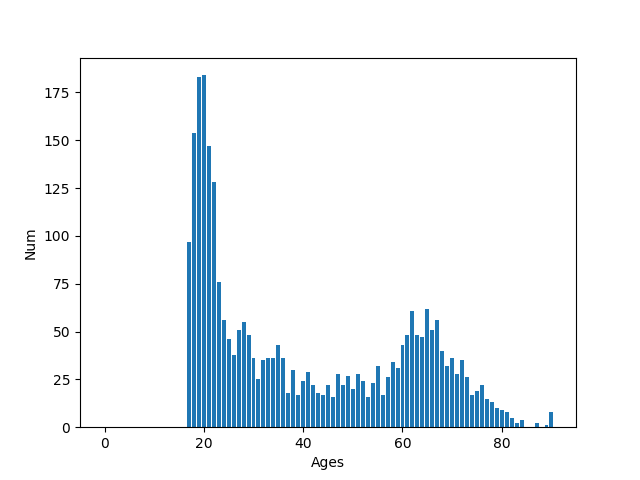 <p>workclass为空</p> </center>
	<center>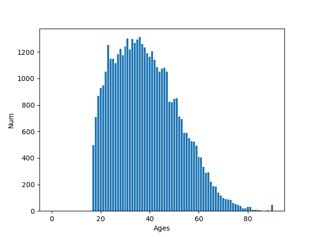 <p>workclass非空</p> </center>
可以看出很多年轻人还没有工作，结合education等信息可以判断出，很多年轻人正在求学仍未毕业，所以没有工作，职业应该属于学生，所以我们将age小于25的数据，工作类型出现缺失值的填充Never-worked，职业填充为Student。

	```python
	data.ix[((data['age'] < 25) & (data.workclass.isnull())), 
	['workclass', 'occupation']] = ['Never-worked', 'Student']
	```

5. 接下来再观察age对于workclass缺失的影响：
	<center>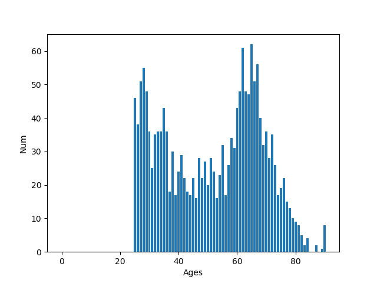 <p>workclass非空</p> </center>
	可以看到age大于60时，数据的缺失值依旧很严重，考虑到实际情况，60岁已经满足绝大多数国家的退休年龄，所以我们可以认为年龄大于60岁，而且没有工作的是退休人群。因此对这部分人群进行缺失值处理：
	
	```python
	data.ix[((data['age'] > 60) & (data.workclass.isnull())),
	['workclass','occupation']] = ['Retired','Retired']
	```
	
6. 再次观察缺失值分布情况：
 	<center>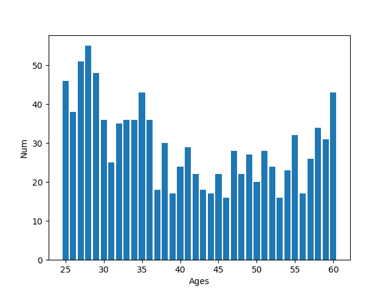 <p>workclass非空</p> </center>
 	已经相对平稳，对于剩余的缺失值可以直接填充Unknown:
 	
 	```python
 	data.ix[(data.workclass.isnull()), ['workclass','occupation']] = ['Unknown', 'Unknown']
 	```
 	
7. 对于country中的缺失值，由于数量较小且数据在USA上存在严重的偏态现象，所以这里就直接采取了填充Unknown：
	
	```python
	data.loc[data['native-country'].isnull(),'native-country'] = 'Unknown' 
	```
8. 在数据清洗之后，由于剩下的特征中，workclass、marital_status、occupation、relationship、race以及native_country均是离散的数据类型，所以需要对这几种特征进行重新编码。由于这些离散类型的数据，不存在相互的远近关系，所以这里采用onehot编码，来保证同一个属性中两个不同值之间的距离都相同。同时考虑到计算机处理能力等限制，并且根据上述分析occupation和workclass之间存在一定的关系，同时native\_country中绝大部分都是United States，考虑到这对最终的结果影响不大，所以本实验中只对workclass，marital\_status，race和sex进行编码，分别为0000001-1000000，0000001-1000000，00001-10000以及0-1。编码之后的数据特征数量变为123
	
	```python
	vec = DictVectorizer(sparse=False)
	onehotx = vec.fit(x.to_dict(orient='record'))
	onehotxt = vec.fit(xt.to_dict(orient='record'))
	```

#### 分布可视化
对数据进行清洗之后，为了探索数据集各个特征的分布，这里将各个特征分布用适当的形式可视化：  
年龄：
<center>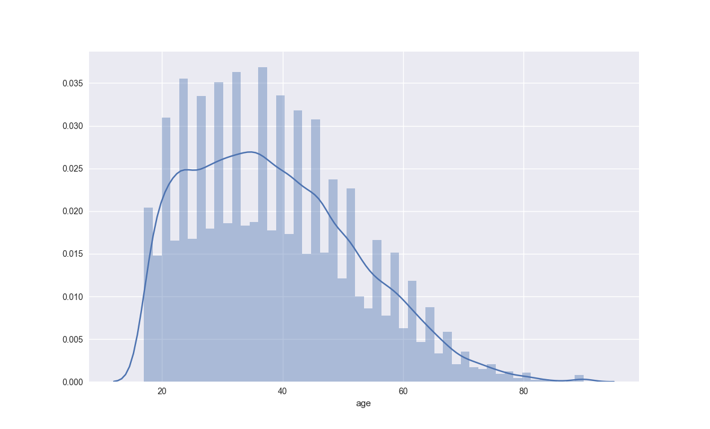  </center>
可以看出年龄分布非常接近正态分布，由于人口普查的限制，过小的年龄无法参与调查，故低年龄数据全部缺失。  
性别：   
<center>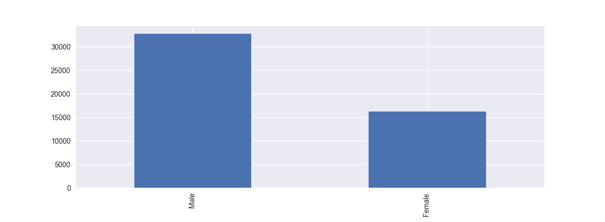  </center>  
可以看出男性明显多于女性，存在不平衡的情况。   
国家：
<center>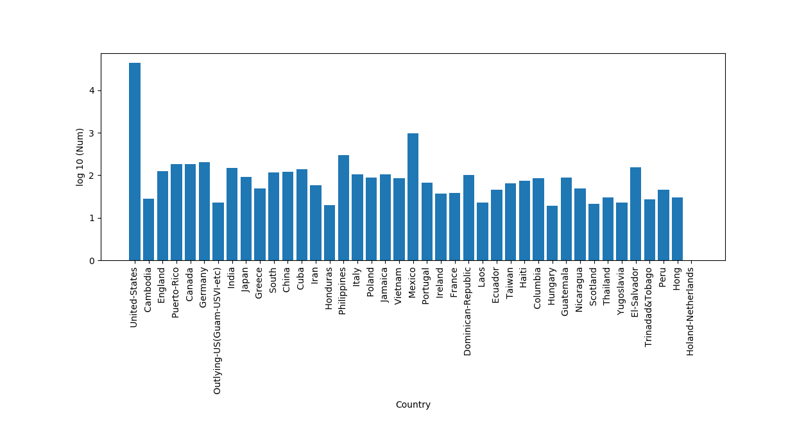  < </center>
可以看到即便在对数的情况下，美国依然占了绝对的优势，由于调查在美国进行，所以绝大多数为美国国籍。    
种族：
<center>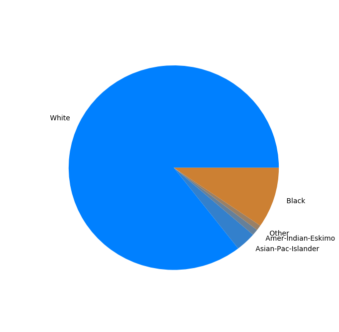  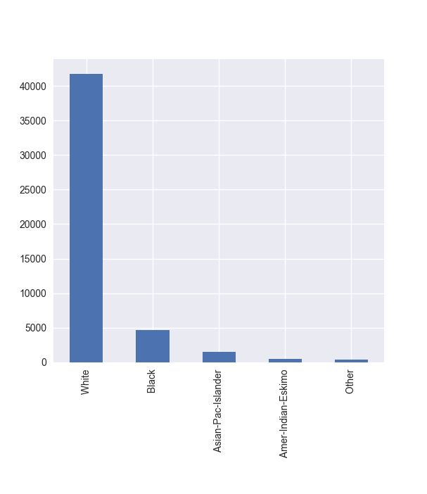  </center>
可以看到白色人种和黑色人种占据了绝大多数，其中白色人种又占据了绝对优势，  
工作类型：
<center>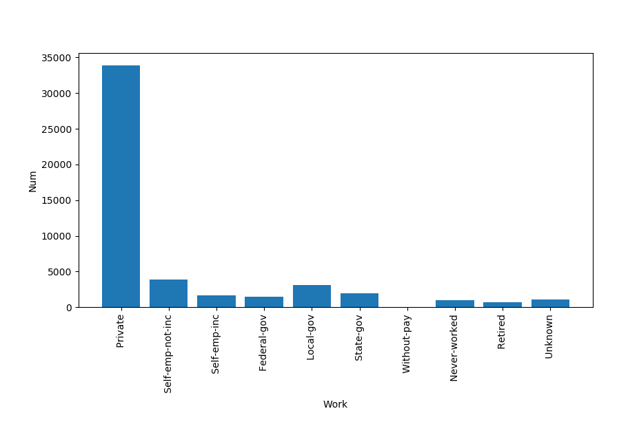   </center>
可以看到大部分人的工作类型还是private。   
具体职位：
<center>  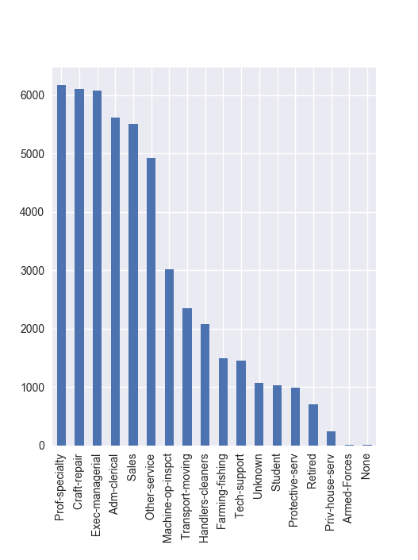  </center>
可以看到各个职位的分布就相对均匀。   
每周工作时间：
<center>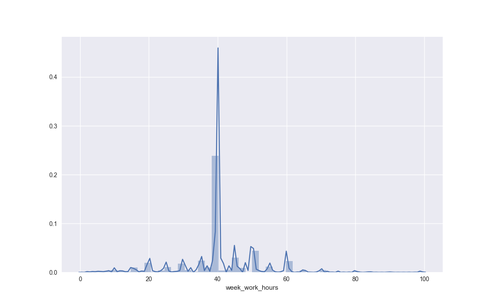   </center>
可以看到在40等几个点上达到了很高的值。   
教育程度：
<center>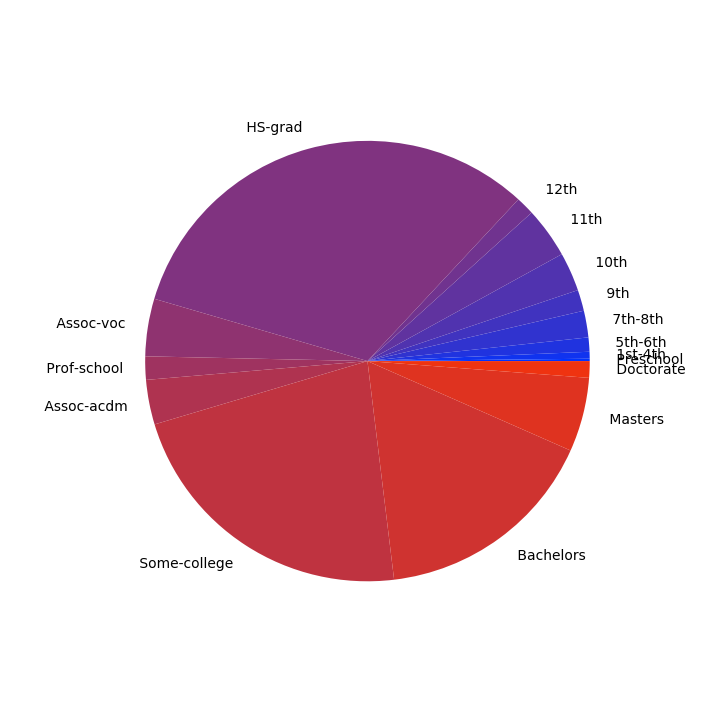  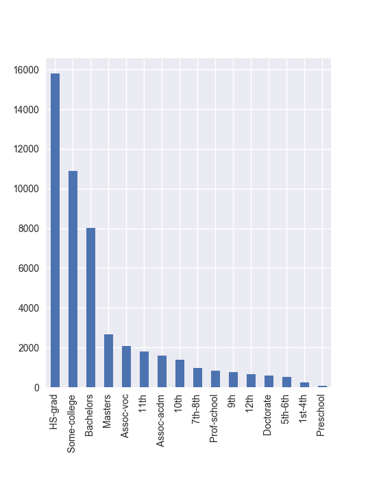 </center>
在教育程度上Highschool，some-college和Bachelor占据了绝大多数。  
教育水平：
<center>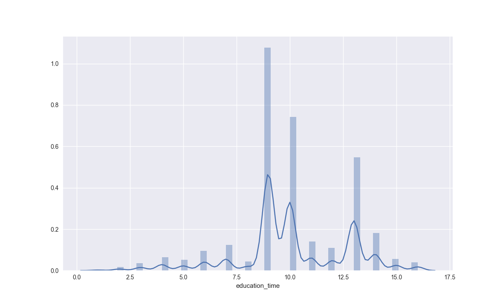   </center>
呈现两个极大值。   
资本收入：
<center>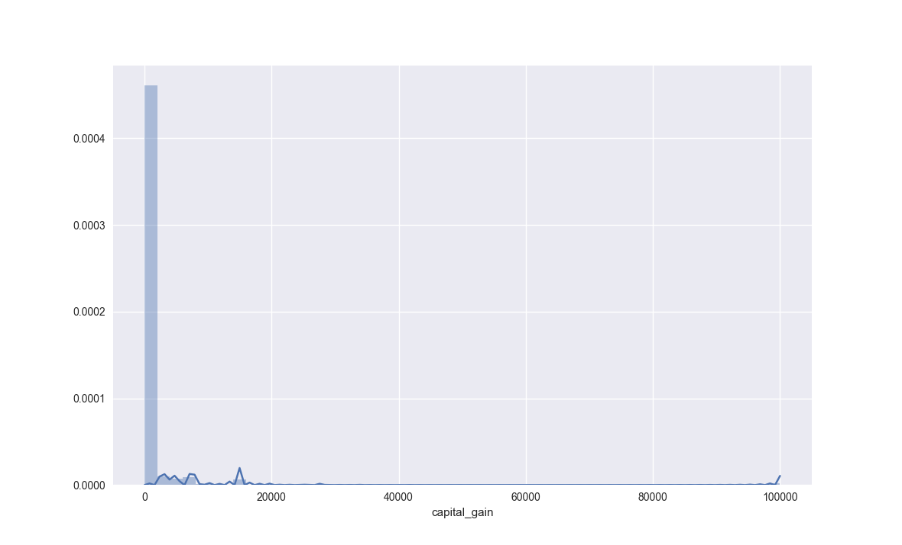   </center>
整体都相对集中在低收入阶段。   
资本支出：
<center>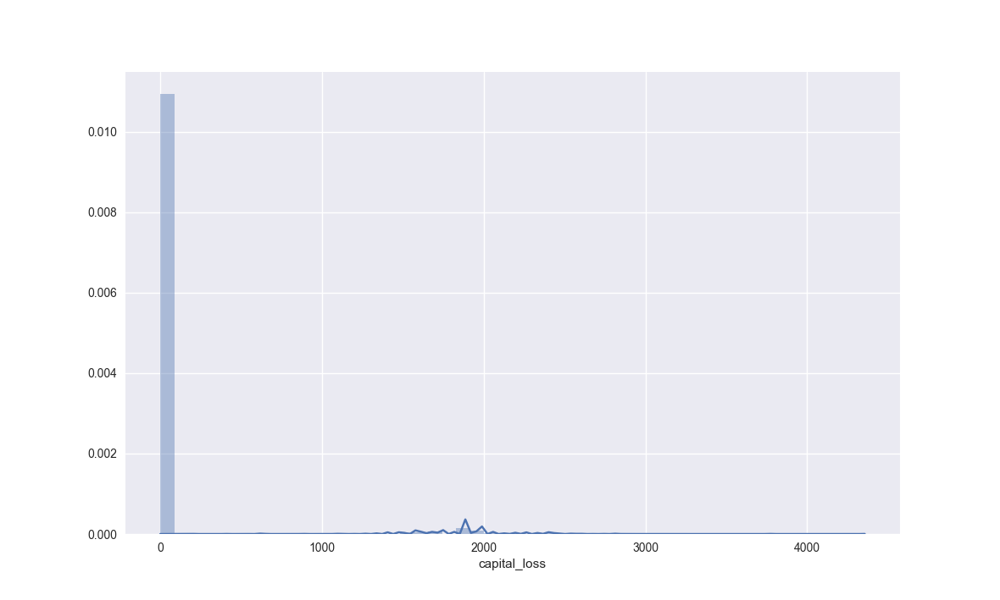   </center>
整体上数量与支出成反相关，大都集中在低支出部分。  
婚姻状况：
<center>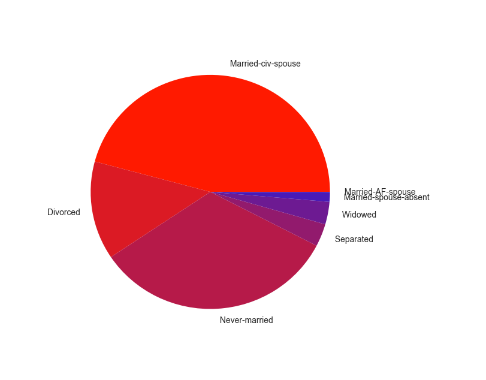  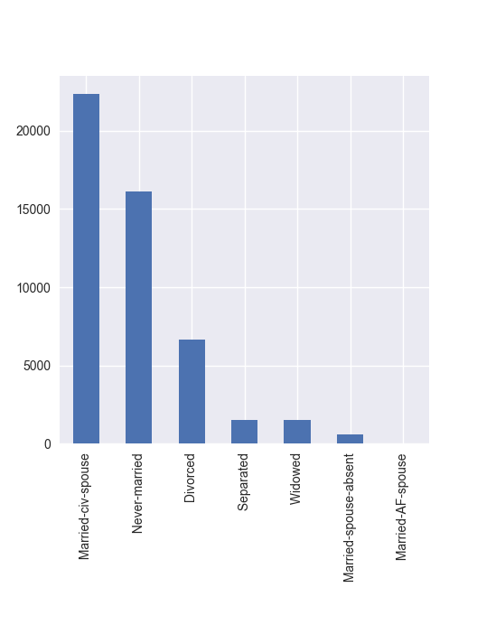  </center>  
符合现实状况但是依旧分布不均，主要分布在married spouse 和 never married 两类，但divorced也占据了很大一部分。  
家庭关系：
<center>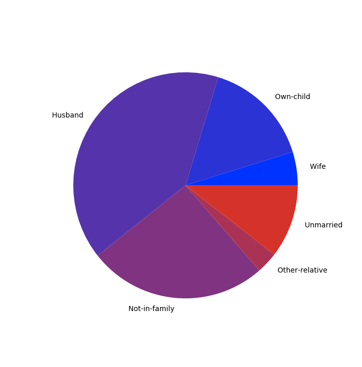  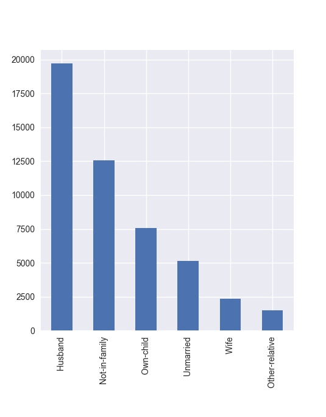  </center>
相对分布不够均匀，大量集中在husband 和 Not in family 两类。  
收入：
<center>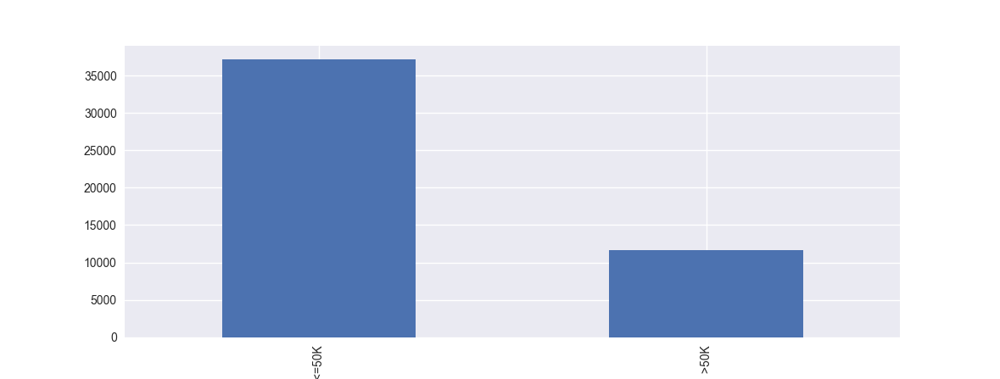  </center>  
可以看出<50K明显多于>50K，存在不平衡的情况。
    
从上面各个特征的分布，可以看出很多特征中数据的分布很不平衡。在native\_country属性中，绝大多数的人都集中在美国，因而该属性对于最终的分析的影响不大。同时观察到captital\_gain和capital_loss大多数都处于0。在workclass中大多数都是private，在race中大多数是white，这些不平衡分布很可能会影响到特征之间的相关性分析，故在分析关联规则时，需要综合考虑不平衡带来的影响。


#### 相关性分析
在将数据编码之后，可以进一步采用了Apriori算法来对数据集进行分析，由于Python中缺少成熟的实现，这部分采用了R来实现。

```R
> rules <- apriori(Adult, parameter = list(supp = 0.5, conf = 0.9, target = "rules"))

```
这里设定最小支持度为0.5，最小置信度为0.9，对编码后的数据进行关联规则分析可以得到:

```python
set of 50 rules

rule length distribution (lhs + rhs):sizes
 2  3  4
13 24 13

   Min. 1st Qu.  Median    Mean 3rd Qu.    Max.
   2.00    2.25    3.00    3.00    3.75    4.00

summary of quality measures:
    support         confidence          lift            count
 Min.   :0.5084   Min.   :0.9031   Min.   :0.9844   Min.   :24832
 1st Qu.:0.5415   1st Qu.:0.9148   1st Qu.:0.9936   1st Qu.:26447
 Median :0.5797   Median :0.9229   Median :0.9994   Median :28314
 Mean   :0.6319   Mean   :0.9306   Mean   :1.0037   Mean   :30863
 3rd Qu.:0.7352   3rd Qu.:0.9489   3rd Qu.:1.0066   3rd Qu.:35908
 Max.   :0.8707   Max.   :0.9583   Max.   :1.0586   Max.   :42525

```
即一共50条关联规则，涉及两项特征的13条，三项的24条，四项的13条，可以看到规则的支持度，置信度等参数的统计信息。接下来我们来看具体的规则结果：

```python 
 lhs                               rhs                       support confidence lift count
{hours-per-week=Full-time}     => {capital-gain=None}            0.543  0.929 1.012 26550
{hours-per-week=Full-time}     => {capital-loss=None}            0.560  0.958 1.005 27384
{sex=Male}                     => {capital-gain=None}            0.605  0.905 0.986 29553
{sex=Male}                     => {capital-loss=None}            0.633  0.947 0.993 30922
{workclass=Private}            => {capital-gain=None}            0.641  0.923 1.007 31326
{workclass=Private}            => {capital-loss=None}            0.663  0.956 1.003 32431
{race=White}                   => {native-country=United-States} 0.788  0.921 1.027 38493
{race=White}                   => {capital-gain=None}            0.781  0.914 0.996 38184
{race=White}                   => {capital-loss=None}            0.813  0.951 0.998 39742
{native-country=United-States} => {capital-gain=None}            0.821  0.915 0.998 40146
{native-country=United-States} => {capital-loss=None}            0.854  0.952 0.999 41752
{capital-gain=None}            => {capital-loss=None}            0.870  0.949 0.995 42525
{capital-loss=None}            => {capital-gain=None}            0.870  0.913 0.995 42525
{capital-gain=None,
 hours-per-week=Full-time}     => {capital-loss=None}            0.519  0.955 1.001 25357
{capital-loss=None,
 hours-per-week=Full-time}     => {capital-gain=None}            0.519  0.925 1.009 25357
{race=White,
 sex=Male}                     => {native-country=United-States} 0.541  0.920 1.025 26450
{sex=Male,
 native-country=United-States} => {race=White}                   0.541  0.905 1.058 26450
{race=White,
 sex=Male}                     => {capital-gain=None}            0.531  0.903 0.984 25950
{race=White,
 sex=Male}                     => {capital-loss=None}            0.556  0.945 0.992 27177
{sex=Male,
 native-country=United-States} => {capital-gain=None}            0.540  0.903 0.984 26404
{sex=Male,
 native-country=United-States} => {capital-loss=None}            0.566  0.946 0.992 27651
{sex=Male,
 capital-gain=None}            => {capital-loss=None}            0.569  0.941 0.987 27825
{workclass=Private,
 race=White}                   => {native-country=United-States} 0.543  0.914 1.018 26540
{workclass=Private,
 race=White}                   => {capital-gain=None}            0.547  0.920 1.003 26728
{workclass=Private,
 race=White}                   => {capital-loss=None}            0.567  0.954 1.001 27717
{workclass=Private,
 native-country=United-States} => {capital-gain=None}            0.568  0.921 1.004 27789
{workclass=Private,
 native-country=United-States} => {capital-loss=None}            0.589  0.955 1.002 28803
{workclass=Private,
 capital-gain=None}            => {capital-loss=None}            0.611  0.952 0.999 29851
{workclass=Private,
 capital-loss=None}            => {capital-gain=None}            0.611  0.920 1.003 29851
{race=White,
 native-country=United-States} => {capital-gain=None}            0.719  0.912 0.995 35140
{race=White,
 capital-gain=None}            => {native-country=United-States} 0.719  0.920 1.025 35140
{race=White,
 native-country=United-States} => {capital-loss=None}            0.749  0.950 0.997 36585
{race=White,
 capital-loss=None}            => {native-country=United-States} 0.749  0.920 1.025 36585
{race=White,
 capital-gain=None}            => {capital-loss=None}            0.740  0.947 0.993 36164
{race=White,
 capital-loss=None}            => {capital-gain=None}            0.740  0.909 0.991 36164
{capital-gain=None,
 native-country=United-States} => {capital-loss=None}            0.779  0.948 0.994 38066
{capital-loss=None,
 native-country=United-States} => {capital-gain=None}            0.779  0.911 0.993 38066
{race=White,
 sex=Male,
 native-country=United-States} => {capital-loss=None}            0.511  0.944 0.990 24976
{race=White,
 sex=Male,
 capital-loss=None}            => {native-country=United-States} 0.511  0.919 1.024 24976
{sex=Male,
 capital-loss=None,
 native-country=United-States} => {race=White}                   0.511  0.903 1.056 24976
{sex=Male,
 capital-gain=None,
 native-country=United-States} => {capital-loss=None}            0.508  0.940 0.986 24832
{workclass=Private,
 race=White,
 native-country=United-States} => {capital-loss=None}            0.518  0.953 1.000 25307
{workclass=Private,
 race=White,
 capital-loss=None}            => {native-country=United-States} 0.518  0.913 1.017 25307
{workclass=Private,
 race=White,
 capital-gain=None}            => {capital-loss=None}            0.520  0.951 0.997 25421
{workclass=Private,
 race=White,
 capital-loss=None}            => {capital-gain=None}            0.520  0.917 0.999 25421
{workclass=Private,
 capital-gain=None,
 native-country=United-States} => {capital-loss=None}            0.541  0.951 0.998 26447
{workclass=Private,
 capital-loss=None,
 native-country=United-States} => {capital-gain=None}            0.541  0.918 1.000 26447
{race=White,
 capital-gain=None,
 native-country=United-States} => {capital-loss=None}            0.680  0.945 0.992 33232
{race=White,
 capital-loss=None,
 native-country=United-States} => {capital-gain=None}            0.680  0.908 0.990 33232
{race=White,
 capital-gain=None,
 capital-loss=None}            => {native-country=United-States} 0.680  0.918 1.023 33232
```
可以看到很多关联规则印证了我们的想法：每周工作时间较长的人群通常资本带来收益和支出也相对较少，更倾向于通过劳动换取报酬；肤色为白色的人群通常国籍是美国人，
<center>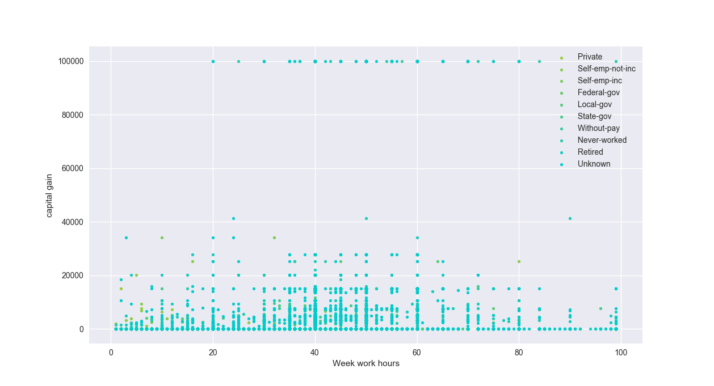   </center>
可以看到绝大部分相关规则都涉及capital-gain和capital-loss，但是通过对前面的各个特征的分布分析可以知道，captital\_gain和capital_loss大多数都处于0，同时native\_country属性中绝大多数的人都集中在美国，workclass中大多数都是private，race中大多数是white，这些不平衡分布在很大程度上会造成对相关性的影响，考虑到这些影响，我们对工作时间，资本收入以及支出计算协方差：

```python
num_data = []
for cate in ['capital_gain', 'capital_loss', 'week_work_hours']:
    num_data.append(data[cate].values)
num_data = np.array(num_data, dtype=np.float64)
cov = np.corrcoef(num_data)
print(cov)
```
得到结果：

```python
[[ 1.         -0.03144077  0.08215728]
 [-0.03144077  1.          0.05446722]
 [ 0.08215728  0.05446722  1.        ]]
```

可以看到实际上几个特征之间的相关性较低，受到了较多的不平衡分布的影响。对于整个数据集，除去上述特征外，其他特征没有明显的相关性。   
由于我们最终的目的是预测收入，所以这里单独对各个属性在不同收入的分布进行探索：
年龄：
<center>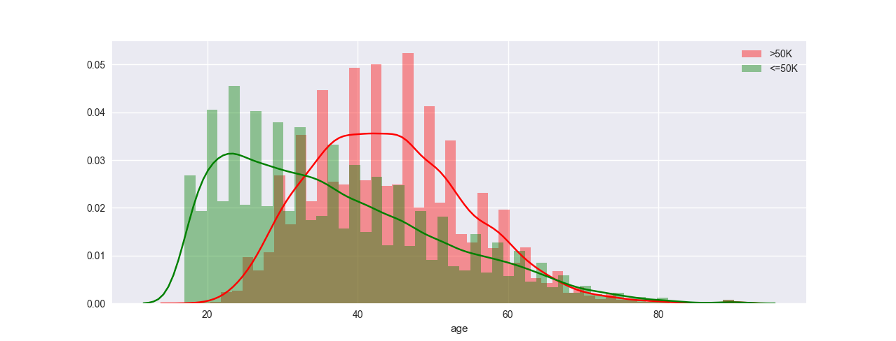  </center>
可以看出年龄对于收入具有明显影响，较大年龄群体相对具有更高的收入。  
性别：   
<center>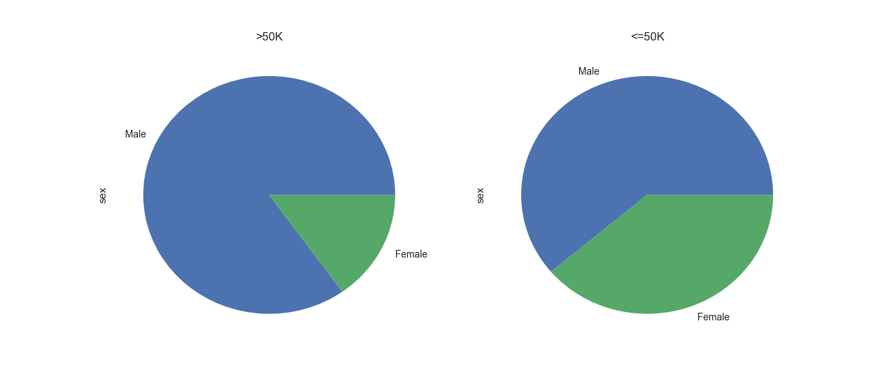  </center>  
可以看出高收入群体中，明显男性更多。   
国家：
<center>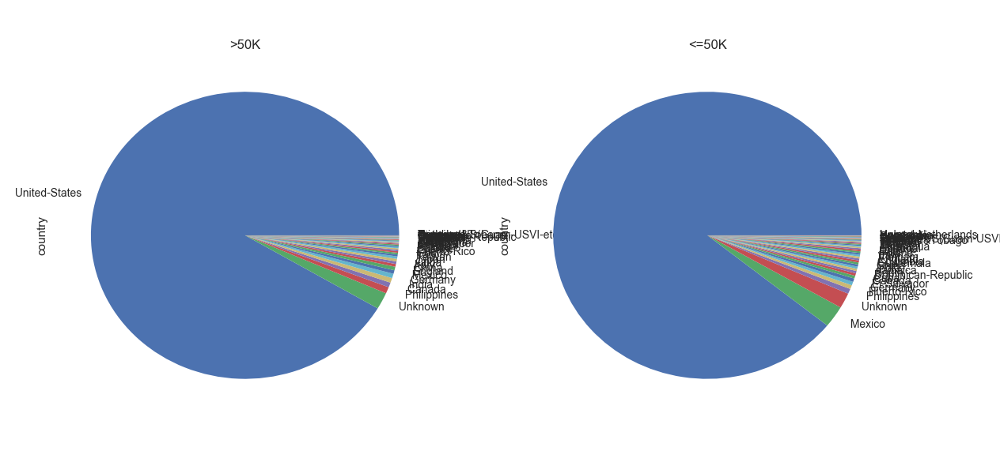  < </center>
整体上非常接近，没有太大影响。   
种族：
<center>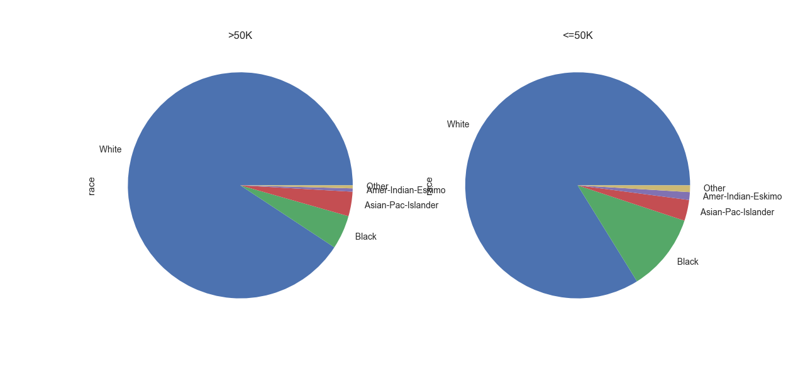  </center>
可以看到明显白种人增加。   
工作类型：
<center>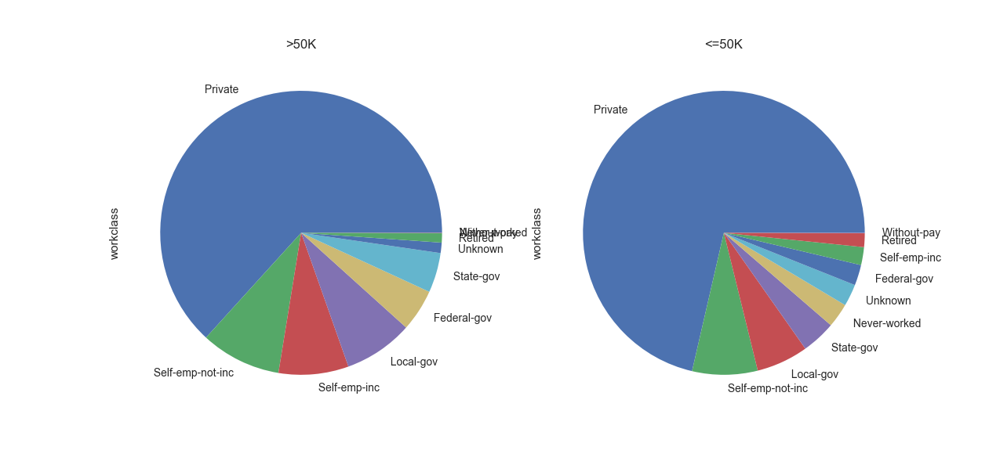   </center>
虽然private类型减少，但整体上还是很相近。   
具体职位：
<center>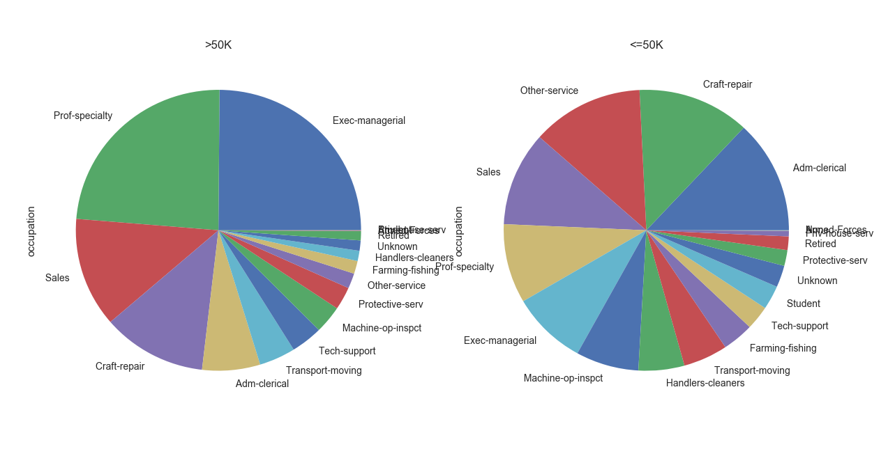   </center>
通过具体职位的对比明显可以看到，高薪群体主要集中在销售，执行经理以及专家等职位，而底薪群体则分布均匀，各个职位的人群相对接近。   
每周工作时间：
<center>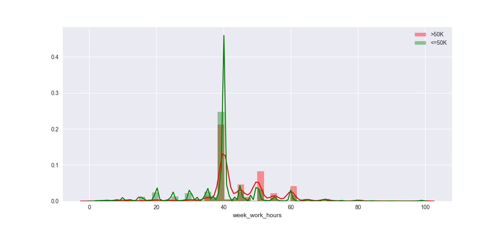   </center>
两个群体大部分人都一周工作40个小时，但是高薪群体加班的情形更加突出。     
教育程度：
<center>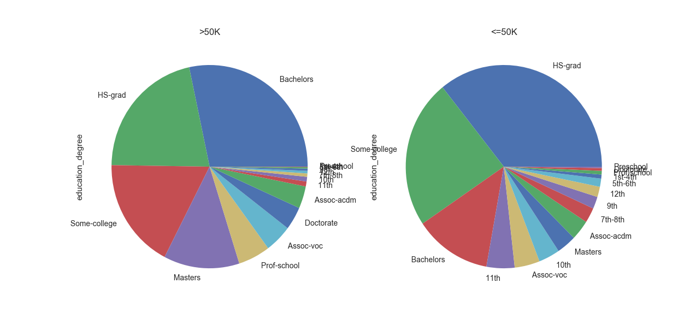  </center>
高薪群体中占据相应比例的群体普遍学历都高低薪群体一个层次，具有非常显著的影响。  
教育水平：
<center>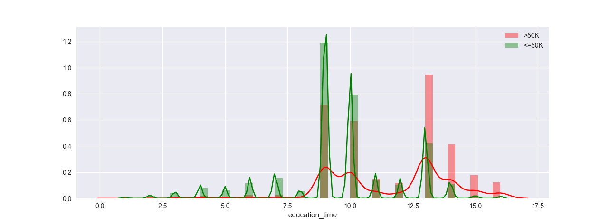   </center>
呈现出了和教育水平类似的结果。   
资本收入：
<center>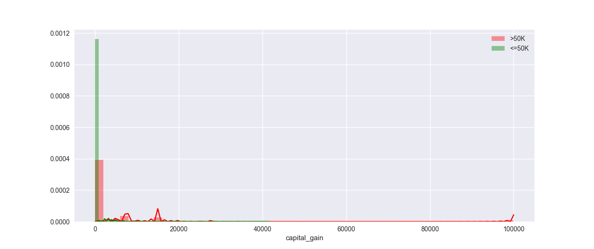   </center>
整体上非常接近，都集中在低收入部分，但是有少量的高薪人群能够取得不错的资本收入。   
资本支出：
<center>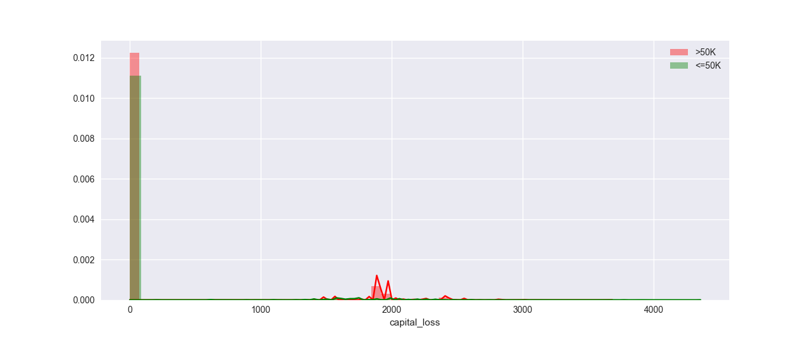   </center>
与资本收入结果类似  
婚姻状况：
<center>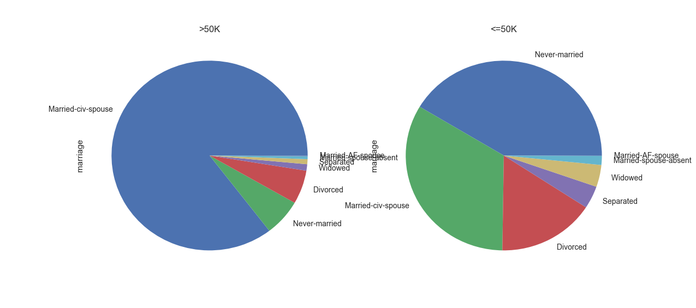   </center>  
明显高薪群体中绝大部分都是结婚状态，而低薪群体中很大一部分都是未婚状态。  
家庭关系：
<center>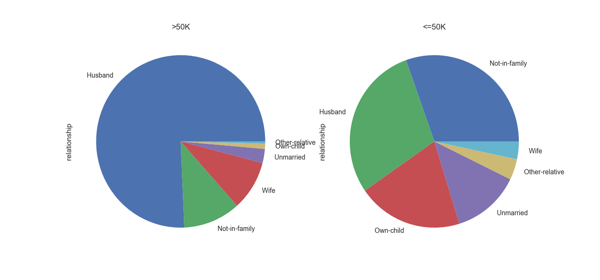   </center>
高薪群体中身为丈夫的群体占据很大一部分，而低薪群体中未成家和丈夫占据了相当的比重。

#### 构造分类模型
这里选用了贝叶斯，SVM和MLP几种模型。对于每种模型，为了达到最好的分类效果，都需要经过充分的参数调整，由于各个模型参数不同，所以都需要单独尝试。由于最终的分类效果受到诸多因素的影响，这里为了专注于比较各个分类模型能够达到的最好性能，避免由于数据集本身划分带来的不确定性，数据集划分采用了adult最常规的划分，即只划分为训练集与测试集，2/3的数据用于训练，1/3的数据用于测试。

- SVM   
SVM即支持向量机，通过核函数将数据向高维空间进行非线性映射，来寻找线性可分情况下的最优分类超平面，对应不同的核函数具有不同的参数。同时为了避免越过边界的异常值影响，引入了惩罚函数。故主要的参数包含核函数的种类，以及对应参数，惩罚函数的系数。这里由于数据集较大，从效率角度采用了libsvm库，对应即-t,-c,-d,-g,-r几项为主要参数：

	```python
	...
	def train(kernel):
		...
	    time_stamp = time.strftime("%H-%M-%S",time.localtime())
	    fout = open('./result/' + kernel_type[kernel] + '_' + time_stamp + '.out', 'w+')
	    y, x = svm_read_problem(train_data_file)
	    yt, xt = svm_read_problem(test_data_file)
	
	    # Cost
	    c_para = list(np.logspace(0,12,13,base=4)/1e4)
	    g_para = list(np.logspace(0,6,7,base=2)/(8 * feature_num))
	    d_para = list(range(2,7))
	    r_para = list(range(0,3,1))
	    for r in r_para:
	        for g in g_para:
	            g = round(g, 5)
	            for c in c_para:
	                c = round(c, 5)
                    for d in d_para:
                        param = '-t ' + str(kernel) + ' -c ' + str(c) + ' -g ' + str(g) + ' -r ' + str(r) + ' -d ' + str(d)
                        fout.write(param + ' ')
                        param = svm_parameter(param + ' -b 1 -m 5000 -q')
                        problem = svm_problem(y,x)
                        model = svm_train(problem, param)
                        p_label, p_acc, p_val = svm_predict(yt, xt, model)
                        fout.write(str(p_acc) + '\n')
                        fout.flush()
	    ...
	```
	可以得到如下的结果：
	
	```python
	-t 0 -c 0.0001 -g 0.00102 -r 0 (76.01254446016752, 0.9594982215932994, nan)
	-t 0 -c 0.0004 -g 0.00102 -r 0 (76.01254446016752, 0.9594982215932994, nan)
	-t 0 -c 0.0016 -g 0.00102 -r 0 (80.14303744215398, 0.794278502313841, 0.1295187264078399)
	
	...
	
	-t 3 -c 26.2144 -g 0.06504 -r 2 (77.1637281523693, 0.9134508739052282, 0.14308147048391237)
	-t 3 -c 104.8576 -g 0.06504 -r 2 (77.27081500745784, 0.9091673997016866, 0.14132801410059206)
	-t 3 -c 419.4304 -g 0.06504 -r 2 (77.06046582781964, 0.9175813668872146, 0.13755300285871958)
	-t 3 -c 1677.7216 -g 0.06504 -r 2 (77.21727157991357, 0.9113091368034574, 0.1437720505670205)
	```
	通过比较可以来得到最好的分类效果：
	
	```python
	# linear kernel
	 -t 0 -c 0.1024 -g 0.00813 -r 1 (85.01934770591487, 0.5992260917634052, 0.3144204965776658)
	 # polynomial kernel
     -t 1 -c 0.4096 -g 0.01626 -r 1 -d 6 (85.15447454087587, 0.5938210183649653, 0.3157506434758314)
     # rbf kernel 
     -t 2 -c 1.6384 -g 0.03252 -r 0 (85.11147963884282, 0.595540814446287, 0.31449403186182173)
     # sigmoid kernel 
	 -t 3 -c 104.8576 -g 0.00102 -r 1 (85.06234260794791, 0.5975062956820834, 0.3155179778381641)
	 
	 
	# 可以看出四种核在不同的参数下均达到了85%的最佳准确率，
	# 其中多项式核准确率和RBF核准确率相比能够达到更高一点的准确率。更加具体的结果放在后面分析。
	
	```
	
- MLP   
与SVM类似，首先需要通过调整参数来达到最佳的分类效果。但是相比SVM，MLP的参数更加“自由”，并且存在容易过拟合和局部最优的问题，所以需要更多的考虑。这里对网络结构，激活函数，求解方式，学习速率，正则项以及学习速率调整策略等参数在一个基于先验估计的范围内进行尝试。通过减少网络复杂度和提高正则项系数来减少过拟合的影响。

	```python
	...
   networks = [(100,20), (200,50), (200,20),(200,300,100), (200,400,100),
                (400,100,40), (400,200,100),(400,200,100,30),(200,400,100,30)]
    activations = ['logistic', 'tanh', 'relu','identity']
    solvers = ['lbfgs','sgd', 'adam']
    learning_rates = [0.001, 0.01, 0.0001]
    alphas = [0.00001, 0.0001, 0.001, 0.01, 0.1]
    learning_rate_setings = ['constant', 'invscaling', 'adaptive']
    for lr in learning_rates:
        for lrs in learning_rate_setings:
            for activation in activations:
                for solver in solvers:
                    for alpha in alphas:
                        for network in networks:
                            clf = mlpc(activation=activation, alpha=alpha, batch_size='auto',
                               beta_1=0.9, beta_2=0.999, early_stopping=False,
                               epsilon=1e-08, hidden_layer_sizes=network, learning_rate=lrs,
                               learning_rate_init=lr, max_iter=200, momentum=0.9,
                               nesterovs_momentum=True, power_t=0.5, random_state=1, shuffle=True,
                               solver=solver, tol=0.0001, validation_fraction=0.1, verbose=False,
                               warm_start=False)
                            x,y,xt,yt = load_data()
                            clf.fit(x,y)
                            predictions = clf.predict(xt)
    ...
	```

- KNN  
	同样的，对参数k进行调整，来寻找最优分类效果：
	
	```python
	x,y,xt,yt = load_data()
    fout = open('./' + 'knn' + '_' + '.out', 'w+')
    parameter_values = list(range(1, 21))
    # 对每个k值的准确率进行计算
    for k in parameter_values:
        # 创建KNN分类器
        clf = KNeighborsClassifier(n_neighbors=k)
        clf.fit(x.toarray(), y)
        predictions = clf.predict(xt.toarray())
        print(classification_report(yt, predictions))

        fout.write(str(classification_report(yt, predictions)))
        fout.write('\n')
        fout.flush()
    fout.close()
	```	
	
- 朴素贝叶斯  
	相比SVM与MLP等模型，这里贝叶斯分类不需要反复参数调整，可以直接训练预测：
	
	```python
	x,y,xt,yt = load_data()
    clf = GaussianNB()
    clf.fit(x.toarray(), y)
    predictions = clf.predict(xt.toarray())
    print(classification_report(yt, predictions))
    ```

- 决策树   
	这里作为基准，来进行分类效果的比较：
	
	```python
	clf = DecisionTreeClassifier(max_depth=8)
    clf.fit(x.toarray(), y)
    predictions = clf.predict(xt.toarray())
    print(classification_report(yt, predictions))
	```

	
#### 结果分析
从不同参数环境下挑选各个模型能够达到的最优的分类效果，比较相应的混淆矩阵：

- SVM 

	```python
	-t 1 -c 0.4096 -g 0.01626 -r 1 -d 6
	             precision    recall  f1-score   support
	       -1.0       0.88      0.94      0.91     12435
	        1.0       0.74      0.58      0.65      3846
	avg / total       0.85      0.85      0.84     16281
	```

- MLP

	```python
	0.001 constant (400, 200, 100) tanh sgd
	             precision    recall  f1-score   support
	       -1.0       0.88      0.93      0.90     12435
	        1.0       0.72      0.61      0.66      3846
	avg / total       0.85      0.85      0.85     16281
	
	```

- KNN

	```python
	10 < k < 21
	             precision    recall  f1-score   support
	       -1.0       0.86      0.93      0.90     12435
	        1.0       0.71      0.52      0.60      3846
	avg / total       0.83      0.84      0.83     16281
	
	```	

- 朴素贝叶斯

    ```python
	             precision    recall  f1-score   support
	       -1.0       0.96      0.45      0.62     12435
	        1.0       0.35      0.93      0.50      3846
	avg / total       0.81      0.57      0.59     16281
	```
- 决策树

	```python
	             precision    recall  f1-score   support
	       -1.0       0.87      0.93      0.90     12435
	        1.0       0.70      0.56      0.62      3846
	avg / total       0.83      0.84      0.83     16281
	```
	
对比几种分类模型的最优结果可以看到，SVM和MLP相比其他分类模型具有更好的分类能力，并且SVM在正类数据的准确率上高于MLP，并且在几种核上都达到了相近的准确率，一方面表明了数据集具有较好的线性可分性，另一方面也表明SVM的鲁棒性相对较高。相比之下，决策树模型和KNN分类能力有所降低，但依然优于朴素贝叶斯模型。朴素贝叶斯模型尽管在负类上达到了很高的准确率但是召回值非常高，正类数据的准确率非常低，造成最终准确率相对较低，这也反应出了数据集中存在具有一定相关性的特征，进一步证实了我们在相关性分析中的讨论。   
尽管MLP和SVM的准确率相对较高，但是相应的训练时间也显著高于其他分类模型，其中朴素贝叶斯模型和决策树模型在训练时间上具有明显优势。

#### 结论
数据集本身除去存在一些缺失值外，主要问题来自于不平衡性，由于客观原因以及人口普查的局限性，不平衡难以避免，但分类的结果表明数据集的线性可分性相对较好，所以最终可以在85%的置信度下对收入进行判断。    
通过上面的分析我们可以看出，在该数据集反应的群体中，绝大多数是来自美国的青壮年，并且肤色为白色，男性占据了2/3，大部分人从事着私人或者私企的工作，分布在多种职位上，大多数人每周工作40小时，婚姻状况集中在未婚和已婚，受教育程度差异较大，但是高中和大学水平占据了很大一部分，大部分人来自资本的收益和支出都为0，其中全职工作和为私人或私企工作的人群偏多，    
大部分人的收入还是处在低于50K的水平，大约是超越50K人数的三倍。通过上面的分析可以看出对收入明显影响的包括教育程度，工作类型，性别，年龄，家庭状况等，其中教育和工作类型起了非常显著的影响，也印证了教育与职业的重要性。但由于数据本身具有不平衡的分布，影响了许多特征之间的相关性，所以一些影响因素仍需进一步探究。    


--

##### *关于课程的一些建议
- 课程本身很有意义，但是由于内容与前面所学课程相冲突，所以建议课程整体设计上更偏向于实践，多从实际的工程角度出发
- 课程的作业可以进一步扩大范围，进一步增加难度
- 由于数据挖掘领域发展迅速，并且同学们具有一定基础所以建议课程能够多涉及一些领域前沿内容
