#  作业一 


#### Problem
可视化探索adult数据集adult.txt
adult数据集说明：ftp://public.sjtu.edu.cn/datasci

用可视化手段初步探索adult数据集的基本情况。


#### Solution
数据集提供了诸多种类的数据，可以从多个角度进行分析来挖掘出多种信息，这里选取其中一个角度，探索受教育的分布以及带来的影响。  
首先对于受教育程度的分布：
  
- 教育程度和教育时间在各个国家之间：
<center> 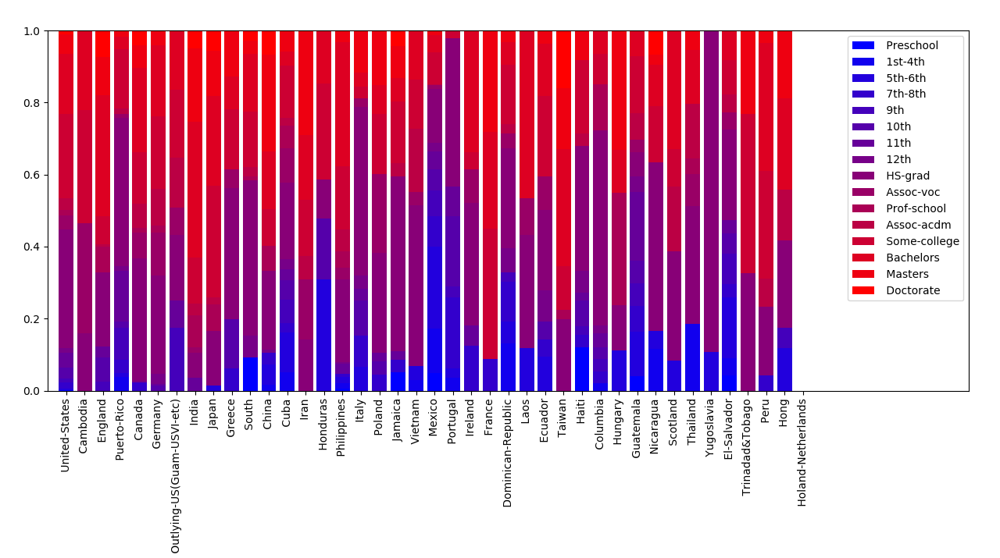 </center>
可以很明显的看出以美国等国家为代表的较发达国家中，受过高等教育的人口比例明显较高，整体呈现教育水平十分成熟，而以墨西哥等国家为代表的欠发达国家中，存在着很大比例的人口没有没有受过高等教育，甚至没有受过正规的教育，差别巨大。  

- 尽管调查存在着很大的不均衡性，但是也能一定程度上反映，从人口（权重）数量上来看，美国的高等教育非常普及：
<center> 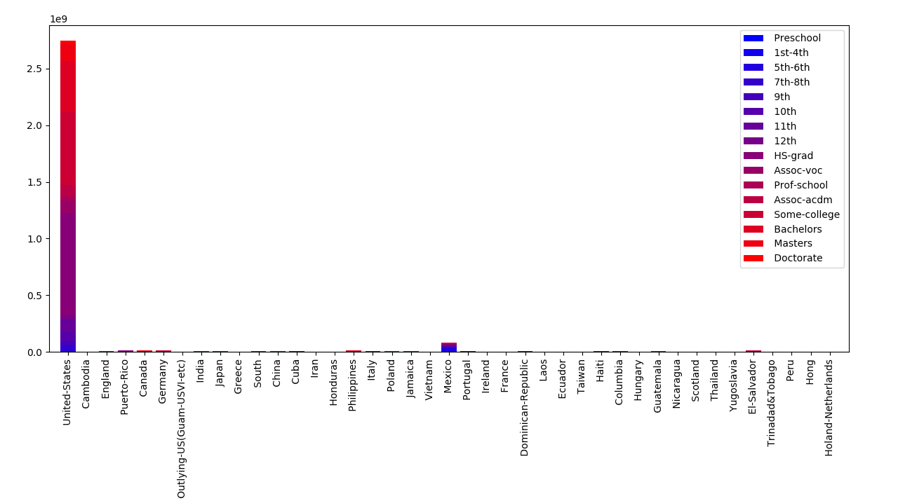 </center>

对比各个国家的发展与现状可以看出，一个国家的发展水平和教育有很大的相关性。  
对于个人的影响也能够明确的看出，教育对于职业，家庭以及收入等诸多方面的影响。    

- 从最直接的角度收入上来看，对比>50K和<=50K收入中的教育程度分布：
<center> 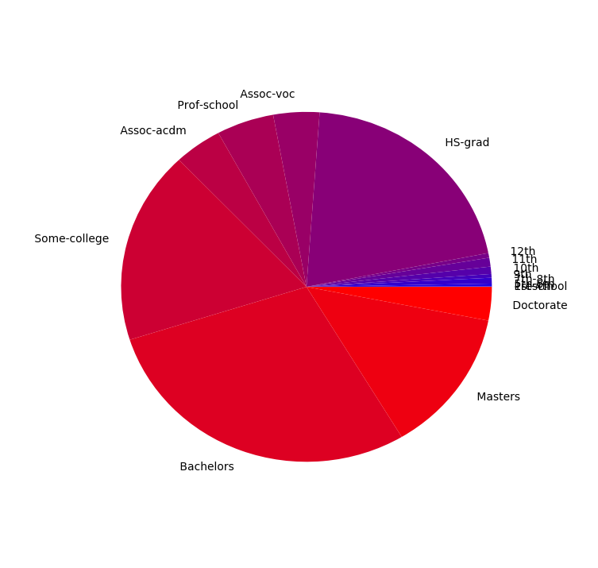 </center>
收入>50K的人群中，大学生、学士和硕士占了接近2/3的比例，尽管也存在较多高中教育水平的群体，但相比较少，且更低教育程度的群体几乎没有。

<center> 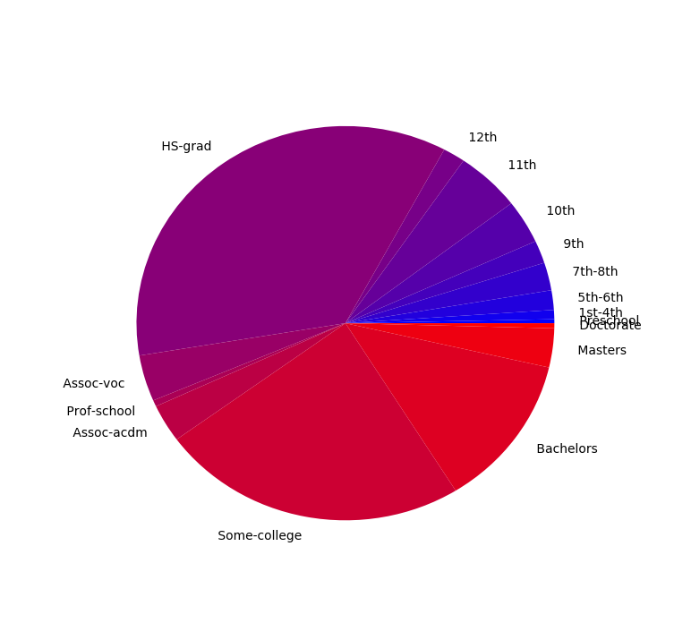 </center>
收入<=50K的人群中，可以非常明显地看到，高中教育水平的群体占了非常大的一部分，远高于其他任何群体，同时大学教育水平也占比较大，两者占比接近3/4，并且低水平教育占比明显增加，与学士及更高水平相当。  
从这两张图可以分析出教育水平很大程度上影响着收入水平，明显教育水平高的群体更容易获得高收入。

- 从资本收入以及工作时间上来看，分析各个群体的资本收入情况和每周工作时间：
<center> 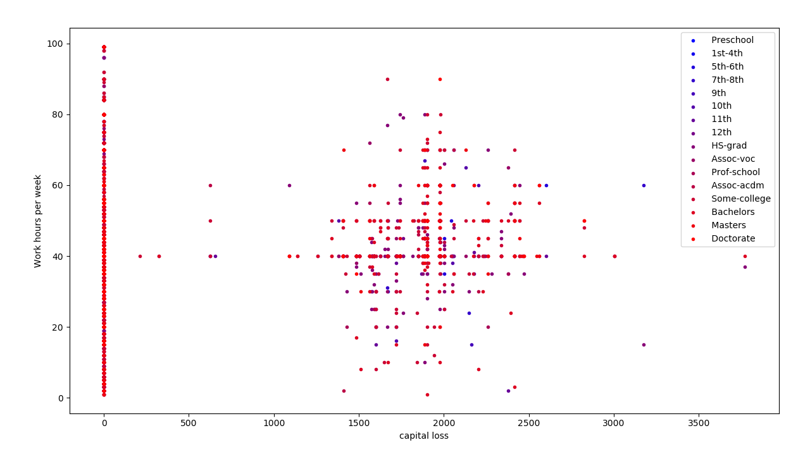 </center>
可以看出，高水平教育人群相对工作时间较为集中，多为40个小时，即每周5天的8小时工作制，虽然也有很多人资本收入为0，但是大部分人具有稳定的资本收入；而低水平教育人群则工作时间非常分散，差别巨大，  

- 从职业上看，对比各个职业中的教育程度分布：
<center> 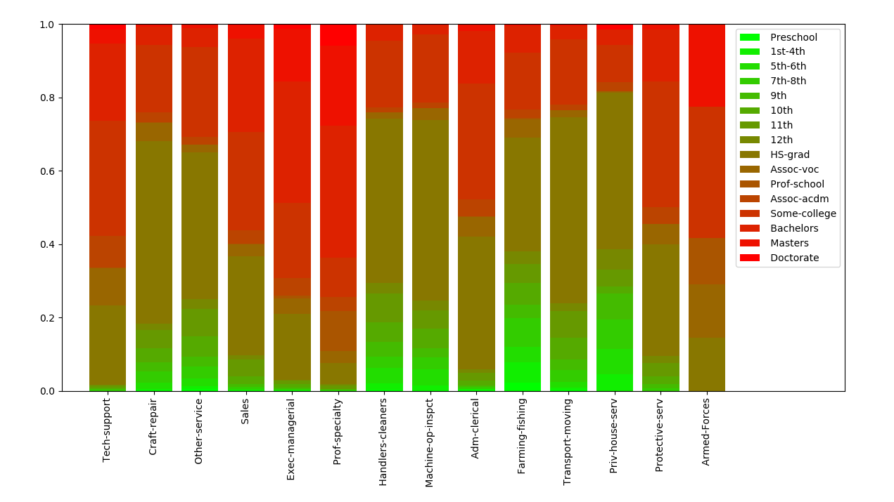 </center>
可以明显看出，类似Tech support等注重技术的职位明显对高教育水平群体有偏重，低水平教育群体更多的集中在类似Priv-house-serv等更偏向于劳动的职位。  

- 从家庭关系上看，对比各种家庭关系中的教育程度分布：
<center> 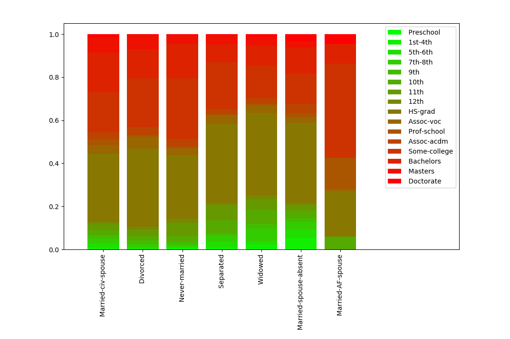 </center>
明显可以看到Married-AF-spouse中，高教育水平群体占了绝大多数，而其他几种关系中，都相差不多。   

整体上，可以看出教育水平对于国家，对于个人都影响巨大，各个方面都具有很大的积极意义。

对于该数据集的其他数据，大致基本情况如下：  

- 年龄分布：<center> 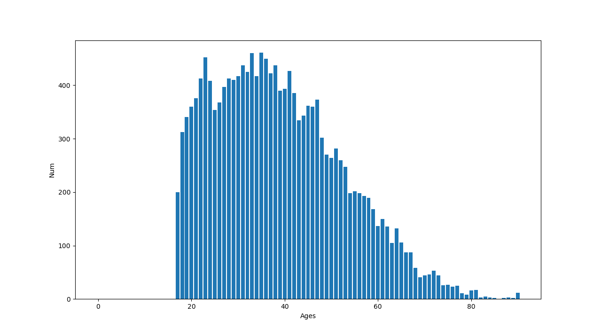 </center>
- 种族分布：<center>  </center>
- 教育水平分布：<center> 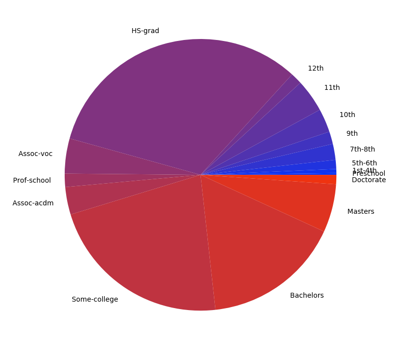 </center>
- 教育时间分布：<center> 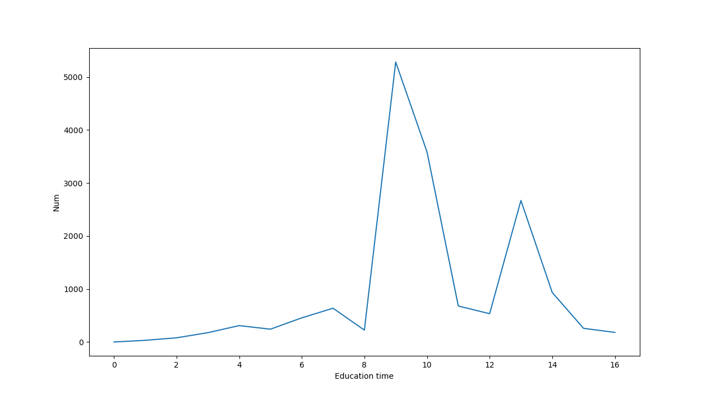 </center>
- 工作分布：<center> 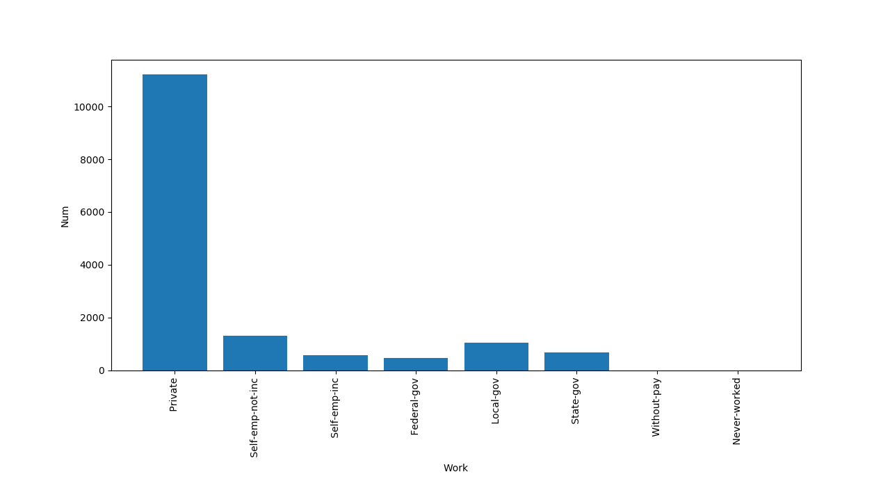 </center>
- 职业分布：<center> 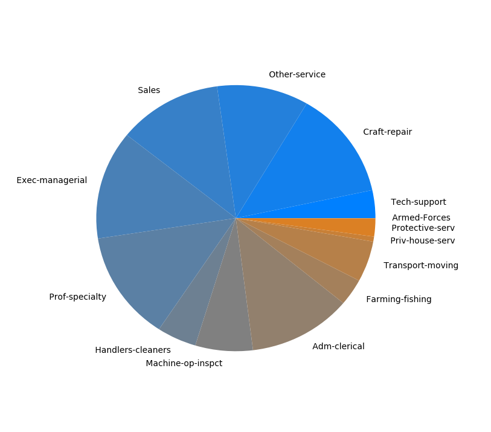 </center>


#### Implementation 
实现采用了基本的pandas和matplotlib，每个分析过程首先对数据进行处理，根据需要选出满足条件的数据，通过权重项计算比例，然后根据具体类型用不同的形式展现出来，具体代码如下：

```python 
import pandas as pd
import matplotlib.pyplot as plt


# Process the data
category = ['age', 'work', 'weight', 'education_degree', 'education_time', 'marriage', 'job', 'family', 'race', 'sex', 'capital_gain', 'capital_loss', 'week_work_hours', 'country', 'income']
data = pd.read_csv("./adult.txt", names=category)


education_degrees = [' Preschool',' 1st-4th',' 5th-6th',' 7th-8th',' 9th',' 10th',' 11th',' 12th',' HS-grad',' Assoc-voc',' Prof-school',' Assoc-acdm',' Some-college',' Bachelors',' Masters',' Doctorate']
countrys = ' United-States, Cambodia, England, Puerto-Rico, Canada, Germany, Outlying-US(Guam-USVI-etc), India, Japan, Greece, South, China, Cuba, Iran, Honduras, Philippines, Italy, Poland, Jamaica, Vietnam, Mexico, Portugal, Ireland, France, Dominican-Republic, Laos, Ecuador, Taiwan, Haiti, Columbia, Hungary, Guatemala, Nicaragua, Scotland, Thailand, Yugoslavia, El-Salvador, Trinadad&Tobago, Peru, Hong, Holand-Netherlands'
countrys = countrys.split(',')
jobs = ' Tech-support, Craft-repair, Other-service, Sales, Exec-managerial, Prof-specialty, Handlers-cleaners, Machine-op-inspct, Adm-clerical, Farming-fishing, Transport-moving, Priv-house-serv, Protective-serv, Armed-Forces'
jobs = jobs.split(',')
marriages = ' Married-civ-spouse, Divorced, Never-married, Separated, Widowed, Married-spouse-absent, Married-AF-spouse'
marriages = marriages.split(',')
works = ' Private, Self-emp-not-inc, Self-emp-inc, Federal-gov, Local-gov, State-gov, Without-pay, Never-worked'
works = works.split(',')
races  = ' White, Asian-Pac-Islander, Amer-Indian-Eskimo, Other, Black'
races = races.split(',')

###############################################


edu_ratio = {}
edu_num = {}
for education_degree in education_degrees:
    edu_ratio[education_degree] = []
    edu_num[education_degree] = []
    for country in countrys:
        country_data = data[data['country'] == country]
        sum_all_weights = sum(country_data['weight'])
        country_edu_data = country_data[country_data['education_degree'] == education_degree]
        sum_edu_weights = sum(country_edu_data['weight'])
        if sum_all_weights == 0:
            ratio = 0
        else:
            ratio = sum_edu_weights * 1.0 / sum_all_weights
        edu_ratio[education_degree] += [ratio]
        edu_num[education_degree] += [sum_edu_weights]


country_edu_fig = plt.figure("Country - Education")
plt.bar(list(range(len(countrys))),edu_ratio[education_degrees[0]],color=[0,0,1],label=education_degrees[0])
bottom = edu_ratio[education_degrees[0]]
for i in range(1,len(education_degrees)):
    plt.bar(list(range(len(countrys))),edu_ratio[education_degrees[i]],bottom=bottom,color=[i/15.0,0.0,1-i/15.0],label=education_degrees[i])
    for j in range(len(bottom)):
        bottom[j] += edu_ratio[education_degrees[i]][j]
plt.xticks(list(range(len(countrys))), countrys, rotation=90)
plt.legend(loc='upper right')
plt.xlim([-1,len(countrys)+8])


country_population_edu_fig = plt.figure("Country weight - Education")
plt.bar(list(range(len(countrys))),edu_num[education_degrees[0]],color=[0,0.0,1],label=education_degrees[0])
bottom = edu_num[education_degrees[0]]
for i in range(1,len(education_degrees)):
    plt.bar(list(range(len(countrys))),edu_num[education_degrees[i]],bottom=bottom,color=[i/15.0,0.0,1-i/15.0],label=education_degrees[i])
    for j in range(len(bottom)):
        bottom[j] += edu_num[education_degrees[i]][j]
plt.xticks(list(range(len(countrys))), countrys, rotation=90)
plt.legend(loc='upper right')
plt.xlim([-1,len(countrys)])


###############################################


edu_ratio = {}
edu_num = {}
for education_degree in education_degrees:
    edu_ratio[education_degree] = []
    edu_num[education_degree] = []
    for job in jobs:
        job_data = data[data['job'] == job]
        sum_all_weights = sum(job_data['weight'])
        job_edu_data = job_data[job_data['education_degree'] == education_degree]
        sum_edu_weights = sum(job_edu_data['weight'])
        if sum_all_weights == 0:
            ratio = 0
        else:
            ratio = sum_edu_weights * 1.0 / sum_all_weights
        edu_ratio[education_degree] += [ratio]
        edu_num[education_degree] += [sum_edu_weights]


jobs_edu_fig = plt.figure("Jobs - Education")
plt.bar(list(range(len(jobs))),edu_ratio[education_degrees[0]],color=[0,1,0],label=education_degrees[0])
bottom = edu_ratio[education_degrees[0]]
for i in range(1,len(education_degrees)):
    plt.bar(list(range(len(jobs))),edu_ratio[education_degrees[i]],bottom=bottom,color=[i/15.0,1-i/15.0,0],label=education_degrees[i])
    for j in range(len(bottom)):
        bottom[j] += edu_ratio[education_degrees[i]][j]
plt.xticks(list(range(len(jobs))), jobs, rotation=90)
plt.legend(loc='upper right')
plt.xlim([-1,len(jobs)+2])


###############################################


edu_ratio = {}
edu_num = {}
for education_degree in education_degrees:
    edu_ratio[education_degree] = []
    edu_num[education_degree] = []
    for marriage in marriages:
        marriage_data = data[data['marriage'] == marriage]
        sum_all_weights = sum(marriage_data['weight'])
        marriage_edu_data = marriage_data[marriage_data['education_degree'] == education_degree]
        sum_edu_weights = sum(marriage_edu_data['weight'])
        if sum_all_weights == 0:
            ratio = 0
        else:
            ratio = sum_edu_weights * 1.0 / sum_all_weights
        edu_ratio[education_degree] += [ratio]
        edu_num[education_degree] += [sum_edu_weights]


marriages_edu_fig = plt.figure("Relationship - Education")
plt.bar(list(range(len(marriages))),edu_ratio[education_degrees[0]],color=[0,1,0],label=education_degrees[0])
bottom = edu_ratio[education_degrees[0]]
for i in range(1,len(education_degrees)):
    plt.bar(list(range(len(marriages))),edu_ratio[education_degrees[i]],bottom=bottom,color=[i/15.0,1-i/15.0,0],label=education_degrees[i])
    for j in range(len(bottom)):
        bottom[j] += edu_ratio[education_degrees[i]][j]
plt.xticks(list(range(len(marriages))), marriages, rotation=90)
plt.legend(loc='upper right')
plt.xlim([-1,len(marriages)+2])


###############################################

capital_gain_work_hour_fig = plt.figure('Captial_gain_Week_work_hour')
for i in range(len(education_degrees)):
    p = plt.scatter(data[data['education_degree'] == education_degrees[i]]['capital_loss'],data[data['education_degree'] == education_degrees[i]]['week_work_hours'],marker='.',color=[i/15.0,0.0,1-i/15.0])
    # plt.legend(education_degrees[i])
plt.legend(education_degrees,loc='upper right')
plt.ylabel('Work hours per week')
plt.xlabel('capital loss')


###############################################


higher_income_dist_fig = plt.figure('Higher income distribution on education degree')
higher_income = data[data['income'] == ' >50K.']
lower_income = data[data['income'] == ' <=50K.']

sizes = []
colors = []
sum_higher_income = sum(higher_income['weight'])
for i in range(len(education_degrees)):
    sum_edu_higher_income = sum(higher_income[higher_income['education_degree'] == education_degrees[i]]['weight'])
    sizes += [sum_edu_higher_income]
    colors += [[i/15.0,0.0,1-i/15.0]]
plt.pie(sizes,colors=colors,labels=education_degrees)

sizes = []
colors = []
lower_income_dist_fig = plt.figure('Lower income distribution on education degree')
sum_lower_income = sum(lower_income['weight'])
for i in range(len(education_degrees)):
    sum_edu_lower_income = sum(lower_income[lower_income['education_degree'] == education_degrees[i]]['weight'])
    sizes += [sum_edu_lower_income]
    colors += [[i/15.0,0.0,1-i/15.0]]
plt.pie(sizes,colors=colors,labels=education_degrees)


###############################################


age_fig = plt.figure('Ages')
ages = []
max_age = max(data['age'])
for x in range(0,max_age+1):
    ages += [len(data[data['age'] == x])]

plt.bar(list(range(0,max_age+1)),ages)
plt.ylabel('Num')
plt.xlabel('Ages')


###############################################


work_fig = plt.figure('Work')
work_num = []
for x in range(0,len(works)):
    work_num += [len(data[data['work'] == works[x]])]

plt.bar(list(range(0,len(works))),work_num)
plt.ylabel('Num')
plt.xlabel('Work')
plt.xticks(list(range(len(works))), works, rotation=90)


###############################################


edu_fig = plt.figure('Education')
edu_num = []
colors = []
sum_all = len(data)
for x in range(0,len(education_degrees)):
    edu_num += [len(data[data['education_degree'] == education_degrees[x]])]
    colors += [[x / len(education_degrees), 0.2, 1 - x / len(education_degrees)]]
plt.pie(edu_num,colors=colors,labels=education_degrees)


###############################################


job_fig = plt.figure('Jobs')
job_num = []
colors = []
sum_all = len(data)
for x in range(0,len(jobs)):
    job_num += [len(data[data['job'] == jobs[x]])]
    colors += [[x / len(jobs), 0.5, 1 - x / len(jobs)]]
plt.pie(job_num,colors=colors,labels=jobs)


###############################################


edu_time_fig = plt.figure('Education time')
edu_time_num = []
colors = []
# sum_all = len(data)
max_time = max(data['education_time'])
for x in range(0,max_time+1):
    edu_time_num += [len(data[data['education_time'] == x])]
    # colors += [[x / len(education_degrees), 0.2, 1 - x / len(education_degrees)]]
# plt.pie(edu_num,colors=colors,labels=education_degrees)
plt.plot(list(range(0,max_time+1)), edu_time_num)
plt.ylabel('Num')
plt.xlabel('Education time')


###############################################


race_fig = plt.figure('Race')
race_num = []
colors = []
sum_all = len(data)
for x in range(0,len(races)):
    race_num += [len(data[data['race'] == races[x]])]
    colors += [[x / len(races), 0.5, 1 - x / len(races)]]
plt.pie(race_num,colors=colors,labels=races)


###############################################

plt.show()
```


