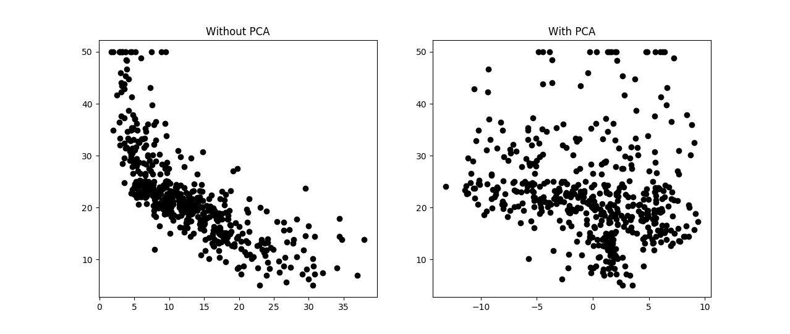
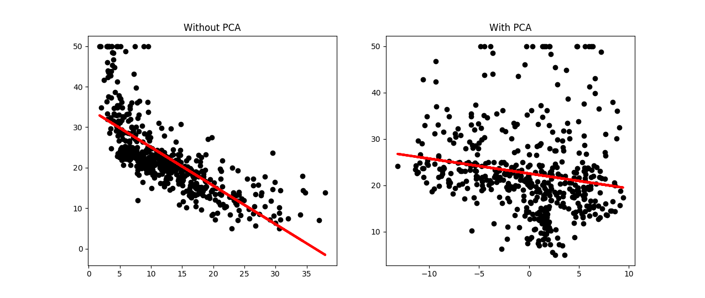
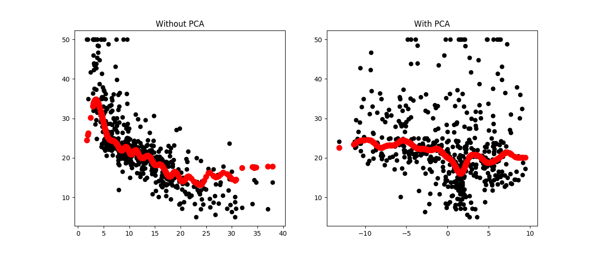
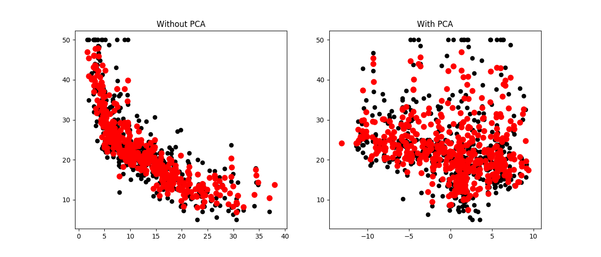

# <center> 作业三 </center>

#### Problem
对Boston数据集进行PCA降维

```
The Boston house-price data of Harrison, D. and Rubinfeld, D.L. 'Hedonic
 ...

 Variables in order:
 CRIM     per capita crime rate by town
 ZN       proportion of residential land zoned for lots over 25,000 sq.ft.
 ...

 0.00632  18.00   2.310  0  0.5380  6.5750  65.20  4.0900   1  296.0  15.30  396.90   4.98  24.00
 0.02731   0.00   7.070  0  0.4690  6.4210  78.90  4.9671   2  242.0  17.80  396.90   9.14  21.60
 0.02729   0.00   7.070  0  0.4690  7.1850  61.10  4.9671   2  242.0  17.80  392.83   4.03  34.70
 0.03237   0.00   2.180  0  0.4580  6.9980  45.80  6.0622   3  222.0  18.70  394.63   2.94  33.40
 0.06905   0.00   2.180  0  0.4580  7.1470  54.20  6.0622   3  222.0  18.70  396.90   5.33  36.20
 ...
```
#### Solution 
- Boston数据集是关于波士顿房价的数据集，每条数据包含房屋以及房屋周围的详细信息。其中包含城镇犯罪率，一氧化氮浓度，住宅平均房间数，到中心区域的加权距离以及自住房平均房价等等。一共包含506条数据，每条数据包含13个方面的信息，以及一个可以用来作为target的房价中位数。     

- 对于Boston数据集的降维，采用了基本的PCA实现方式：
	- 各属性零均值化(即减去属性均值)
	- 求协方差矩阵
	- 求协方差矩阵的特征值及对应特征向量
	- 对特征值从大到小排序
	- 将特征向量按对应特征值大小从上到下按行排列成矩阵
	- 将数据转换到k个特征向量构建的新空间中

- 为了避免异常值的影响，进行简单的数据预处理，对标准分数大于3的异常值进行处理。利用StandardScaler进行标准化,然后对绝对值大于3的异常值都转换为-3或3。

- 对于降维空间维数的选取利用了UFLDL教程中介绍的方差百分比:  
	*设$\lambda_1, \lambda_2, ... ,\lambda_n$ 表示 $\Sigma$的特征值（按从小到大排列），使得$\lambda_j$为对应于特征向量$u_j$的特征值，那么我们保留前k个成分，则保留的方差百分比可计算为：*
	$$\frac{\sum_{j=1}^k\lambda_j}{\sum_{j=1}^n\lambda_j}$$
	故可根据百分比来确定降维的维数，这里取99%。

- 为了检验降维的效果，与原有数据集进行了简单的对比，在课程示例的基础上对比了处理前和处理后的数据的效果，可以明显看出PCA降维带来的好处。


#### Result
包含价格均值的Boston数据集(506x14)在进行处理之后得到特征值：

```
[  3.09100129e+04   6.25081428e+03   8.22464007e+02   2.67296502e+02
   7.70431236e+01   4.66834420e+01   1.70629028e+01   1.35584446e+01
   8.90961528e+00   2.72121107e+00   1.10202414e+00   2.17934498e-01
   5.91054423e-02   2.92529621e-03]
```

要达到99%的方差百分比，只需选取前4个特征向量即降至4维即可。  
进一步对降维处理过的数据集与原数据集进行比较：
<center> <span> 数据集 </span></center>
<center> <span>线性回归</span></center>
<center> <span> SVM </span></center>
<center> <span> Random Forest回归</span></center>
可以看出在经过PCA之后，数据集在被挑选出来的特征上具有更优的区分性，


#### Implementation
```python
#!/usr/bin/python
# -*- coding: UTF-8 -*-

import numpy as np
import matplotlib.pyplot as plt
from sklearn import datasets
from sklearn.feature_selection import SelectKBest,f_regression
from sklearn.linear_model import LinearRegression
from sklearn.svm import SVR
from sklearn.ensemble import RandomForestRegressor
from sklearn.preprocessing import StandardScaler as ss


def get_data():
    file_name = './Boston数据集.txt'
    data_file = open(file_name, 'r')
    data = data_file.readlines()
    data = data[22:]
    outfile_name = './data.txt'
    out_file = open(outfile_name, 'w')
    for datum in data:
        out_file.write(datum)
    data_file.close()
    out_file.close()
    data = np.loadtxt(outfile_name)
    return data

# centralize the data
def center(data):
    m,n = data.shape
    mean = np.mean(data,axis=0)
    avgs = np.tile(mean, (m, 1))
    centered_data = data - avgs
    return centered_data

# smooth the exception of the data
def preprocess(data, flag):
    cont_v = [n for n in range(np.shape(data)[1]) if n != 3]
    normalized_data = ss().fit_transform(data[:, cont_v])
    outlier_row, outlier_col = np.where(np.abs(normalized_data) > 3)
    if (flag):
        for i in range(0,len(outlier_col)):
            normalized_data[outlier_row[i]][outlier_col[i]] = np.sign(normalized_data[outlier_row[i]][outlier_col[i]]) * 3
    return normalized_data


def pca(data, ratio):
    cov = np.cov(data, rowvar=0)
    eig_vals, eig_vects = np.linalg.eig(np.mat(cov))

    all = sum(eig_vals)
    choosen = 0
    n = 0
    for i in range(0,len(eig_vals)):
        choosen += eig_vals[i] * 1.0 / all
        n += 1
        if (choosen >= ratio):
            break
    print(choosen,n)

    print(eig_vals)
    principal_vect = eig_vects[:n]
    principal_comp = data * principal_vect.T
    return principal_comp

def main():
    # Get the data
    data = get_data()

    # Zero-mean normalization
    data = center(data)

    # Just scale the data without removing the Exception data
    # preprocess(data, False)
    # Scale data also remove the Exception data
    preprocess(data, True)

    pricipal_data = pca(data, 0.99)
    print(pricipal_data)


def test():
    boston_dataset = datasets.load_boston()
    X_full = boston_dataset.data
    Y = boston_dataset.target

    pca_X_full = pca(center(X_full),0.99)

    # Select the feature
    selector = SelectKBest(f_regression,k=1)
    selector.fit(X_full,Y)
    X = X_full[:,selector.get_support()]

    selector.fit(pca_X_full,Y)
    pca_X = np.array(pca_X_full[:,selector.get_support()])

    fig = plt.figure('数据集')
    ax = fig.add_subplot(121)
    ax.scatter(X,Y,color='black')
    ax.set_title('Without PCA')
    ax = fig.add_subplot(122)
    ax.scatter(pca_X,Y,color='black')
    ax.set_title('With PCA')


    # Linear regression
    regressor = LinearRegression(normalize=True)
    fig1 = plt.figure('线性回归')

    regressor.fit(X,Y)
    ax = fig1.add_subplot(121)
    ax.scatter(X,Y,color='black')
    ax.plot(X,regressor.predict(X),color='red',linewidth=3)
    ax.set_title('Without PCA')

    regressor.fit(pca_X,Y)
    ax = fig1.add_subplot(122)
    ax.scatter(pca_X,Y,color='black')
    ax.plot(pca_X,regressor.predict(pca_X),color='red',linewidth=3)
    ax.set_title('With PCA')


    # SVM
    regressor = SVR()

    fig2 = plt.figure('SVM')

    regressor.fit(X, Y)
    ax = fig2.add_subplot(121)
    ax.scatter(X,Y,color='black')
    ax.scatter(X, regressor.predict(X), color='red', linewidth=3)
    ax.set_title('Without PCA')

    regressor.fit(pca_X, Y)
    ax = fig2.add_subplot(122)
    ax.scatter(pca_X,Y,color='black')
    ax.scatter(pca_X, regressor.predict(pca_X), color='red', linewidth=3)
    ax.set_title('With PCA')

    # Random Forest regression
    regressor = RandomForestRegressor()

    fig3 = plt.figure('Random Forest回归')

    regressor.fit(X, Y)
    ax = fig3.add_subplot(121)
    ax.scatter(X,Y,color='black')
    ax.scatter(X,regressor.predict(X),color='red',linewidth=3)
    ax.set_title('Without PCA')

    regressor.fit(pca_X, Y)
    ax = fig3.add_subplot(122)
    ax.scatter(pca_X,Y,color='black')
    ax.scatter(pca_X,regressor.predict(pca_X),color='red',linewidth=3)
    ax.set_title('With PCA')

    plt.show()

main()
test()

```


