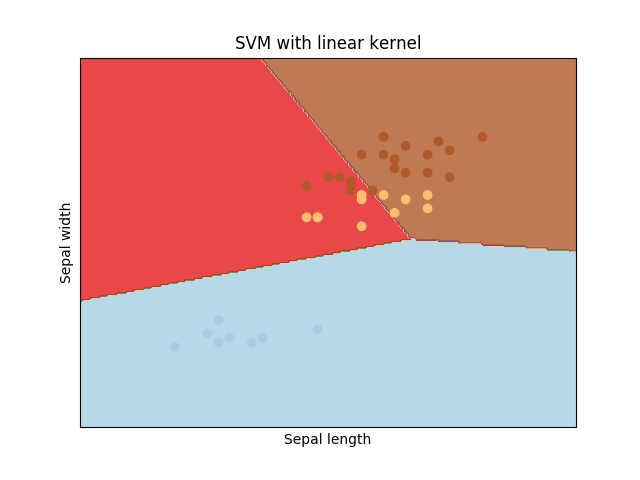
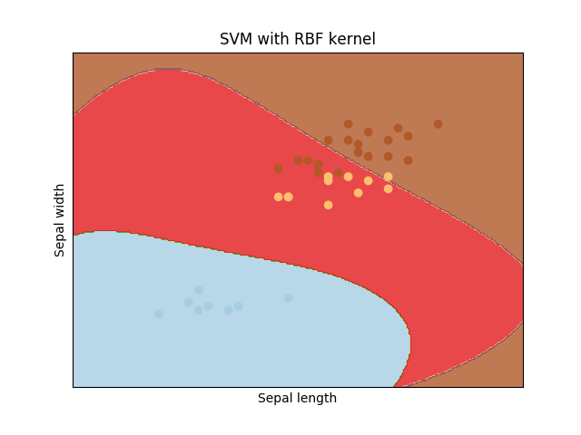
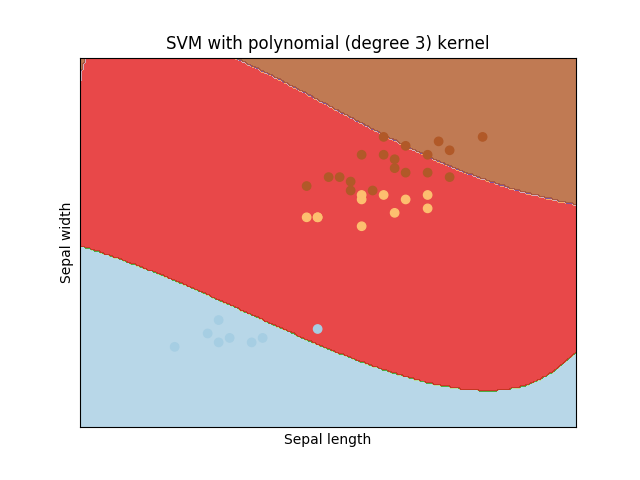
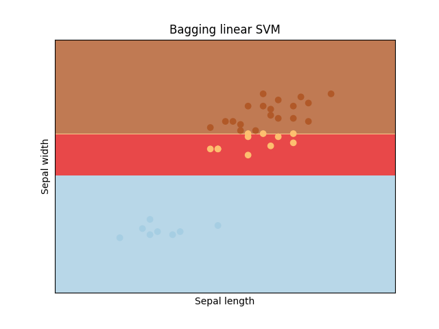
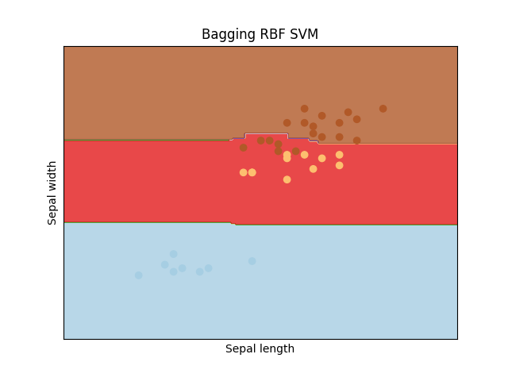
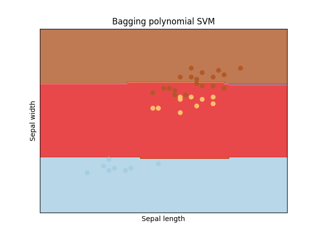
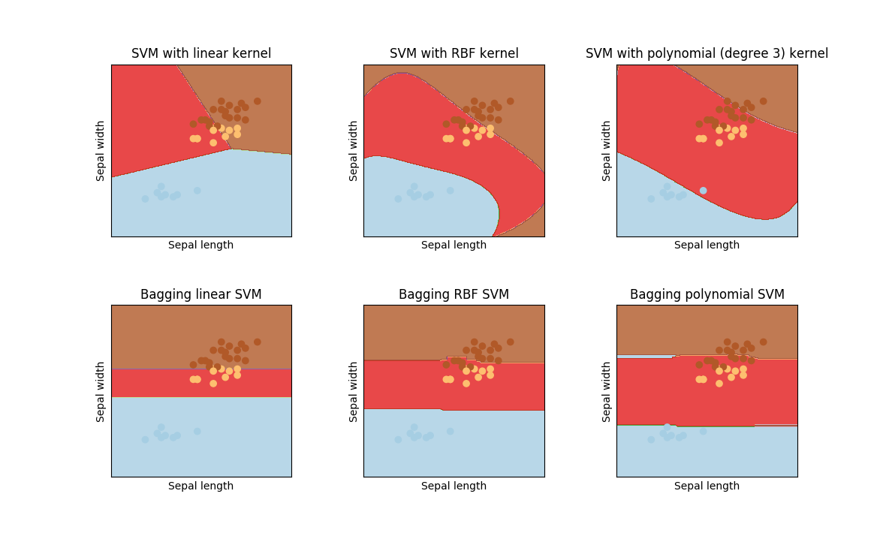

# <center> 作业四 </center>

### Problem 	
研究模型的性能,及改善模型的方法

1. 选择一个现成的数据集或自己创建一个数据集(如利用make_classification)

2. 选择一个模型(如kNN,回归,决策树...)

3. 探索模型单独工作的性能

4. 探索模型组合工作的性能(bagging或boosting)
	

### Solution 
1. 采用了常用的鸢尾花卉数据集，数据集包含150个数据，分为3类，每类50个数据，每个数据包含4个属性。可通过花萼长度，花萼宽度，花瓣长度，花瓣宽度4个属性预测鸢尾花卉属于（Setosa，Versicolour，Virginica）三个种类中的哪一类，其中的一个种类与另外两个种类是线性可分离的，后两个种类是非线性可分离的。为了更加方便的看到数据分类结果，这里选取了其中的两个属性：花萼长度和花萼宽度来进行预测，从而最后可以将数据点和预测结果展示到二维平面上。
2. 对于iris分类问题，由于数据集存在非线性可分离的种类，所以选用了SVM模型，通过选取不同的核函数进行映射，构造出超平面进行分类，并且引入了松弛变量来对非线性可分的数据进行分类。由于单个SVM本身就能达到相对不错的效果，所以为了到达弱分类器的效果，这里将惩罚系数设置的较小，从而弱化了分类器。在组合多个弱化的SVM后，则可以明显看到分类效果的提升。
3. 对单个的SVM分类器，惩罚系数设置为0.1，选取线性核、RBF核以及多项式核进行分类。
	- 线性核
	
	```python
	# 训练集上的分类效果：
		         precision    recall  f1-score   support
	     setosa       0.98      1.00      0.99        42
	 versicolor       0.86      0.77      0.81        39
	  virginica       0.76      0.84      0.80        31
	avg / total       0.88      0.88      0.87       112
	```
	```python
	# 测试集上的分类效果
		         precision    recall  f1-score   support
	     setosa       1.00      1.00      1.00         8
	 versicolor       0.55      0.55      0.55        11
	  virginica       0.74      0.74      0.74        19
	avg / total       0.74      0.74      0.74        38      

	
	```
	将测试用的数据点和分类情况可视化可得：
	<center>  </center>
	通过图像可以看出明显的“线性”分界，但是versicolor和virginica两类数据存在较多的错误预测，通过预测结果也可以看出两种分类的准确率较低，导致整体的准确率较低。   
	
	- RBF 核
	
	```python 
	# 训练集上的分类效果
	             precision    recall  f1-score   support
	
	       setosa       1.00      1.00      1.00        42
	   versicolor       0.81      0.90      0.85        39
	    virginica       0.85      0.74      0.79        31
	  avg / total       0.89      0.89      0.89       112
	```
	```python	     
	# 测试集上的分类效果 
	             precision    recall  f1-score   support
	
	     setosa       1.00      1.00      1.00         8
	 versicolor       0.62      0.91      0.74        11
	  virginica       0.93      0.68      0.79        19
	avg / total       0.86      0.82      0.82        38

	```
	将测试用的数据点和分类情况可视化可得：
	<center>  </center>
	通过图像可以看出，相比线性核，RBF核具有更强的“非线性”，能够相对更“贴合”数据，对versicolor和virginica两类数据的预测准确率均有提升，但versicolor种类的预测准确率依旧较低，与virginica之间的分界线依旧存在较多错误。   
	- 多项式核（degree = 3）
	
	```python
	# 训练集上的分类效果
	             precision    recall  f1-score   support
	     setosa       1.00      0.93      0.96        42
	 versicolor       0.68      1.00      0.81        39
	  virginica       1.00      0.52      0.68        31
	avg / total       0.89      0.84      0.83       112
	```
	```python
	# 测试集上的分类效果	
	             precision    recall  f1-score   support
	     setosa       0.98      0.88      0.93         8
	 versicolor       0.41      1.00      0.58        11
	  virginica       1.00      0.21      0.35        19
	avg / total       0.83      0.58      0.54        38

	```
	将测试用的数据点和分类情况可视化可得：
	<center>  </center>
	通过结果分析可以明显看出，多项式核对于setosa和virginica两种数据在训练集和数据集上都达到了很高的准确率，但对于较难区分的versicolor类数据，则有非常多的错误预测，导致最终平均的准确率相较于RBF核降低。
	
	- 通过不同核函数的对比可以看出，RBF核和多项式核引入了非线性相比线性核达到了更好的分类效果，而多项式核对于不易分类的数据更加敏感，更容易出现预测错误。
	
4. 这里选用了bagging方法，首先通过20个相同的SVM模型进行预测:

	- 线性核 SVM bagging 

	```python
	# 测试集上的分类效果
	             precision    recall  f1-score   support
	
	     setosa       1.00      1.00      1.00         8
	 versicolor       1.00      1.00      1.00        11
	  virginica       1.00      1.00      1.00        19
	
	avg / total       1.00      1.00      1.00        38
	
	```
	将测试用的数据点和分类情况可视化可得：
	<center>  </center>
	可以预测结果中非常明显的看到，通过bagging预测的准确率得到了极大的提升，三个种类的测试数据的预测准确率均为100%，相比单个线性核的SVM，在不易分类的versicolor和virginica两种数据上都得到了很大的改善。从图像中也可以看出，分界线非常准确的分出了三类测试数据，并且更加规整。
	
	- RBF核 SVM bagging
	
	```python
	# 测试集上的分类效果	
	             precision    recall  f1-score   support
	
	     setosa       1.00      1.00      1.00         8
	 versicolor       0.65      1.00      0.79        11
	  virginica       1.00      0.68      0.81        19
	
	avg / total       0.90      0.84      0.84        38
	
	
	```
	将测试用的数据点和分类情况可视化可得：
	<center>  </center>
	通过分析预测结果可以看出，通过bagging整体预测的准确率也得到了提升，virginica类测试数据的准确率由85%提升到了100%，但另一方面versicolor种类的数据预测的准确率则有所下降，结合图像可以看到，RBF的非线性被bagging带来的效果减弱，没有能起到应有的分类效果。
	
	- 多项式核 SVM bagging
	
	```python 
	 # 测试集上的分类效果
	             precision    recall  f1-score   support
	
	     setosa       1.00      1.00      1.00         8
	 versicolor       0.52      1.00      0.69        11
	  virginica       1.00      0.47      0.64        19
	
	avg / total       0.86      0.74      0.73        38
	```
	将测试用的数据点和分类情况可视化可得：
	<center>  </center>
	可以看到相比单一的多项式核函数SVM，在setosa和virginica类测试数据的准确率依旧保持在100%的基础上，versicolor种类的数据预测的准确率得到部分提升，但同时和RBF核SVM的bagging类似，非线性被减弱。

#### Conclusion
对比单个SVM的分类预测结果和bagging SVM的分类预测结果可以看出，通过bagging预测的准确率得到了提升，但另一方面也存在非线性减弱的现象。
	<center>  </center>

#### Implementation
```python 

from sklearn import svm
from sklearn.ensemble import BaggingClassifier
from sklearn.metrics import classification_report
from sklearn.cross_validation import train_test_split
from sklearn.preprocessing import StandardScaler
from sklearn.datasets import load_iris
import matplotlib.pyplot as plt
import numpy as np

iris = load_iris()
print(iris.data.shape)

ss = StandardScaler()

data = iris.data[:,[0,2]]

# 划分为训练集,测试集
X_train, X_test, y_train, y_test = train_test_split(data, iris.target, test_size = 0.25, random_state = 33)
X_train = ss.fit_transform(X_train)
X_test = ss.transform(X_test)

# SVM 模型
C = 0.1
linear_svm = svm.LinearSVC(C=C).fit(X_train, y_train)
rbf_svm = svm.SVC(kernel='rbf', gamma=0.7, C=C).fit(X_train, y_train)
poly_svm = svm.SVC(kernel='poly', degree=3, C=C).fit(X_train, y_train)

y_pred = linear_svm.predict(X_train)
print(classification_report(y_train,y_pred, target_names = iris.target_names))
y_pred = rbf_svm.predict(X_train)
print(classification_report(y_train,y_pred, target_names = iris.target_names))
y_pred = poly_svm.predict(X_train)
print(classification_report(y_train,y_pred, target_names = iris.target_names))


# bagging集成
linear_svm_bagging = BaggingClassifier(
    svm.LinearSVC(C=C),
    n_estimators=20,         # 构造20个SVM模型
    bootstrap=True,
    max_samples=1.0,          # Bootstrap样本大小用所有实例
    bootstrap_features=True,
    max_features=0.7,         # Bootstrap特征使用70%,各模型不一样
    random_state=9)
linear_svm_bagging.fit(X_train,y_train)

rbf_svm_bagging = BaggingClassifier(
    svm.SVC(kernel='rbf', gamma=0.7, C=C),
    n_estimators=20,         # 构造20个SVM模型
    bootstrap=True,
    max_samples=1.0,          # Bootstrap样本大小用所有实例
    bootstrap_features=True,
    max_features=0.7,         # Bootstrap特征使用70%,各模型不一样
    random_state=9)
rbf_svm_bagging.fit(X_train,y_train)

poly_svm_bagging = BaggingClassifier(
    svm.SVC(kernel='poly', degree=3, C=C),
    n_estimators=20,         # 构造20个SVM模型
    bootstrap=True,
    max_samples=1.0,          # Bootstrap样本大小用所有实例
    bootstrap_features=True,
    max_features=0.7,         # Bootstrap特征使用70%,各模型不一样
    random_state=9)
poly_svm_bagging.fit(X_train,y_train)


# 在测试集上预测
y_pred = linear_svm.predict(X_test)
print(classification_report(y_test,y_pred, target_names = iris.target_names))

y_pred = rbf_svm.predict(X_test)
print(classification_report(y_test,y_pred, target_names = iris.target_names))

y_pred = poly_svm.predict(X_test)
print(classification_report(y_test,y_pred, target_names = iris.target_names))


y_pred = linear_svm_bagging.predict(X_test)
print(classification_report(y_test,y_pred, target_names = iris.target_names))

y_pred = rbf_svm_bagging.predict(X_test)
print(classification_report(y_test,y_pred, target_names = iris.target_names))

y_pred = poly_svm_bagging.predict(X_test)
print(classification_report(y_test,y_pred, target_names = iris.target_names))

#
# 创建网格，以绘制图像
h = .02  # 网格中的步长
x_min, x_max = X_test[:, 0].min() - 1, X_test[:, 0].max() + 1
y_min, y_max = X_test[:, 1].min() - 1, X_test[:, 1].max() + 1
xx, yy = np.meshgrid(np.arange(x_min, x_max, h),
                     np.arange(y_min, y_max, h))

# 图的标题
titles = ['SVM with linear kernel',
          'SVM with RBF kernel',
          'SVM with polynomial (degree 3) kernel',
          'Bagging linear SVM',
          'Bagging RBF SVM',
          'Bagging polynomial SVM']


for i, clf in enumerate((linear_svm, rbf_svm, poly_svm, linear_svm_bagging, rbf_svm_bagging, poly_svm_bagging)):
    # 绘出决策边界，不同的区域分配不同的颜色
    plt.subplot(2, 3, i + 1) # 创建一个2行2列的图，并以第i个图为当前图
    plt.subplots_adjust(wspace=0.4, hspace=0.4) # 设置子图间隔

    Z = clf.predict(np.c_[xx.ravel(), yy.ravel()]) #将xx和yy中的元素组成一对对坐标，作为支持向量机的输入，返回一个array

    # 把分类结果绘制出来
    Z = Z.reshape(xx.shape) #(220, 280)
    plt.contourf(xx, yy, Z, cmap=plt.cm.Paired, alpha=0.8) #使用等高线的函数将不同的区域绘制出来

    # 将训练数据以离散点的形式绘制出来
    plt.scatter(X_test[:, 0], X_test[:, 1], c=y_test, cmap=plt.cm.Paired)
    plt.xlabel('Sepal length')
    plt.ylabel('Sepal width')
    plt.xlim(xx.min(), xx.max())
    plt.ylim(yy.min(), yy.max())
    plt.xticks(())
    plt.yticks(())
    plt.title(titles[i])

plt.show()

```
