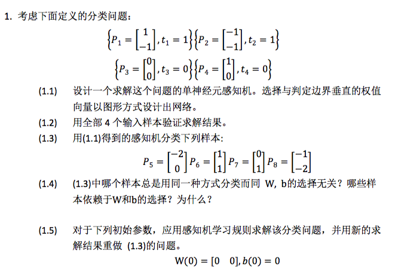
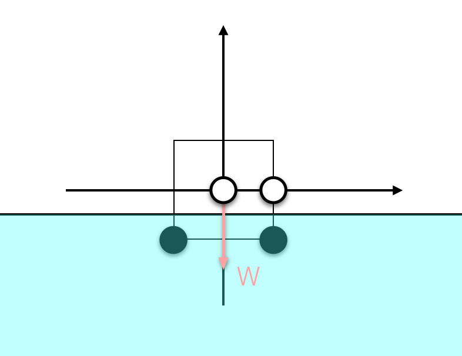
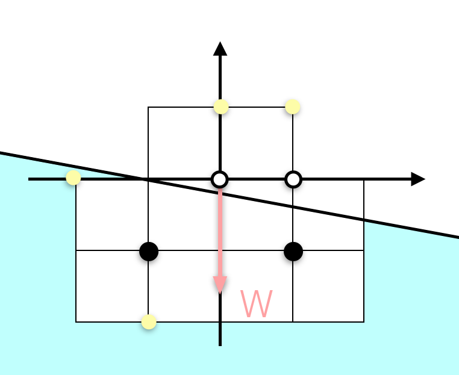
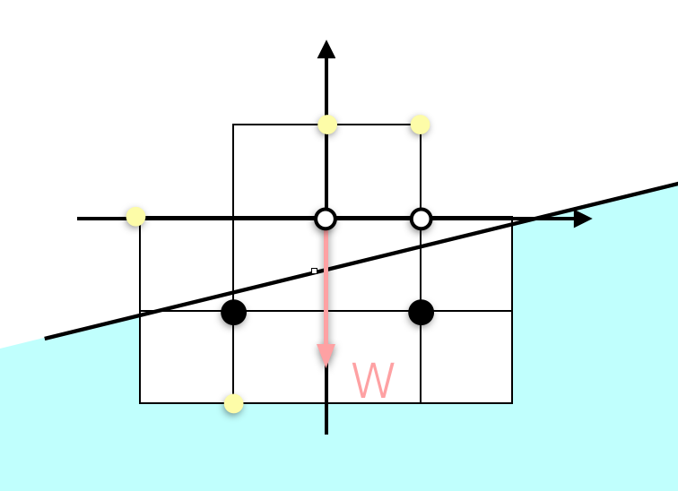
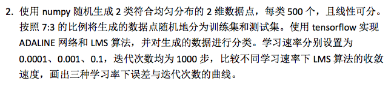
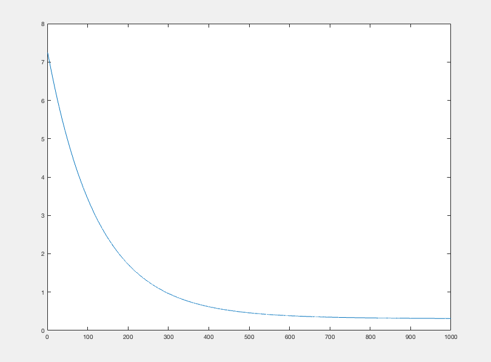
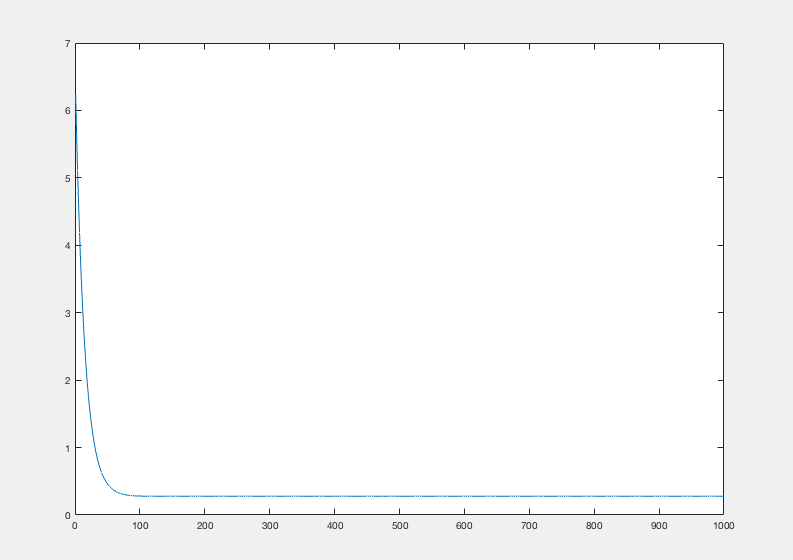

# <center> 第一次作业 </center>


 

##### Solution

<center>  </center> 

(1.1) 根据数据我们可以直接得到weight vector $[0,-1]$,由 $Wp + b = 0$ 可得如图所示的Decision boundary, 即网络为
<center>  </center> 
<center> $a = hardlims􏰄([0\ -1] p + (-0.5)􏰅)$ </center>
<center> $w_{1,1} = 0, w_{1,2} = -1, b = -0.5$ </center>

Python实现代码即：

```python
def multiple(l1,l2):
    result = mat(l1)*mat(l2).T
    return result[0,0]
    
def hardlims(x):
    if x >= 0:
        return 1
    else:
        return 0   
def predict(data,W,b):
    return hardlims(multiple(W,data) + b)
    
# a = predict(p,W,b)
```

(1.2) 分别带入可得：

 - $P_1$: $a = hardlims􏰄([0\ -1][1\ -1]  + (-0.5)􏰅) = 1 = t_1 $
 - $P_2$: $a = hardlims􏰄([0\ -1][-1\ -1]  + (-0.5)􏰅) = 1 = t_2 $
 - $P_3$: $a = hardlims􏰄([0\ -1][0\ 0]  + (-0.5)􏰅) = 0 = t_3 $
 - $P_4$: $a = hardlims􏰄([0\ -1][1\ 0]  + (-0.5)􏰅) = 0 = t_4 $


(1.3) 分别带入可得：

 - $P_5$: $a = hardlims􏰄([0\ -1][-2\ 0]  + (-0.5)􏰅) = 0$
 - $P_6$: $a = hardlims􏰄([0\ -1][1\ 1]  + (-0.5)􏰅) = 0$
 - $P_7$: $a = hardlims􏰄([0\ -1][0\ 1]  + (-0.5)􏰅) = 0$
 - $P_8$: $a = hardlims􏰄([0\ -1][-1\ -2]  + (-0.5)􏰅) = 1$
 
(1.4) 样本$P_6,P_7,P_8$总是用同一种方式进行分类与W,b的选择无关，但$P_5$依赖于W,b的选择。

当W,b的选择能够形成这样的Decision boundary时，$P_5$会被分类为1:
<center>  </center> 
当W,b的选择能够形成这样的Decision boundary时，$P_5$会被分类为0: 
<center>  </center> 
而由于$P_1,P_2,P_3,P_4$的限制，$P_6,P_7,P_8$则不会出现这种情况，

(1.5) 首先用Python实现学习算法：

```python
from numpy import *

def hardlims(x):
    if x >= 0:
        return 1
    else:
        return 0

def multiple(l1,l2):
    result = mat(l1)*mat(l2).T
    return result[0,0]

def train(train_data,W,b):
    flag = 0
    for train_datum in train_data:
        t = train_datum[1]
        a = predict(train_datum[0],W,b)
        e = t - a
        flag = flag + abs(e)
        W = map(lambda x,y: x + y, W, map(lambda x: e*x, train_datum[0]))
        b = b + e
    return W,b,flag

def test(test_data, W,b):
    for test_datum in test_data:
        a = predict(test_datum[0],W,b)
        test_datum[1] = a


def predict(data,W,b):
    return hardlims(multiple(W,data) + b)


def main():
    W = [0,0]
    b = 0
    train_data = [[[1,-1],1],[[-1,-1],1],[[0,0],0],[[1,0],0]]
    test_data = [[[-2,0],-1],[[1,1],-1],[[0,1],-1],[[-1,-2],-1]]
    iteration_num = 0
    flag = 1
    while(flag):
        flag = 0
        W,b,flag = train(train_data,W,b)
        test(test_data,W,b)
        print 'Iteration No: ', iteration_num
        print '*** W: ', W, '; b:' ,b
        print '*** test data and result: ', test_data
        iteration_num = iteration_num + 1
        
main()

```

为了避免得到不一致的结果，这里没有随机改变每次迭代的样本的顺序。
当迭代至所有训练数据都正确时，停止迭代，可以得到如下结果

```
Iteration No:  0
*** W:  [0, 0] ; b: -1
*** test data and result:  [[[-2, 0], 0], [[1, 1], 0], [[0, 1], 0], [[-1, -2], 0]]
Iteration No:  1
*** W:  [0, -1] ; b: -2
*** test data and result:  [[[-2, 0], 0], [[1, 1], 0], [[0, 1], 0], [[-1, -2], 1]]
Iteration No:  2
*** W:  [0, -2] ; b: -2
*** test data and result:  [[[-2, 0], 0], [[1, 1], 0], [[0, 1], 0], [[-1, -2], 1]]
Iteration No:  3
*** W:  [0, -2] ; b: -2
*** test data and result:  [[[-2, 0], 0], [[1, 1], 0], [[0, 1], 0], [[-1, -2], 1]]
```

我们可以得到最终的训练结果和预测结果：$w_{1,1} = 0, w_{1,2} = -2, b = -2$

对 $P_5,P_6,P_7,P_8$ 的预测分类结果分别为: $0,0,0,1$

---	



##### Solution
比较结果：  
学习速率为0.0001时，需要更多的迭代次数，收敛速度会更慢，最后的时间会很长；  
学习速率为0.001时，收敛较快，并且得到了很好的结果
学习速率为0.1时，误差训练变的非常巨大，无法收敛，速度过快
不同学习率下误差与迭代次数的曲线：
learning_rate = 0.0001  
<center>  </center> 
learning_rate = 0.001  
<center>  </center> 
learning_rate = 0.1  
<center>全都是nan……</center> 
##### 具体实现

```python
import tensorflow as tf
import numpy as np

#首先生成随机数据，按照7：3比例分成训练集和测试集，同时保证最后选出的点满足顺序随机。

data_x1 = np.random.uniform(2,3,1000)
data_x2 = np.random.uniform(12,13,1000)
data_y1 = np.random.uniform(15,13,1000)
data_y2 = np.random.uniform(30,20,1000)

train_output = [] 
test_output = []
train_result_output = []
test_result_output = []

rands = np.random.rand(1000)
for i in range(700):
        if (rands[i] > 0.5):
                train_output.append([data_x1[i],data_y1[i]])
                train_result_output.append(1)
        else:
                train_output.append([data_x2[i],data_y2[i]])
                train_result_output.append(2)

for i in range(700,1000):
        if rands[i] > 0.5:
                test_output.append([data_x1[i],data_y1[i]])
                test_result_output.append(1)
        else:
                test_output.append([data_x2[i],data_y2[i]])
                test_result_output.append(2)

##################################################
# 设定不同的学习速率，直接用tf的梯度优化根据上面的数据进行训练，error直接采用求和
learning_rate = 0.001

p = tf.placeholder(tf.float32,[1,2])
t = tf.placeholder(tf.float32,[1])

W = tf.Variable(tf.zeros([1,2]),name="weights")
b = tf.Variable(tf.zeros([1]),name="bias")

a = tf.matmul(W,tf.transpose(p))+b

errors = []
error_output = open('./error_'+str(learning_rate)+'.txt','w+')

loss = tf.reduce_sum(tf.square(t - a))
train_step = tf.train.GradientDescentOptimizer(learning_rate).minimize(loss)

init = tf.global_variables_initializer()
with tf.Session() as sess:
    sess.run(init)
    for num_step in range(1000):
        error = 0
        for i in range(700):
                sess.run(train_step,feed_dict={p: [train_output[i]], t: [train_result_output[i]]})
        for i in range(300):
                error = error + sess.run(loss,feed_dict={p: [test_output[i]], t: [test_result_output[i]]})
        print(error)
        error_output.write(str(error) + '\n')
        errors.append(error)


error_output.close()
   

```

生成数据：

```
2.78367181674 13.8403567666
2.40736283905 14.1758494736
12.0497496134 26.0219919454
12.3131572188 25.3556019681
12.27868795 26.1482612538
12.9007246382 20.1744433078
2.89716228303 14.0159392435
12.4833158684 22.8260461442
12.5039343869 22.8867040113
2.06403659232 13.002446943
12.2986022121 28.6640366263
......

```


