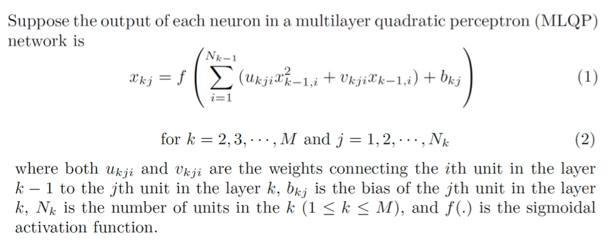

# <center> 第二次作业 </center>

  

##### Problem
1. 试推导训练上述MLQP的下列两种BP算法:   
  a) 批量学习; b) 在线学习  
2. 编程实现问题1)中的训练MLQP的在线BP算法
3. 用含有一层中间层(中间层的神经元数目可设成10)的两层MLQP学习双螺旋问题,比较在三种不同学习率下网络的训练时间和决策面


##### Solution
1 . 仿照推导训练MLP的BP算法，使用下面的“notation”（其中用x取代了y，用y取代了v, 用f取代了$\varphi$）:  
   $e_j(n) = d_j(n) - x_j(n) \tag{1} $  
   $\mathcal{E}(n) = \frac{1}{2} \sum_{j \in \mathbb{C}}  e_j^2(n) \tag{2}$   
   $y_{kj}(n) = \sum_{i=1}^{N_{k-1}}(u_{kji}(n)x^2_{k-1,i}(n) + v_{kji}(n)x_{k-1,i}(n)) + b_{kj}(n) \tag{3}$  
   $x_{kj}(n) = f(y_{kj}(n)) \tag{4}$    
   由链式规则：   
   $\frac{\partial \mathcal{E}(n)}{\partial u_{ji}} = \frac{\partial \mathcal{E}(n)}{\partial e_j(n)}\frac{\partial e_j(n)}{\partial x_j(n)}\frac{\partial x_j(n)}{\partial y_j(n)}\frac{\partial y_j(n)}{\partial u_{ji}} \tag{5}$    
   $\frac{\partial \mathcal{E}(n)}{\partial v_{ji}} = \frac{\partial \mathcal{E}(n)}{\partial e_j(n)}\frac{\partial e_j(n)}{\partial x_j(n)}\frac{\partial x_j(n)}{\partial y_j(n)}\frac{\partial y_j(n)}{\partial v_{ji}} \tag{6}$    
   对(2)两边求偏微分可得：  
   $\frac{\partial \mathcal{E}(n)}{\partial e_j(n)} = e_j(n) \tag{7} $   
   对(1)两边求偏微分可得：
   $\frac{\partial e_j(n)}{\partial x_j(n)} = -1 \tag{8}$  
   对(4)两边求偏微分可得：  
   $\frac{\partial x_j(n)}{\partial y_j(n)} = f'_j(y_j(n)) \tag{9}$
   对(3)两边求偏微分可得：    
   $\frac{\partial y_j(n)}{\partial u_{ji}(n)} = x_j^2(n) \tag{10}$  
   $\frac{\partial y_j(n)}{\partial v_{ji}(n)} = x_j(n) \tag{11}$  
   综上：   
   $\frac{\partial \mathcal{E}(n)}{\partial u_{ji}(n)} =  -e_j(n)f'_j(y_j(n))x_j^2(n) \tag{12}$      
   $\frac{\partial \mathcal{E}(n)}{\partial v_{ji}(n)} =  -e_j(n)f'_j(y_j(n))x_j(n) \tag{13}$   
   由delta rule可以得到：  
   $\Delta u_{ji}(n) = -\eta \frac{\partial \mathcal{E}(n)}{\partial u_{ji}(n)} \tag{14}$   
   $\Delta v_{ji}(n) = -\eta \frac{\partial \mathcal{E}(n)}{\partial v_{ji}(n)} \tag{15}$   
   分别带入到(12),(13)可得：  
   $\Delta u_{ji}(n) = -\eta \delta_j(n)x_j^2(n) \tag{16}$    
   $\Delta v_{ji}(n) = -\eta \delta_j(n)x_j(n) \tag{17}$   
   其中:
   $\delta_j(n) = -{\frac{\partial \mathcal{E}(n)}{\partial y_j(n)}}  = e_j(n)f'_j(y_j(n)) \tag{18}$  
   为了推导至中间层，我们令  
   $\delta_j(n) = -{\frac{\partial \mathcal{E}(n)}{\partial x_j(n)}} \frac{\partial x_j(n)}{\partial y_j(n)} = -{\frac{\partial \mathcal{E}(n)}{\partial x_j(n)}}f'(y_j(n)) \tag{20}$  
   由链式规则可得：  
   $\frac{\partial \mathcal{E}(n)}{\partial x_j(n)} = \sum_ke_k \frac{\partial e_k(n)}{\partial x_j(n)} = \sum_ke_k \frac{\partial e_k(n)}{\partial y_k(n)} \frac{\partial y_k(n)}{\partial x_j(n)} \tag{21}$  
   而   
   $e_k(n) = d_k(n) - x_k(n) = d_k(n)-f(y_k(n)） \tag{22}$
   故  
   $\frac{\partial e_k(n)}{\partial y_j(n)} = -f'(y_k(n)) \tag{23}$
  	又  
  	$y_k(n) = \sum_{j=0}^m(u_{kj}(n)x_j^2(n)+v_{kj}(n)x_j(n)) \tag{24}$
   可得  
  	$\frac{\partial y_k(n)}{\partial x_j(n)} = 2u_{kj}(n)x_j(n) + v_{kj}(n) \tag{25}$
   带入(21)可得  
   $\frac{\partial \mathcal{E}(n)}{\partial x_j(n)} = \sum_k e_k(n) f'(y_k(n))(2u_{kj}(n)x_j(n) + v_{kj}(n)) \\ = -\sum_k \delta_k(n)(2u_{kj}(n)x_j(n) + v_{kj}(n)) \tag{26}$
   综上  
   $\delta_j(n) = -f'(y_j(n))\sum_k \delta_k(n)(2u_{kj}(n)x_j(n) + v_{kj}(n)) \tag{27}$
   
   a) 批量学习(Batch mode)时  
   在以上推导的基础上，$\mathcal{E}$重新定义
   $\mathcal{E}_{av} = \frac{1}{2N}\sum_{n=1}^N \sum_{j \in \mathbb{C}} e_j^2(n) \tag{28}$    
   用Batch delta rule可得:  
   $\Delta u_{ji} = -\eta \frac{\partial \mathcal{E}_{av}}{\partial u_{ji}} = -\frac{\eta}{N} \sum_{n=1}^Ne_j(n) \frac{\partial e_j(n)}{\partial u_{ji}} \tag{29}$   
   $\Delta v_{ji} = -\eta \frac{\partial \mathcal{E}_{av}}{\partial v_{ji}} = -\frac{\eta}{N} \sum_{n=1}^Ne_j(n) \frac{\partial e_j(n)}{\partial v_{ji}} \tag{30}$ 
   用新的$\Delta u_{ji}$和$\Delta v_{ji}$带入到上面的推导过程中，即可得到MLQP批量学习的BP算法：
   $\delta_j(n) = -{\frac{\partial \mathcal{E}(n)}{\partial y_j(n)}}  = \frac{1}{N} \sum_{n=1}^N e_j(n)f'_j(y_j(n)) \tag{31}$ 
   中间层:
   $\delta_j(n) = - \frac{1}{N} \sum_{n=1}^N f'(y_j(n))\sum_k \delta_k(n)(2u_{kj}(n)x_j(n) + v_{kj}(n)) \tag{32}$

   b) 在线学习(Sequential mode)时  
   如上推导 
   $\delta_j(n) = -{\frac{\partial \mathcal{E}(n)}{\partial y_j(n)}}  = e_j(n)f'_j(y_j(n)) \tag{18}$   
   中间层:    
   $\delta_j(n) = -f'(y_j(n))\sum_k \delta_k(n)(2u_{kj}(n)x_j(n) + v_{kj}(n)) \tag{27}$


<p><br></br></p>

--- 


2 . 算法实现还是采用了Python语言，通过直接模拟前向传播和反向传播两个过程，来进行预测结果和优化权值。在上述MLQP推导过程上，加入了slide中阐述的momentum机制，在梯度相同时加快收敛速度：

```python 
def backPropagaion(...)
...
            for j in xrange(len(delta)):
                self.last_u[-1 - j] = -self.learning_rate * (delta[j] * np.multiply(x[-2 - j], x[-2 - j]).T + self.momentum * self.last_u[-1 - j])
                self.last_v[-1 - j] = -self.learning_rate * (delta[j] * x[-2 - j].T + self.momentum * self.last_v[-1 - j])
                self.last_b[-1 - j] = -self.learning_rate * (delta[j] + self.momentum * self.last_b[-1 - j])
...
```

<p><br></br></p>
---

3 . 实现：基于(2)中实现的MLQP的BP算法，在（2）的基础上通过更改u和v矩阵结构直接构建中间层为10个节点的网络，然后通过测试数据得到测试误差，最后对均匀分布的点阵进行预测，通过[-1,1]x[-1,1]中的10000个点的预测结果来大致得到训练出来的决策面形状:

```python
def main():
...
    # 绘制决策面
    p_x = np.array(range(-100,100,1))
    p_x = p_x / 100.0
    p_y = p_x
    px = []
    py = []
    colors = []

...
    for x in p_x:
        for y in p_y:
            if (model.sim(np.mat([x,y]).transpose())) > 0.5:
                px.append(x)
                py.append(y)
                colors.append('b')
            else:
                px.append(x)
                py.append(y)
                colors.append('r')
    ax1.scatter(px, py, c=colors, s=1, marker=',')
    plt.show()
...
```  

结果：这里均采用了训练至误差小于5e-5后停止训练的方式，以此来比较三种学习速率的收敛时间以及最后的分界面：


学习速率为0.5时：


  
<center> 分界面 </center>

  
<center> 错误率随迭代次数变化 </center>

 
<center> 运行时间 </center>


学习速率为1时：

  
<center> 分界面 </center>

  
<center> 错误率随迭代次数变化 </center>

 
<center> 运行时间 </center>


学习速率为1.5时：

  
<center> 分界面 </center>

  
<center> 错误率随迭代次数变化 </center>

 
<center> 运行时间 </center>

##### Conclusion 
通过对分界面的比较可以看出，学习速率为0.5时得到的分界面更加均匀并且光滑，学习速率为1.5时得到的分界面会存在拐角等不平滑的地方，整体上看准确性会低于0.5的时候，而1的时候介于中间。  
通过错误率与迭代次数的曲线可以看出，收敛速度与学习速率成整相关，1.5时收敛速度很快，而0.5时在开始阶段需要几乎多一倍的时间来达到相同的收敛效果。  
运行时间也进一步反应了上述结论。   
很明显能够带来启发，在实际应用中，能够及时调节学习速率将同时兼顾效率和准确率。 
