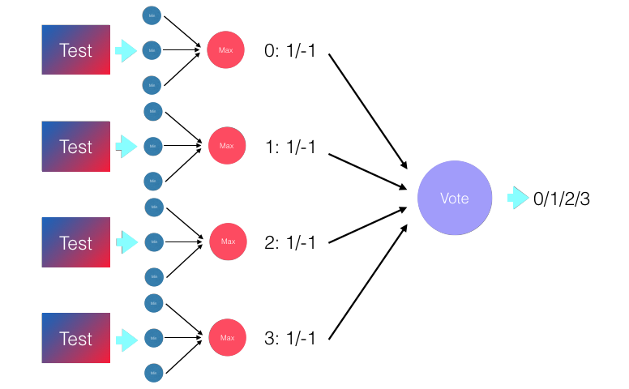
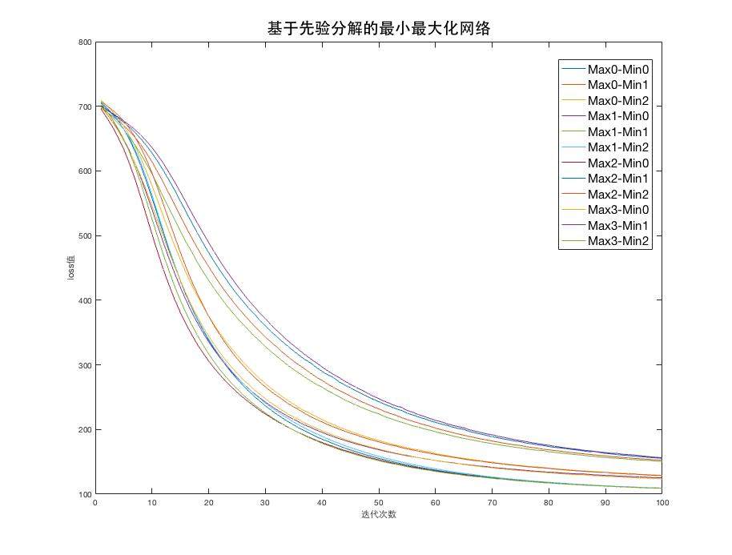

# <center> 工科创4J 大作业报告 </center>

### 摘要
题目要解决的是一个基于脑电情绪识别的四分类问题，通过 SEED-4 数据集的子集，根据对脑电特征数据集的学习，对平静、悲伤、恐惧和高兴四种情绪进行分类。   
整体上按照题目的要求进行了逐一实现：
  
- 使用 tensorflow 构建全连接网络,直接学习
- 用最小最大模块化网络解决上述问题,用随机方式分解原问题,每个子问题用 (1)中全连接网络学习,每个子问题采用1对多模式，训练过程使用多进程实现
- 同上，但是基于先验分解原问题  
- 给出上述分类器的分类混淆矩阵,F1 值以及测试准确率随迭代次数变化 的曲线,并分析了哪种分类器分类性能最好，四类情绪识别精度如何，哪类情绪容易区分，哪类情绪不容易区分
- 比较了全连接网络与最小最大模块化全连接网络的训练时间和分类时间
- 尝试了LSTM对问题进行处理  

最终结果MLP达到了60%左右的正确率，M3网络达到了65%左右的准确率，并且对结果进行了进一步分析。

小组成员及分工为：  

- Me   
	分工：(1-5) 全连接和最大最小化进行预测、分析 及 对应部分报告
- Another boy    
	分工:（6加分项） 使用LSTM进行预测 及 对应部分报告  

	
-- 
	
### 方法􏰉描述
1. 整体上采用了最基本的全连接网络，按照TensorFlow中常用的方式设置输入层，隐藏层以及输出层，由于数据量较小，所以不断使用训练集进行迭代训练，不过这也导致了过拟合的现象严重，所以一方面对数据进行预处理，将数据映射到[-1,1]的区间上，另一方面添加了L2正则项，在不断尝试之后，激活函数选用了sigmoid函数，损失函数采用交叉熵，优化方式采用随机梯度下降，隐藏层被缩减至一层并且采用尽可能少的节点(40个)，正则项的  $\lambda$ 参数设置为0.8，在不断训练之后能够在训练集和测试集上均收敛，达到相对不错的效果。
2. 在1的基础上，首先将数据进行处理，将四分类数据根据类别分别处理为一对多的形式，针对每个类别分成对应的正类和负类:
<center> </center> 
每个最小最大化(M3)网络对每一个类进行学习，最终对于测试数据由4个M3网络进行正类和负类的判定，通过综合所有结果进行判断。
由于采用了随机分解原问题的方式，所以每个Min模块下的子网络的训练数据不需要根据负类的类别进行特别安排：
<center> </center> 
在最小化模块的基础上，通过最大化模块对最小化模块的结果进行处理，得到对属于该类别正负类的判断：
<center> </center> 
其中对于min模块中子网络的训练以及分类可以进行完全并行化的处理，通过multiprocessing库中的进程池，每个训练过程单独运行一个进程：  
<center> </center> 
并且可以将每一个进程运行到一个核上：
<center> </center>    
对比串行计算时，CPU的占用情况：
<center> </center> 
可以明显看出并行计算带来的效果。  
对于每个类别训练出的最小最大化网络，需要通过一个vote操作来判断是否有M3网络判断为正类，则对应的M3网络类别即为该数据的预测类别：
<center> </center> 
经过多次试验选取了max\_num = 4, min\_num = 3 的结构，子网络的数据集大小为1000，有重叠
3. 和2的方式基本相同，但是基于先验进行问题分解，故对最小化模块进行训练的数据集需要保证来自同样的类别，即同一个模块中负类类别均相同：
<center> </center> 
其他部分与2相同。
4. 混淆矩阵、F1值只需要对最后预测测试数据得到的数据结果进行分析即可，对于1中的全连接网络，得到测试准确率与迭代次数的关系只需要每次迭代时进行预测并将预测输出即可，对于采用了多进程的最小最大化网络，由于各个进程之间迭代速度存在差异，并且每次预测都需要min-max操作和vote操作，所以采用了将迭代过程中的预测结果暂存，当训练结束后，再对存下来的中间结果进行计算，来得到测试准确率与迭代次数的关系。   
5. 对于训练时间与分类时间，由于网络达到收敛的准确点难以判断，而胡乱的时间输出本身就会干扰正常的执行时间，故没有一个精确的测量方式能够获得准确的训练至收敛的时间，对于最小最大化网络，更是包含了多个子网络，各个子网络的训练时间存在差别，并且涉及到了多进程，会受到操作系统环境的诸多影响，所以基本上无法测定精确值，但是通过大致的时间节点以及迭代次数，即可明显的分辨出两者训练时间的差别。对于分类时间，由于均为同样的网络，故可以明显进行比较。
6. 这里采用了LSTM的方式，之所以选择LSTM是因为，我们认为脑电信号中包含了很重要的时序信息，直接通过MLP等方式是无法体现出时序特点的。其次，LSTM虽然具有能够继承先前信息的特性，但是我们也发现，对于输入序列的长度过长时，LSTM也是存在缺陷的，对于过长的序列，信息的重叠会导致最开始的信息的特性会逐渐消失。      
因为给出的数据格式为N*310，想要保持时间特性，第一步便是将所有的数据按照实验进行分类，而非按照数据采样点进行分类。需要提及的是因为数据集不包含是第几次实验这一信息，所以在这一点上，我们只能根据Label进行划分，将具有连续的Label的数据认为是同一个实验。    
在经过对数据进行处理后，因为Tensorflow的静态图特性，TF版本的LSTM并不支持对边长Sequence 的处理，如果想要处理需要进行Padding，以及进行Mask的设置，让Sequence 对应的LSTM Cell的输出计算误差。

--

### 程序设计􏰉描述
1. 全连接网络

	```python
	
	### 首先导入相关模块
	import tensorflow as tf
	from tensorflow.contrib import layers
	...
	
	### 定义从数据集中随机获取指定大小的batch
	def next_batch(data, label, batch_size):
		...
	    np.random.shuffle(index)
	    ...
	    return batch_data,batch_label
	
	### 将label转换为onehot数据格式
	def onehot(labels, units):
		...
	    return onehot_labels
	
	### 对数据进行预处理，映射到[-1,1]区间上
	def normalize(data, base):
		...
	        
	### 主函数
	def main():
		# 首先将输出io初始化：
	    output_file = time.strftime("%H-%M-%S",time.localtime()) + '.txt'
	    loss_out = open('./loss_' + output_file, 'w')
	    ...
	    
	    # 设置参数
	    in_units = 310
		...
	    learning_rate = 0.0001
	    regular_ratio = 0.9
		...
	    
	    # 准备数据
	    data_file = './data.mat'
	    data = scio.loadmat(data_file)
	    train_data = data['train_de']
	    train_label = onehot(data['train_label_eeg'], out_units)
	    ...
	
		# 数据预处理
	    normalize(train_data, test_data)
	    normalize(test_data, test_data)

		## 搭建全连接网络
		sess = tf.InteractiveSession()
		
		# 采用了sigmoid激活函数
	    W1 = ...
	    b1 = ...
	    ...
	 
		# 定义正则项和损失函数，采用L2正则化和交叉熵
	    regular = layers.l2_regularizer(.5)(W1) + ...
	    loss = -tf.reduce_sum(y_ * tf.log(y)) + regular_ratio * ...	
	    # 设置优化方法，采用随机梯度下降法
	    train_step = tf.train.GradientDescentOptimizer...
	
		## 进行训练
	    tf.global_variables_initializer().run()
	    # 迭代100次基本收敛
	    for j in range(0,100):
	        for i in range(0, batch_num):
	        	# 获得batch
	            batch_x, batch_y = next_batch...  
	            train_step.run({x:batch_x, y_:batch_y})
	
	main()
	```
2. 基于随机分解的最小最大化网络

	```python
	### 导入相关模块	
	import multiprocessing as mp
	...
	
	### 定义从数据集中随机获取指定大小的batch
	def next_batch(data, label, batch_size):
		...
	    return batch_data,batch_label
	
	### 将label转换为onehot数据格式
	def onehot(labels, units):
		...
	    return onehot_labels
	    
	### 对数据进行预处理，映射到[-1,1]区间上
	def no	rmalize(data, base):
			...
		        
	### 移植1中的全连接网络，通过parameters来传入所需参数 
	def network(parameters):
	    train_data = parameters[0]
	    train_label = parameters[1]
		...
	
	### 对数据按照类别进行处理，产生基于随机或者基于先验的对应类别正负类数据
	def process_data(train_data, train_label, random):
		...
	    if (random):
	    	...
	        return data, labels
	    else:
	        ...
	        return pair_data, pair_labels
	        
	### 按照要求随机从训练集中选出各个子网络所需的指定大小数据集
	def random_generate_data(train_data, train_label, min_num, max_num, num):
		...
	    
	### 根据各个子网络返回的正负类判断得到最终结果
	def minmax(results, min_num, max_num, test_label):
	  	...    
	        
	### 主函数
	def main():    
	    # 设置参数
	    min_num = 3
	    max_num = 4
	    ...	    
	
		# 准备数据以及数据预处理
	    data_file = './data.mat'
	    data = scio.loadmat(data_file)
		...
	  
	 	# 生成基于随机分解的对应数据集
	    ovr_random_data, ovr_random_label = process_data(train_data, train_label, True)
	    ...
	
		# 对于每种类别训练最小最大化网络
	    for k in range(0,cate_num):
	        # 生成子网络所需数据集
	        M3_data, M3_label = prior_generate_data...
			...
			
			#准备进程池	
	        pool = mp.Pool()
			...
	        for i in range(0, max_num):
	            ...
	            for j in range(0, min_num):
	            	...
	            	# 新建子进程
	                processes[i] += [pool.apply_async(network, args=(parameters,))]
	                
	      	...
	                
			# 获取子进程返回值
	        for i in range(0, max_num):
	            for j in range(0, min_num):
	                temp = processes[i][j].get()
	                result[temp[0]][j] = temp[1]
	        ...	
	    
	    	# 根据各个子网络的结果进行最小最大化运算得到该类别的正负类判断
	        results[k] += minmax(result, min_num, max_num, test_label)

		# 根据各个类别的最小最大化网络的结果判断具体类别
	    final_result = []
		...
	
	main()
	```

3. 基于先验分解的最小最大化网络

	```python
	### 与2实现相同，但是子网络的数据集需要通过先验生成：
	def prior_generate_data(train_data, train_label, min_num, max_num, num):
	   ...
	    for i in range(0,max_num):
	       ...
	        for j in range(0,min_num):
	                datum, label = next_batch(train_data[j] , train_label[j], num)
	   ...
	```
4. 结果分析与统计   
	全连接网络：
		
	```python
			### 直接在每次迭代训练完成之后进行预测
			...
	        test_accur = accuracy.eval({x:test_data, y_:test_label})
	   	...
		
		### 计算混淆矩阵
	    for i in range(0,len(real)):
	        prediction_static[real[i]][prediction[i]] += 1
	    ...
	```
	
	最小最大化网络
	
	```python
		...
		### 根据保存下来的中间结果来计算出各个迭代之后的准确率
	    for w in range(0,len(results[0])):
	        ...
	        for i in range(0,len(real)):
	            prediction_static[real[i]][prediction[w][i]] += 1
	        ...
	        for i in range(4):
	            final_accuracy += prediction_static[i][i]
	       ...
	```
	
5. 训练时间与分类时间   

	```python
		...
		# 得到大致的训练时间以及分类时间
	  	begin = time.time()
	    for j in range(0,iter_num):
	        for i in range(0, batch_num):
	           ...
	    end = time.time()
	```
	
--
### 实验数据􏰉描述
数据使用的是 SEED-4 数据集的子集,包括 13 个被试,每个被试 1 次实验,共 13 组实验脑电数据，训练集包含 7293 个样本，测试集包含3770 个样本。脑电特征为微分熵 differential entropy(DE)特 征,共 62 个导联,特征􏰁取时间窗口为 4 秒,特征维度为 62*5=310 维。数据标号为四类情绪:平静、悲伤、恐惧和高兴,对应 0、1、2、3。  
--
### 实验结果分析
1. 全连接网络   
	首先根据迭代过程中的loss值绘制曲线：
	<center> </center>    
	对应的在训练数据集以及测试数据集上的准确率：
	<center> </center> 
	可以看出在迭代次数为200次时，loss值减小逐渐开始趋于稳定，在训练数据集上的准确率达到95%左右并且也开始趋于稳定，可以看出已经接近收敛。而对应的测试数据集上的准确率可以看出，在没有收敛时就已达到最高值，后面在趋于收敛的过程中反而逐渐下降，但最终也稳定在了60%左右。
	根据最终得到的结果计算混淆矩阵：
	
	```
		预测	0	1	2	3
	实际
	 0		545	 95  29  254
	 1		68   877 150 153
	 2		105  200 112 376
	 3		70   0   0   736
	``` 
	
	计算各个类对应的F1值：
	
	```
	0: p 0.692 r 0.59 F1 0.318
	1: p 0.748 r 0.703 F1 0.362
	2: p 0.385 r 0.141 F1 0.103
	3: p 0.485 r 0.913 F1 0.317
	```
	
2. 基于随机分解的最小最大化网络   
	首先根据各个子网络在迭代过程中的loss值绘制出曲线(max\_num = 4 , min\_num = 3 时):
	<center> </center>    
	在训练数据集上的准确率:
	<center> </center>
	可以看出在迭代次数为100次时，大部分子网络的loss值减小逐渐开始趋于稳定，虽然在训练数据集上的准确率波动较大，各个子网络准确率也存在差别，但是也开始在90%左右趋于稳定，已经接近收敛。	
	通过暂存下来的中间结果，回溯得到每次迭代之后的准确率：
	<center> </center>
	可以看出在70次迭代之后，基本就达到了最终的分类效果,之后波动在53%左右。  
	根据最终得到的结果计算混淆矩阵：
	
	```
		预测	0	1	2	3
	实际 
	 0		768  0    0   155
	 1		468  653  42  85
	 2		379  142  77  195
	 3		279  42   0   485
	``` 
	
	计算各个类对应的F1值：
	
	```
	0: p 0.405 r 0.832 F1 0.272
	1: p 0.78 r 0.523 F1 0.313
	2: p 0.647 r 0.097 F1 0.084
	3: p 0.527 r 0.602 F1 0.281
	```

3. 基于先验分解的最小最大化网络   
	首先根据各个子网络在迭代过程中的loss值绘制出曲线(max\_num = 4 , min\_num = 3 时):
	<center> </center>    
	在训练数据集上的准确率:
	<center> </center>
	可以看出在迭代次数为80次时，大部分子网络的loss值减小逐渐开始趋于稳定，在训练数据集上的准确率达到95%左右并且也开始趋于稳定，已经接近收敛。当迭代次数为100时，所有子网络的准确率都趋于稳定，接近100%。
	通过暂存下来的中间结果，回溯得到每次迭代之后的准确率：
	<center> </center>
	可以看出在20次迭代之后，基本就达到了最终的分类效果，在70次迭代之后进一步稳定在65%左右。
	根据最终得到的结果计算混淆矩阵：
	
	```
		预测	0	1	2	3
	实际
	 0		566  154  18  185
	 1		108  1049 0   91
	 2		87   200  140 366
	 3		79   56   0   671
	``` 
	
	计算各个类对应的F1值：
	
	```
	0: p 0.674 r 0.613 F1 0.321
	1: p 0.719 r 0.841 F1 0.388
	2: p 0.886 r 0.177 F1 0.148
	3: p 0.511 r 0.833 F1 0.317
	```
4. 对比各个分类器的结果，可以明显看出基于先验的最小最大化网络在全连接网络上们进一步提升了准确率，而基于随机的最小最大化网络由于存在随机造成了一部分子网络的数据集存在偏差，导致最终结果收到影响，降低了准确率。故基于先验的最小最大化网络分类器效果最好。  
	通过混淆矩阵以及各个类的F1值我们可以看出，四类情绪中，0、1、3类整体上均可以达到较好的分类效果，即平静，悲伤和高兴，其中1类区分效果最好，而2类即恐惧情绪整体上的分类效果均存在较大问题，极易分成其他类，较难区分。
5. 正如前面分析，由于全连接网络训练过程中，需要更多的迭代次数(200)来达到收敛，并且需要较多的数据(7329组)，而最小最大化网络中，各个子分类网络只需要100次迭代和一部分数据子集（1000组）即可达到收敛，并且各个子分类网络的训练完全并行，故最小最大化网络的训练时间(25s)小于全连接网络(41s).  
	而对于分类时间，由于最小最大化网络需要对每个子分类网络的结果进行进一步的vote，并且涉及到了综合多个网络的结果，故时间一定明显多于全连接网络，由于程序操作的复杂性以及环境影响，难以测得精确时间，但是粗略的时间测量明显表明了上述结论。  
6. 对于LSTM，网络的特征参数为
CLASS\_NUM=4,BATCH\_SIZE=13,HIDDEN\_SIZE=128,LEARNING\_RATE=1e-8,KEEP\_PROB=0.5
训练次数为500次，最终可以达到的准确率为33.5%左右。  
 数据经过分类后，训练数据维度为169xNx310，其中N为自己设置的Padding后的长度，测试集为68xNx310。经过训练后我们发现，存在的问题为训练数据过少，导致容易造成过拟合的情况，同时也存在神经网络训练结果容易过于波动的情况。
 
   
--

### 结论
1. 对于全连接网络，在经过由于训练数据较少，反复迭代训练存在过拟合的现象，因此在测试数据集上的准确率仍然较低。
2. 可以看出，基于先验最小最大化网络在1中的全连接网络基础上，通过多个利用部分数据集的子网络能够达到更优的分类效果，并且通过利用多进程并行训练过程，可以大大缩短训练时间。
而基于随机的最小最大化网络，由于随机的影响一些子网络分类器训练的时候带有偏差，在min的过程中直接掩盖了其他分类器的正确判断，造成了最终的分类结果反而低于了全连接网络，不过由于也采用了并行训练，整体训练时间还是少于全连接网络。
3. 四种情绪中，恐惧情绪较难分类，很容易表现出其他情绪的特征，所以在情绪数据的测量中，可能仍然存在未测量的隐藏部分。
4. 由于数据量较小并且情绪分类本身存在一定的不确定性，故几种方式都没有得到最优的结果，仍有较大探索空间。
	
--
### 参考文献
- Tensorflow 官方文档
-  4J课程 Slide 
- 《TensorFlow 实战》
- 《基于脑电信号的情绪识别》 朱嘉祎 吕宝粮 上海交通大学


