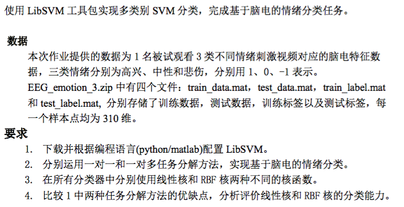

# <center> 第三次作业 </center>

<center>  </center> 

##### Solution
1. 采用了Python环境进行编程，环境搭建参照了官网教程，由于采用了Anaconda的环境，所以直接在make之后将svm.py和svmutil.py拷贝至对应的bin文件夹，把对应的.so库文件拷贝至对应的lib文件夹
2. libsvm本身的多分类就是采用了一对一的方式，所以可以直接使用:
	
	```python
	...
    # One versus One
    prob = svm_problem(train_label, train_data)
    OO_linear_model = svm_train(prob, linear_param)
    OO_RBF_model = svm_train(prob, RBF_param)
    OO_linear_predict = svm_predict(test_label, test_data, OO_linear_model)
    OO_RBF_predict = svm_predict(test_label, test_data, OO_RBF_model)
...
	```
	
	但是也可以手动模拟，通过对标签进行预处理只挑选出相应的两类标签，分别训练3个二分类svm，然后再对预测数据进行投票来得到结果：
	
	```python 
	...
    # One versus One
    train_data_12 = []
    train_data_13 = []
    train_data_23 = []
    
    train_label_12 = []
    train_label_13 = []
    train_label_23 = []
    
    for i in range(len(train_data)):
        if train_label[i] != -1:
            train_data_12 += [train_data[i]]
            train_label_12 += [train_label[i]]
        if train_label[i] != 0:
            train_data_13 += [train_data[i]]
            train_label_13 += [train_label[i]]
        if train_label[i] != 1:
            train_data_23 += [train_data[i]]
            train_label_23 += [train_label[i]]
    
    
    prob_12 = svm_problem(train_label_12, train_data_12)
    prob_13 = svm_problem(train_label_13, train_data_13)
    prob_23 = svm_problem(train_label_23, train_data_23)
    
    # linear
    OO_linear_12_model = svm_train(prob_12, linear_param)
    OO_linear_13_model = svm_train(prob_13, linear_param)
    OO_linear_23_model = svm_train(prob_23, linear_param)
    
    OO_linear_12_predict = svm_predict(test_label, test_data, OO_linear_12_model)
    OO_linear_13_predict = svm_predict(test_label, test_data, OO_linear_13_model)
    OO_linear_23_predict = svm_predict(test_label, test_data, OO_linear_23_model)
    
    # RBF
    OO_RBF_12_model = svm_train(prob_12, RBF_param)
    OO_RBF_13_model = svm_train(prob_13, RBF_param)
    OO_RBF_23_model = svm_train(prob_23, RBF_param)

    OO_RBF_12_predict = svm_predict(test_label, test_data, OO_RBF_12_model)
    OO_RBF_13_predict = svm_predict(test_label, test_data, OO_RBF_13_model)
    OO_RBF_23_predict = svm_predict(test_label, test_data, OO_RBF_23_model)
    
    print(OO_linear_12_predict)
    print(OO_linear_13_predict)
    print(OO_linear_23_predict)
    
    OO_linear_predict_label = []
    OO_RBF_predict_label = []
    for i in range(len(test_label)):
        OO_linear_predict_label += [vote(OO_linear_12_predict[0][i], OO_linear_13_predict[0][i], OO_linear_23_predict[0][i])]
        OO_RBF_predict_label += [vote(OO_RBF_12_predict[0][i], OO_RBF_13_predict[0][i], OO_RBF_23_predict[0][i])]
    
    OO_linear_predict_accuracy = 0
    OO_RBF_predict_accuracy = 0
    for i in range(len(test_label)):
        if OO_linear_predict_label[i] == test_label[i]: OO_linear_predict_accuracy += 1
        if OO_RBF_predict_label[i] == test_label[i]: OO_RBF_predict_accuracy += 1
    OO_linear_predict_accuracy /= len(test_label)
    OO_RBF_predict_accuracy /= len(test_label)
    ...
	```
	
	一对多分类则必须要手动进行模拟，首先对数据进行预处理，将非本类的其他数据统一标记为-1，然后训练各自的svm，最后根据预测时结果为1来自哪一个svm来判定具体的类别：
	
	```python 
	...
	# One versus Rest
    train_label_1 = list(map(lambda x:-1 if x != 1 else 1, train_label))
    train_label_0 = list(map(lambda x:-1 if x != 0 else 1, train_label))
    train_label__1 = list(map(lambda x:-1 if x != -1 else 1, train_label))
    prob_1 = svm_problem(train_label_1, train_data)
    prob_0 = svm_problem(train_label_0, train_data)
    prob__1 = svm_problem(train_label__1, train_data)


    # linear
    OR_linear_1_model = svm_train(prob_1, linear_param)
    OR_linear_0_model = svm_train(prob_0, linear_param)
    OR_linear__1_model = svm_train(prob__1, linear_param)

    OR_linear_1_predict = svm_predict(test_label, test_data, OR_linear_1_model)
    OR_linear_0_predict = svm_predict(test_label, test_data, OR_linear_0_model)
    OR_linear__1_predict = svm_predict(test_label, test_data, OR_linear__1_model)

    # RBF
    OR_RBF_1_model = svm_train(prob_1, RBF_param)
    OR_RBF_0_model = svm_train(prob_0, RBF_param)
    OR_RBF__1_model = svm_train(prob__1, RBF_param)

    OR_RBF_1_predict = svm_predict(test_label, test_data, OR_RBF_1_model)
    OR_RBF_0_predict = svm_predict(test_label, test_data, OR_RBF_0_model)
    OR_RBF__1_predict = svm_predict(test_label, test_data, OR_RBF__1_model)

    OR_linear_predict = []
    OR_RBF_predict = []

    for i in range(len(test_label)):
        OR_linear_predict += [check(OR_linear_1_predict[0][i], OR_linear_0_predict[0][i], OR_linear__1_predict[0][i], OR_linear_1_predict[2][i], OR_linear_0_predict[2][i], OR_linear__1_predict[2][i])]
        OR_RBF_predict += [check(OR_RBF_1_predict[0][i], OR_RBF_0_predict[0][i], OR_RBF__1_predict[0][i],OR_RBF_1_predict[2][i], OR_RBF_0_predict[2][i], OR_RBF__1_predict[2][i])]
...
	```
	但由于存在都预测为其他类，没有结果为1的情况，在判断时增加了比较相关系数的操作，都是-1的情况下，选取相关系数最大的svm：
	
	```python
	...
	def check(a,b,c,e,f,g):
    if (a == 1): return 1
    if (b == 1): return 0
    if (c == 1): return -1
    if ((e >= f) and (e >= g)): return 1
    if ((f >= e) and (f >= g)): return 0
    if ((g >= e) and (g >= f)): return -1
    return 1
...
	```
	最后输出混淆矩阵
	
	```python
	def confusion_matrix(predict,test):
    matrix = [[0,0,0],[0,0,0],[0,0,0]]
    predict = list(map(lambda x:int(x), predict))
    test = list(map(lambda x:int(x), test))
    for i in range(len(test)):
        if (predict[i] == test[i]):
            matrix[predict[i]+1][predict[i]+1] += 1
        else:
            matrix[test[i]+1][predict[i]+1] += 1
    print("Predict: \t 1 \t 0 \t -1 ")
    print("Real 1: \t " + str(matrix[0][0]) + '\t' + str(matrix[0][1]) + '\t' + str(matrix[0][2]))
    print("Real 0: \t " + str(matrix[1][0]) + '\t' + str(matrix[1][1]) + '\t' + str(matrix[1][2]))
    print("Real -1: \t " + str(matrix[2][0]) + '\t' + str(matrix[2][1]) + '\t' + str(matrix[2][2]))
    return matrix
	```
	


3.	在使用线性核时，一般不需要调参，为了和RBF核比较，这里明确出了默认参数，对于RBF核调参则非常重要，不同的c和g会有差别巨大的结果，libsvm提供了工具grid.py用于调参，但是由于libsvm本身只能一对一，所以一对多的时候需要多手动进行调节,一对一RBF核模式下在将g调小后准确率从68%提升到了80%：
	
	```python
	...
	# 线性核
    linear_param = svm_parameter('-t 0 -c 1 -b 1 -g 1')
    # RBF核
    RBF_param = svm_parameter('-t 2 -c 1 -b 1 -g 0.0001')
    ```

4. 通过混淆矩阵我们可以看到具体的分类结果如下：

	```python
	# One versus one:
	linear kernel:(68.22157434402332, 0.31778425655976678, 0.75218468043770181)
	Predict: 	 1 	 0 	 -1 
	Real 1: 	 0	109	0
	Real 0: 	 0	116	0
	Real -1: 	 0	0	118
	RBF kernel:(83.09037900874635, 0.16909620991253643, 0.79110796767060687)
	Predict: 	 1 	 0 	 -1 
	Real 1: 	 51	58	0
	Real 0: 	 0	116	0
	Real -1: 	 0	0	118
	
	# One versus rest:
	linear kernel:(68.22157434402332, 0.31778425655976678, 0.75218468043770181)
	Predict: 	 1 	 0 	 -1 
	Real 1: 	 0	109	0
	Real 0: 	 0	116	0
	Real -1: 	 0	0	118
	RBF kernel:(68.22157434402332, 0.31778425655976678, 0.75218468043770181)
	Predict: 	 1 	 0 	 -1 
	Real 1: 	 0	109	0
	Real 0: 	 0	116	0
	Real -1: 	 0	0	118
	```
	
	可以看到分类结果很相近，错误集中在了1的分类上，即高兴与中性的判别上，只有一对一RBF核模式下，达到了将近一半的准确率。
	从这个结果上看，一对一的效果是优于一对多的，但是由于数据的分类较少，所以没有明显的实现难度差异，一对一和一对多都是只需要3个svm，当数据分类较多时，一对一所需要的分类器的数量将远远大于一对多。
	RBF核相较于线性核计算相对麻烦，也更依赖于参数的调整，但是对于高维数据具有更好的分类效果，此次的数据的维数为310维，相对较大，也可以看到RBF核具有更好的效果。


* 虽然经过了诸多的参数调整的修改代码的尝试，最后的准确率还是几乎一样，类型1几乎都无法识别，在和助教与同学商讨之后还是没有搞清楚原因，大概猜测原因在于SVM直接得到了“最优”的结果，由于类型1一直识别为0，所以会得到一致的结果，原因的正确性还在验证。 
