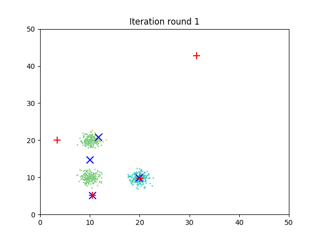
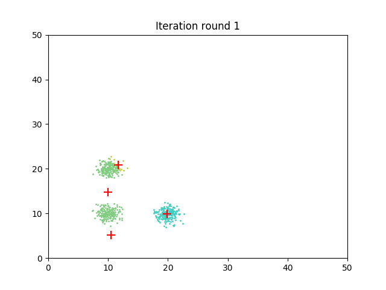

# <center>  Homework 1 </center>

#### 1. k-mean vs GMM
<center>  </center>
#### Solution
*Description:* Compared with k-mean, GMM algorithm tend to have more calculation in every iteration. To avoid this it's easy to think out a variant algorithm that makes a trade-off between k-mean and GMM: first use k-mean to get a nearly convergence than use GMM to get a better result.That algorithm is too simple to write, so I tried to think in another way.     
The difference between k-mean and GMM is that one is hard-clustering and the other is soft-clustering. So I wonder if it's possible to combine the soft-clustering with k-mean algorithm by allowing a single point belongs to many cluster and each with different weight. After some thinking and searching I get the following variant algorithm (Actually there is such a algorithm called ''Fuzzy C-means Clustering'' and referred this algorithm to it).         
 

*Computational details:*  
Just like the k-mean algorithm, we want to minimize:    

<center> $ J =  \sum_{n=1}^N \sum_{k=1}^K r_{nk}  \|x_n - \mu_k \|^2 $    </center>

The difference is that we allow a single point belongs to many clusters at the same time, and there we use $r_{nk}$ to represent the degree of membership of $x_n$ in the cluster $k$. And to get a more 'soft' clustering, we add some exponential to it, that is:   

<center> $ J =  \sum_{n=1}^N \sum_{k=1}^K r_{nk}^m   \|x_n - \mu_k \|^2 $    </center>

where m is any real number greater than 1.   
So we construct the lagrange equation:  
<center> $ \overline{J}(U,\mu_1,...,\mu_K,\lambda_1,...,\lambda_N) = J(U,\mu_1,...,\mu_K) + \sum_{n=1}^N\lambda_n(\sum_{k=1}^Kr_{nk} - 1)   $ </center>
<center> $ = \sum_{n=1}^N\sum_{k=1}^Kr_{nk}^md_{nk}^2 + \sum_{n=1}^N\lambda_n(\sum_{k=1}^Kr_{nk} - 1) $ </center>

$ \lambda_n (n = 1,...,N) $  represent the lagrange operator and $d_{nk}$ represents the ''distance'' $ \|x_n - \mu_k \| $.     
After derivation we can get:
<center> $r_{nk} = (\frac{1}{\sum_{j=1}^K(\frac{d_{nk}}{d_{nj}})})^{\frac{2}{m-2}} $ </center>  
<center> $\mu_n = \frac{\sum_{n=1}^Nr_{nk}^mx_i}{\sum_{n=1}^Nr_{nk}^m} $ </center>

Therefore we can continue this iteration to minimize the J until $\| R^{(i+1)} - R^i \|$ is less than certain value then we can stop.  


*Algorithm:*  

- Initialize R=[$r_{nk}$] matrix, $R^{(0)}$
- At kth step: calculate the centers $[\mu_k] $ with $R^{(k)}$ by    $\mu_n = \frac{\sum_{n=1}^Nr_{nk}^mx_i}{\sum_{n=1}^Nr_{nk}^m} $ 
- Update $R^{(k)}$ by $r_{nk} = (\frac{1}{\sum_{j=1}^K(\frac{d_{nk}}{d_{nj}})})^{\frac{2}{m-2}} $
- Check whether $\| R^{(k+1)} - R^k \|$ is less than the certain value, if true than stop, otherwise go to the second step.


*Advantages:* It can get soft clustering with the increase of parameter m which is more general than hard clustering of k-mean, also it has lower calculation than GMM. It's a nice trade-off between k-mean and GMM algorithm.    
        
*Limitations:* Still cannot avoid the influenence of bad initialization, for it's based on k-mean and GMM, which both are influenced by initialization. Also it is easy to get local optimum. Shortly, it has nearly all the limitaions that k-mean and GMM both have.   


#### 2. k-mean vs CL
<center>  </center>
#### Solution
*Description:* The direct idea is to implement the process of penalization to the E-step, where the centers redetermine. By always penalizing the extra ones, the proper k can be determined. But with implementation and more thinking, it can be found this algorithm is unstable and influenced by initialization. For some cases it still won't make sense.  
More generally, I think it cannot implement with nice results, there is always some cases cannot be avoid by penalization such as:   

<center>  </center>

In many cases like this there isn't good way to choose which one to penlize. So it's hard to get a nice result.


There give the algorithm based on the primitive idea, which can make sense with good initialization.

   
*Algorithm:*

- Initializaion: Just same as k-mean
- E-step: Just same as k-mean
- M-step: Just same as k-mean
- Penalize:  According to the distance bewteen the old centers and new centers, pull or push the centers from its original location. For the corresponding centers, there is a pull force and for the other centers there are push force, which are all related to the distance and relative location.
- If the change is less than the value we set, stop, otherwise continue from E-step. 

*Implementation:* 

```python
import ...

# 基本的辅助函数
def distance2(p1,p2):
	...
def min_distance(p,l):
	...
def initialization(k, low, high):
	...

# E-step 根据到各个中心的距离进行cluster的划分
def E_step(data, centers):
    clusters = []
    k = len(centers)
    for i in range(0,k):
        clusters += [[]]
    for point in data:
        index = min_distance(point, centers)
        clusters[index] += [point]
    return clusters

# 根据各个cluster中的Data point计算新的中心
def M_step(data, centers, clusters):
    new_centers = []
    k = len(clusters)
    for i in range(0,k):
        points = np.array(clusters[i])
        if (len(points) == 0):
            center = centers[i]
        else:
            num = len(points)
            sum_x = np.sum(points[:,0])
            sum_y = np.sum(points[:,1])
            center = np.array([sum_x,sum_y]) * 1.0 / num
        new_centers += [center]
    return np.array(new_centers)

# 在初始化合适的条件下，对多余的中心进行排斥，即pull和push
def penalization(old_centers, new_centers, clusters):
    centers = []
    k = len(clusters)
    for i in range(0,k):
        if ((len(clusters[i]) != 0) and (distance2(new_centers[i], old_centers[i]) > 1e-1)):
            pull = (new_centers[i] - old_centers[i]) / distance2(new_centers[i], old_centers[i])
            push = np.array([0.0,0.0])
            for j in range(0,k):
                if (j != i):
                    push += (new_centers[j] - old_centers[i]) / distance2(new_centers[j], old_centers[i])
            move = (pull - push) * distance2(new_centers[i], old_centers[i])
            centers += [old_centers[i] + move]
        else:
            centers += [old_centers[i]]
    return np.array(centers)

# 主函数
def main()
...
    for i in range(0, iteration_num):
        clusters = E_step(data, centers)

        # Normal
        # centers = M_step(data,centers,clusters)

        # Penalization
        new_centers = M_step(data,centers,clusters)
        centers = penalization(centers, new_centers, clusters)

        fig = plt.figure('Iteration round ' + str(i + 1))
...
```
(See hw1_2.py in the accessory)


*Result:*   
<table>
<tr>
<th colspan="3"> With penalization </th>
</tr>
<tr>
<td bgcolor="white" colspan="2" rowspan="2"> </td>
<td bgcolor="white"> </td>
</tr>
<tr>
<td bgcolor="white"> </td>
</tr>
<tr>
<td bgcolor="white"> </td>
<td bgcolor="white"> </td>
<td bgcolor="white"> </td>
</tr>
</table>
We can see that in this initialization the extra center was repelled so the finaly result is correctly classified. As comparison we show the normal k-mean classifier: 
<table>
<tr>
<th colspan="3"> Normal k-mean </th>
</tr>
<tr>
<td bgcolor="white"> </td>
<td bgcolor="white"> </td>
<td bgcolor="white"> </td>
</tr>
<tr>
<td bgcolor="white"> </td>
<td bgcolor="white" colspan="2" rowspan="2"> </td>
</tr>
<tr>
<td bgcolor="white"> </td>
</tr>
</table>
We can see clearly that there is a cluster that was classified wrong. The extra center influenced the correct classify process.   


*Conclusion:*     
With the results, we can say that for proper initialization, there will be a nice result with CL compared with normal k-mean. But in condition that initialization is not that good, this algorithm still cannot make sense.


<br><p></p></br>
<br><p></p></br>
<br><p></p></br>


#### 3. model selection of GMM
<center>  </center>
<center>  </center>
#### Solution

*Description:* To compare the performace between AIC, BIC and VBEM, the datasets are generated with different number of clusters: 2,4,8,12, and the dimension of datasets changes from 2D to 4D. To add some inequalities, the number of samples of each cluster changes from <200 to <1000 randomly. For AIC and BIC, we can just select the lowest result to get the optimal k, and for vbem, the optimal k is selected via lower bound.

*Implementation:*   
Based on the SKLearn lib, 

```python 
import ...

def main():
    cluster_nums = [2,4,8,12]
    samples_nums = [100,500,900]
    dimensions = [2,3,4]
    k_range = list(range(1,16))
...
    np.random.seed(0)
    cluster_data = []
    for dimension in dimensions:
        for samples_num in samples_nums:
            for cluster_num in cluster_nums:
                data = []
                for i in range(cluster_num):
                    cluster_data += [np.random.randn(np.random.randint(100,100+samples_num), dimension) + np.random.randint(10,50,size=(1,dimension))]
                    data.extend(cluster_data[i])
                data = np.array(data)

                lowest_aic = np.infty
                best_aic_k = 0
                aic = []

                lowest_bic = np.infty
                best_bic_k = 0
                bic = []

                lowest_bound = np.infty
                best_vbem_k = 0
                vbem = []
                
                # AIC与BIC都是通过直接得到的结果进行比较 
                for k in k_range:
                    gmm = GaussianMixture(n_components=k, covariance_type='full')
                    gmm.fit(data)
                    aic.append(gmm.aic(data))
                    bic.append(gmm.bic(data))
                    if aic[-1] < lowest_aic:
                        lowest_aic = aic[-1]
                        best_aic_k = k
                    if bic[-1] < lowest_bic:
                        lowest_bic = bic[-1]
                        best_bic_k = k
                    
                    # VBEM 根据lower bound确定最优的k
                    vbgmm = BayesianGaussianMixture( weight_concentration_prior_type="dirichlet_distribution", n_components=k,covariance_type='full')
                    vbgmm.fit(data)
                    vbem.append(vbgmm.lower_bound_ * (-1))
                    if vbem[-1] < lowest_bound:
                        lowest_bound = vbem[-1]
                        best_vbem_k = k

...

```
(See hw1_3.py in the accessory)

<br><p></p></br>

*Result:*     
We can see all the k selected in different conditions and the corresponding real k:   
 
```
k	dimension 	sample	   aic	   bic	  vbem
2		2		<200		2		2		2
4		2		<200		4		4		4
8		2		<200		9		9		6
12		2		<200		12		12		9
2		2		<600		2		2		2
4		2		<600		4		4		4
8		2		<600		7		7		6
12		2		<600		11		11		10
2		2		<1000		2		2		2
4		2		<1000		4		4		4
8		2		<1000		8		8		6
12		2		<1000		11		11		9
2		3		<200		2		2		2
4		3		<200		4		4		4
8		3		<200		8		8		6
12		3		<200		12		12		9
2		3		<600		2		2		2
4		3		<600		4		4		4
8		3		<600		7		7		6
12		3		<600		12		12		9
2		3		<1000		2		2		2
4		3		<1000		4		4		4
8		3		<1000		7		7		6
12		3		<1000		11		11		10
2		4		<200		2		2		2
4		4		<200		4		4		4
8		4		<200		8		8		6
12		4		<200		12		12		9
2		4		<600		2		2		2
4		4		<600		4		4		4
8		4		<600		8		8		6
12		4		<600		11		11		9
2		4		<1000		2		2		2
4		4		<1000		4		4		4
8		4		<1000		8		8		6
12		4		<1000		11		11		9
```

From these results we can see that generally the AIC and BIC has better performance than the VBEM, both have 75% correct ratio while VBEM has only 50%. And when the number of clusters gets larger, the error ratio increases in general. 

<br></br> 

For every condition we can see the calculated result in the selection process. For convenience of the results showing, the lower bound has some processing so that it can be placed into the same plot with AIC and BIC:   
<center> 
<table cellpadding="0" border="0">
<tr>
<th> </th>
<th> 2D </th>
<th> 3D </th>
<th> 4D </th>
</tr>
<tr >
<td align="center" bgcolor="white"> k = 2  <200 samples </td>
<td bgcolor="white"> </td>
<td bgcolor="white"> </td>
<td bgcolor="white"> </td>
</tr>
<tr >
<td align="center" bgcolor="white"> k = 2  <600 samples </td>
<td bgcolor="white"> </td>
<td bgcolor="white"> </td>
<td bgcolor="white"> </td>
</tr>
<tr >
<td align="center" bgcolor="white"> k = 2  <1000 samples </td>
<td bgcolor="white"> </td>
<td bgcolor="white"> </td>
<td bgcolor="white"> </td>
</tr>
<tr >
<td align="center" bgcolor="white"> k = 4  <200 samples </td>
<td bgcolor="white"> </td>
<td bgcolor="white"> </td>
<td bgcolor="white"> </td>
</tr>
<tr >
<td align="center" bgcolor="white"> k = 4  <600 samples </td>
<td bgcolor="white"> </td>
<td bgcolor="white"> </td>
<td bgcolor="white"> </td>
</tr>
<tr >
<td align="center" bgcolor="white"> k = 4  <1000 samples </td>
<td bgcolor="white"> </td>
<td bgcolor="white"> </td>
<td bgcolor="white"> </td>
</tr>
<tr >
<td align="center" bgcolor="white"> k = 8  <200 samples </td>
<td bgcolor="white"> </td>
<td bgcolor="white"> </td>
<td bgcolor="white"> </td>
</tr>
<tr >
<td align="center" bgcolor="white"> k = 8  <600 samples </td>
<td bgcolor="white"> </td>
<td bgcolor="white"> </td>
<td bgcolor="white"> </td>
</tr>
<tr >
<td align="center" bgcolor="white"> k = 8  <1000 samples </td>
<td bgcolor="white"> </td>
<td bgcolor="white"> </td>
<td bgcolor="white"> </td>
</tr>
<tr >
<td align="center" bgcolor="white"> k = 12  <200 samples </td>
<td bgcolor="white"> </td>
<td bgcolor="white"> </td>
<td bgcolor="white"> </td>
</tr>
<tr >
<td align="center" bgcolor="white"> k = 12  <600 samples </td>
<td bgcolor="white"> </td>
<td bgcolor="white"> </td>
<td bgcolor="white"> </td>
</tr>
<tr >
<td align="center" bgcolor="white"> k = 12  <1000 samples </td>
<td bgcolor="white"> </td>
<td bgcolor="white"> </td>
<td bgcolor="white"> </td>
</tr>
</table>
 </center>
<br><p></p></br>

*Analysis & Conclusion:*    
We can see that the error manly comes from the conditions that has more number of clusters: 
<center> </center>
AIC, BIC and VBEM all get the wrong k, especilly the VBEM has considerable gap. From the lower bound we can see that it's very close for k>9, so it's very easy to be influcenced.    
When the number of clusters is small all the them can get nice result: 
<center> </center>
however when the number of clusters is middle, both AIC and BIC can get correct k most of times, while VBEM still makes error:
<center> </center>


Above all, with these results, we can see that the AIC and BIC has better performance than VBEM for datasets in these condtions.