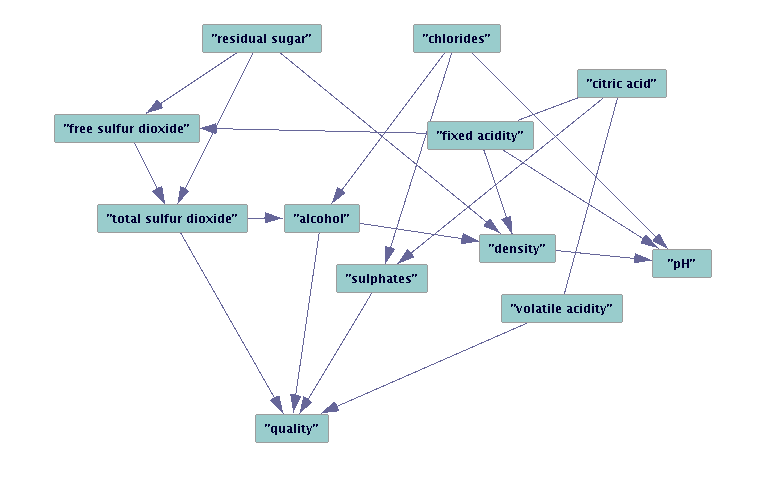
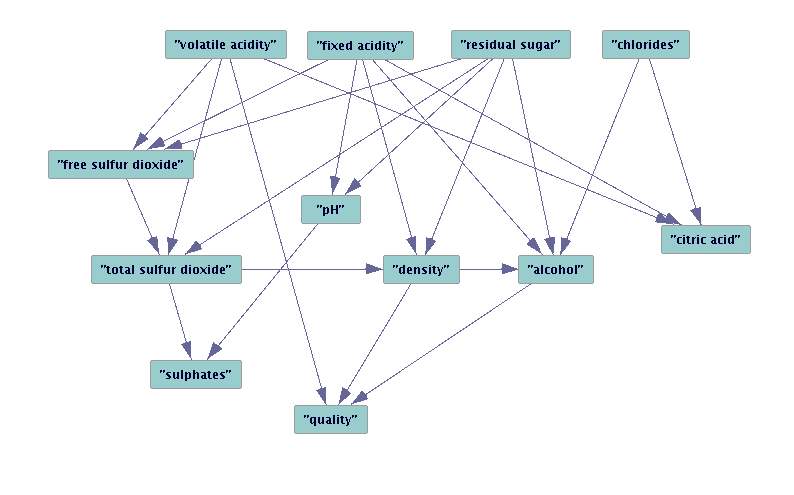

# <center> Homework 2 </center>

  
#### Solution 
- Conventional PCA    
	PCA can be defined as the orthogonal projection of the data onto a lower dimensional principal subspace, such that the variance of the projected data is maximized, so to get the first principal component w by following algorithm: 
	- First calculate the mean of the data $$\bar x = \frac{1}{N}\sum_{n=1}^Nx_n$$
	- Then get the covariance matrix $$S = \frac{1}{N}\sum_{n=1}^{N}(x_n - \bar x)(x_n - \bar x)^T$$
	- For we want to get the first principal component so we can project the data into a one-dimensonal space, i.e., $M = 1$. Without loss of generality we can choose a D-dimensional unit vector $u_1$ to project each data point $x_n$ into projected data $u_1^Tx_n$, which satisfies that $u_1^Tu_1 = 1$. So we can get the variance of the projected data $$\frac{1}{N}\sum_{n=1}^N\{u_1^Tx_n - u_1^T\bar x_n\}^2 = u_1^TSu_1$$ 
	- To maximize the projected variance $u_1^TSu_1$ with respect to $u_1$, we introduce a Lagrange multiplier that we shall denote by $\lambda _1$, and then make an unconstrained maximization of $$u_1^TSu_1 + \lambda _1(1 - u_!^Tu_1)$$
	- By setting the derivative with respect to $u_1$ equal to zero, we see that this quantity will have a stationary point when $$Su_1 = \lambda _1u_1$$ which says that $u_1$ must be an eigenvector of S. 
	- If we left-multiply the by $u_1^T$ and make use of $u_1^Tu_1 = 1$, we see that the variance is given by $$u_1^TSu_1 = \lambda _1$$
	- Therefore to maximize the projected vatiance $u_1^TSu_1$, we calculate the eigenvalues and eigenvectors of $S$: $$S = \sum_{k=1}^r\lambda _kv_kv_k^T$$ then choose the largest eigenvalue $\lambda _1$, with the corresponding eigenvector  $v_1$. 
	- So the first principal component of a data vector $x_i$ can be given as $t_1 = x_i ⋅ v_1$ in the transformed co-ordinates.

	*Besides the the ways based on eigen-decomposition, we can also start from the probabilistic.*   

- Probabilistic PCA      
	The probabilistic PCA model can be expressed in terms of a marginalization over a continuous latent space $z$ in which for each data point $x_n$, there is a corresponding latent variable $z_n$. We can therefore make use of the **EM** algorithm to find maximum likelihood estimates of the model parameters:
	-  First we calculate the complete-data log likelihood function: $$\ln p(X,Z| \mu, W, \sigma^2) = \sum_{n=1}^N\{\ln p(x_n|z_n) + \ln p(z_n)\}$$ where the nth row of the matrix $Z$ is given by $z_n$.   
	-  Then we see the data $x$ as observed variable that $$x = Wz + \mu + \epsilon$$ where $z$ is one-dimensional latent variables and $\epsilon$ is a D-dimensional zero-mean Gaussian-distributed noise variable with covariable $\sigma ^2 I$.  
	   We define the Gaussian prior distribution $p(z)$ as $$p(z) = N(z | 0, I)$$ the conditional distribution of the observerd variable $x$ $$p(x|z) = N(x|Wz + \mu, \sigma ^2 I)$$ Then we can get the marginal distribution $$p(x) = \int p(x|z)p(z)dz = N(x|\mu, C) $$
	   We can get C by calculate $E[(Wz + \epsilon)(Wz + \epsilon)^T]$ that $$C = WW^T + \sigma^2I$$ 
	   So we can get $$p(z|x) = N(z|M^{-1}W^T(x-\mu),\sigma^{-2}M)$$
	   where $$M = W^TW + \sigma^2I$$
	- So we can calculate the expectation of the likelihood with respect to the posterior distribution over the latent variables we obtain $$E[\ln p(X,Z| \mu, W, \sigma^2)] = -\sum_{n=1}^N\left\{\frac{D}{2}\ln(2\pi\sigma^2) + \frac{1}{2}Tr(E[z_nz_n^T]) \\ + \frac{1}{2\sigma^2}\|x_n - \mu \|^2 - \frac{1}{\sigma^2}E[z_n]^TW^T(x_n - \mu) \\ + \frac{1}{2\sigma^2}Tr(E[z_nz_n^T]W^TW)\right\}$$ And then we can use EM algorithm.
 -  In the E-step, we use the old parameter values to evaluate $$E[z_n] = M^{-1}W^T(x_n - \bar x)$$ $$E[z_nz_n^T] = cov[z_n] + E[z_n]E[z_n]^T \\ = \sigma^2M^{-1} + E[z_n]E[z_n]^T$$ 
 -  In the M-step, we maximiza with respect to $W$ and $\sigma^2$, keeping the posterior statistics fixed. $$W_{new} = \left[\sum_{n=1}^N(x_n - \bar x)E[z_n]^T][\sum_{n=1}^NE[z_nz_n^T]\right]^{-1}$$ $$\sigma^2_{new} = \frac{1}{ND} \sum_{n=1}^N\{\|x_n - \bar x\|^2 - 2E[z_n]^TW^T_{new}(x_n - \bar x) + Tr(E[z_nz_n^T]W^T_{new}W_{new})\}$$
	- After the EM step into convergence, we get the final $W$ and $\sigma^2$. In this case, the columns of $W$ define the principal subspace of standard PCA. 
	- Compared with conventional PCA, probabilistic needs to use Bayes' theorem to map the point in data space to latent space. Any point $x$ in data space can be sumarized by its posterior mean and covariance in latent space: $$E[z|x] = M^{-1}W^T(x - \bar x)$$  this projects to a point in data space given by $$WE[z|x] + \mu$$ For the dimension of $z$ is 1, so the first principal component is just $$WM^{-1}W^T(x_{(i)} - \bar x)$$  

- Advantages and limitations: 
 	- Conventional PCA
		- The conventional PCA is easy to understand and implement, it gives the answer directly.
		- But when the data gets huge, the eigen decomposition has inacceptable computation cost.
		- And it cannot get the any statistic information.
	- Probabilistic PCA
		- It represents a constrained form of Gaussian distribution in which the number of free parameters can be restricted while still allowing the model to capture the dominant correlations in a data set. 
		- We can derive an EM algorithm for PCA that is computation efficient when only a few leading eigenvectors are required. 
		- The combination with EM also allows us to deal with missing value in the data set. 
		- Probabilistic PCA forms the basis for a Bayesian treatment of PCA in which the dimensionality of the principal subspace can be found automatically from the data.
		- But it's more difficult to implement and understand. 
		- In some cases, it's not precise as conventional PCA.

		
--

  
#### Solution 
First for the $e$, because it is a noise, so we can wirte the distribution of $e$:
$$p(e) = G(e|0, \Sigma _e)$$
Then we try to calculate the $p(x)$: 
 $$p(x) = \int p(x|y)p(y)dy $$
 For $p(x|y)$ and $p(y)$ both are Gaussian distribution, so this is corresponds to a linear-Gaussian model, this marginal distribution is again Guassian, and is given by 
 $$p(x) = G(x|E[x], cov[x])$$
For the expectation of $x$:
$$E[x] = E[Ay + \mu + e] = \mu$$
For the covariance of $x$:
$$cov[x] = E[(Ay+e)(Ay+e]^T] = E[Ayy^TA^T] + E[ee^T] = A\Sigma_yA^T + \Sigma _e$$
Then we have
$$p(x) = G(x|\mu, A\Sigma_yA^T + \Sigma _e)$$
We use $z =  \left[
 \begin{matrix}
   y \\
   x
  \end{matrix}
  \right]$ to express the joint distribution over $x$ and $y$ then we have
$$\ln p(z) = \ln p(y) + \ln p(x|y) \\ =  -\frac{1}{2} y^T\Sigma_y^{-1}y - \frac{1}{2}(x-Ay-\mu)^T\Sigma_e^{-1}(x-Ay-\mu) + const$$
where 'const' denotes terms independent of x and y. And for $p(x,y)$ also is Gaussian distribution. To get the distribution, we consider the second order terms in above equation, which can be written as:
$$ -\frac{1}{2}y^T(\Sigma_y^{-1}+A^T\Sigma_e^{-1}A)y - \frac{1}{2}x^T\Sigma_e^{-1}x + \frac{1}{2}x^T\Sigma_e^{-1}Ay + \frac{1}{2}y^TA^T\Sigma_e^{-1}x \\ = 
\left[
 \begin{matrix}
   y \\
   x
  \end{matrix}
  \right]^T
  \left[
 \begin{matrix}
   \Sigma_y^{-1}+A^T\Sigma_e^{-1}A & -A^T\Sigma_e^{-1}\\
   -\Sigma_e^{-1}A & \Sigma_e^{-1}
  \end{matrix}
  \right]
  \left[
 \begin{matrix}
   y \\
   x
  \end{matrix}
  \right] \\ = -\frac{1}{2}z^TRz$$ 
  So the convariance matrix is:
  $$cov[z] = R^{-1} =   \left[
 \begin{matrix}
   \Sigma_y & \Sigma_yA^T\\
   A\Sigma_y & \Sigma_e+A\Sigma_yA^T
  \end{matrix}
  \right]$$
  Similariy, we can find the expectation of $z$:
  $$E[z] =  \left[
 \begin{matrix}
   0 \\
   \mu 
  \end{matrix}
  \right]$$
 Therefore we can get expectation of $ p(y|x)$:
 $$E[y|x] = (\Sigma_y^{-1}+A^T\Sigma_e^{-1}A)^{-1}A^T\Sigma_e^{-1}(x - \mu)$$
 Also the covariance:
 $$cov[y|x] = (\Sigma_y^{-1}+A^T\Sigma_e^{-1}A)^{-1}$$
 Above all we get the result:
$$ p(y|x) = G(y| MA^T\Sigma_e^{-1}(x - \mu), M) $$
where 
$$M = (\Sigma_y^{-1}+A^T\Sigma_e^{-1}A)^{-1}$$

--
    
#### Solution 
For ICA based on the Central Limit Theorem, which states that the distribution of the sum (average or linear combination) of $N$ independent random variables approaches Gaussian as $N\rightarrow \infty$. To solve the BSS problem, we want to find a matrix ${\mathbf W}$ so that ${\mathbf y=Wx=WAs = z^T s}$ is as close to the independent sources ${\mathbf s}$ as possible. This can be seen as the reverse process of the central limit theorem above.  
Consider one component $y_i={\mathbf w_i^TAs}$ of ${\mathbf y}$, where  ${\mathbf w_i^T}$ is the ith row of ${\mathbf W}$. As a linear combination of all components of ${\mathbf s}$,  $z^Ts$ is necessarily more Gaussian than any of the components unless it is equal to one of them (i.e.,  ${z^T}$ has only one non-zero component). So the get closer to $s$, we need more no-Gaussian. In other words, it can be achieved by finding  ${\mathbf W}$ that maximizes the non-Gaussianity of ${\mathbf y=Wx=WAs}$ (so that ${\mathbf y}$ is least Gaussian).We can say that non-Gaussianity is independence. More non-Gaussian, more independent. And obviously there at most one Gaussian variabble is allowed in ICA.      
Therefore, maximizing non-Gaussianity could be used as a principle for ICA estimation.

--
  
  
#### Solution 
- In this part, we trying to solve the problem about the quality of wine, so we can make the adjustment during vegetation process timely by analysis the related statistical indices.   
  To be specific, it needs to figure out what factors matters for a high quality wine, and how these factors influence each other, i.e., the relationship of these factors.   
  Based on the existing dataset, we choose the related factors:
  - fixed acidity: the acid difficult to volatilize 
  - volatile acidity: the acid easy to volatilize, mostly it's a wine fault, a wine fault or defect is an unpleasant characteristic of a wine often resulting from poor winemaking practices or storage conditions, and leading to wine spoilage. Shortly, it will destroy the wine. 
  - citric acid: a weak organic tribasic acid, $C_6H_8O_7$. 
  - residual sugar: remaining sugar in the wine 
  - chlorides: $Cl^-$, generated by the dissolution of some mineral substances 
  - free sulfur dioxide:  free $SO_2$
  - total sulfur dioxide: total $SO_2$
  - density: density 
  - pH: PH value 
  - sulphates: mineral	salt based on $SO_4^-$ 
  - alcohol: the alcohol by volume    
	
	In the process of vinification, these factors play an important part in the formation of taste and flavour of the wine, and there we judged the taste and flavour by quality, which scores between 0 and 10. Also this is what we concerned most. 
	
- The datasets includes two sub-datasets, which give the records about red-wine and white-wine seperately. Both datasets comes from UC Irvine Machine Learning Repository(UCI), and often used in classification or regression tasks. The red-wine dataset has 1599 records, and the white-wine dataset has 4898 records, which is abundant for analysis. Both datasets have 12 properties corresponding to the above factors and the quality. The classes are ordered and not balanced, e.g., there are munch more normal wines than excellent or poor ones. And it's not sure if all input variables are relevant. In the prespect of winemaker, these variables make sense.

- There we use the PC algorithm.  In this framework of Causal Bayesian Network (CBN), causal relationships are represented with a Directed Acyclic Graph. So by calculating the conditional independence in the data and with optional background knowledge, the PC algorithm is trying to construct a DAG that represents a Markov equivalence class. If the conditional independence and background knowledge always give correct answers, and the causal Markov and causal faithfulness assumptions hold, then the output pattern contains the true SEM, even thought the algorithm does not check each DAG.    
	Assume that we have a set of variables $X = (X_1, . . . , X_n)$ with a global probability distribution about them P. We use A to represent a subset of variables of X. By I(A, B|C) we will denote that sets A and B are conditionally independent given C. PC algorithm assumes faithfulness. This means that there is a directed acyclic graph, G, such that the independence relationships among the variables in X are exactly those represented by G by means of the d-separation criterion (Pearl, 1988). For d-speration, if $X \perp Y | S$ , we say $X$ and $Y$ are d-sperated by $S$. PC algorithm is based on the existence of a procedure which is able of saying when I(A, B|C) is verified in graph G. It starts with a complete, undirected graph and deletes recursively edges based on conditional independence decisions.
For example, the edge between A and B is removed if we can find a set S that does not include A and B, and when conditioning on S, A and B are independent. Then on a posterior step it tries to make the orientation of the edges. We give the detail as following:
	
	```
		- PC Algorithm
		Input: Dataset D with a set of variables V
		Output: The undirected graph G with a set of edges E
		
		Firstly connect all the nodes in G
		Let depth d = 0
		repeat
			for each ordered pair of adjacent vertices X and Y in G do
				if (|adj(X, G)\{Y}| >= d) then
					for each subset Z ⊆ adj(X, G)\{Y} and |Z| = d do
						Test I(X, Y|Z)
						if I(X, Y|Z) then
							Remove edge between X and Y
							Save Z as the separating set of (X, Y)
							Update G and E
							break
						end
					end
				end
			end
			Let d = d + 1
		until |adj(X, G)\{Y}| < d for every pair of adjacent vertices in G;
		
		for each triple of vertices X,Y,Z in G do
			if (X,Y are adjacent) and (Y,Z are adjacent) and (X,Z are not adjacent) then 
				if (Y is not in the separating set of (X, Z)) then 
					orient X-Y-Z as X -> Y <- Z
				end
			end
		end
	
		repeat 
			for each triple of vertices X,Y,Z in G do
				if (X -> Y) and (Y,Z are adjacent) and (X,Z are not adjacent) then 
					if (no arrowhead Y) then
						orient B-C as B -> C
					end
				end
				if (X -> Y) and (A,B are still connected) then 
					orient A-B as A -> B
				end
			end
		end
	```		
		
		
	In this way we get the DAG. But DAG only give us qualitative information: which variables causally influence which others, they don't tell us quantitatively how big the causal effects are. They only put constraints on the probability distribution over variables in the graph, but they don't fully specify the probability distribution. For that, we need models. we apply the Structural Equation Model (SEM) on it.  With the DAG getted from PC algorithm we can construct linear model to reflect the relationships between the variables. A linear model means the relationships between the variables can be described with linear equations. For example, if we have the graph X -> Y <- Z, we could describe this as the standard SEM parametric model: $$X=\epsilon_1 \ \ \ Z=\epsilon_2 \ \ \ Y=\alpha X+\beta Z+\epsilon_3$$ Where the errors $\epsilon_1,\epsilon_2,\epsilon_3$ are independent random variables with Gaussian distributions. There we assumed that the variable is in Gaussianl distribution, so we can get to know the relationship between these variables by parameters. Then we try to solve the parameter estimation.  
	A linear SEM over a set of random variables $V =
\{V_1,...,V_n\}$ is given by a set of structural equations of the form
$$V_j = \sum_i c_{ji}V_i + \epsilon_j\ ,\ j = 1, . . . , n$$
where the summation is over the variables in $V$ judged to
be immediate causes of $V_j . c_{ji}$, called a path coefficient,
quantifies the direct causal influence of $V_i$ on $V_j . \epsilon_j$ ’s represent “error” terms and are assumed to have normal distribution. The set of variables (and the corresponding
structural equations) are considered to be ordered
as $V_1 < V_2 < ... < V_n$. We denote the covariances between
observed variables $\sigma _{ij} = Cov(V_i, V_j)$, and between error terms $\psi _{ij} = Cov(i, j)$. We denote the following matrices,
$\Sigma =[\sigma_{ij}], \Psi =[\psi_{ij}],$ and $C = [c_{ij}]$. Without loss of
generality, the model is assumed to be standardized such that
each variable $V_j$ has zero mean and variance 1.
The structural assumptions encoded in a model are the
zero path coefficients $c_{ji}$ and zero error covariances $\psi_{ij}$ .
The model structure can be represented by a directed acyclic
graph (DAG) G with (dashed) bidirected edges, called a
causal diagram (or path diagram), as follows: the nodes of G
are the variables $V_1,...,V_n$; there is a directed edge from $V_i$
to $V_j$ in G if Vi appears in the structural equation for $V_j$ , that
is, $c_{ji} = 0$; there is a bidirected edge between $V_i$ and $V_j$ if the error terms i and j have non-zero correlation ($\psi_{ij} = 0$). 
The parameters of the model are the non-zero entries in
the matrices C and $\Psi$. Fixing the model structure and given
parameters C and $\Psi$, the covariance matrix $\Sigma$ is given by (see,
for example, [Bollen, 1989])
$$\Sigma=(I − C)^{−1}\Psi[(I − C)^{−1}]^T$$
In this way, we can get the identification of this model if this model is identified. Then we can get the parameters.
	

- Based on Tetrad, we use the PC algorithm to discover the causal in wine dataset.  
	First we analysis the red-wine dataset. With different parameters setting we can get the following result: 
<table>
<tr>
<td> <center>  With low allowance for cutoff</td>
<td> <center>  With high allowance for cutoff</td>
</tr>
</table>

	We can see that with the allowance changes, the causal also changes. And we know that some factors cannot be the reason for other factors so we add some knowledge background to it and adjust the parameters. Then we can get:
<center>  </center>
With this DAG, we construct SEM and estimate the model parameters then we can get:
<center>  </center>
<center>  </center>
We apply the same process on white-wine dataset, after some adjustment on parameters we can get:
<center>  </center>
<center>  </center>
<center>  </center>

- Analysing the result, we can see that
	- For both red-wine and white-wine, the quality is directly influenced by alcohol and volatile acidity. And we can see from weights that volatile acidity has negative inspect on quality, which is consistent with experience that volatile acidity will rise wine fault and ruin the wine. For alcohol, although it's not sure that higher alcohol wine has better quality, higher alcohol wine does need strict requirements. It maybe reflect that people prefer high alcohol wine for most wine has low alcohol compared with other alcoholic drinks, so higher alcohol wine maybe more closer to be a alcoholic drink.
	- For red-wine, its quality still get influenced by total $SO_2$ and  $SO_4^-$ mineral	salt, which mainly affect the mouthfeel and taste. It will takes various saline taste, making the feel more diverse. While for white-wine, its quality still get influenced by density, which plays a important role on wine body, lower density will make light-bodied wine. Compared with red-wine, it seems that wine body is more important than mouthfeel for white-wine.
	- Besides quality, we can see many meaningful relationship between various factors，e.g., we can see that the total $SO_2$ is rely on the residual sugar while the free $SO_2$ has negative corelation with residual sugar; the density not only influenced by residual sugar, but also the fixed acidity and so on.
	  	


- Reference:  
	- J. Pearl, Causality: models, reasoning, and inference. Cambridge
	University Press, 2000.
	- P. Spirtes, C. Glymour, and R. Scheines, Causation, Prediction, and
	Search, 2nd ed. Cambridge, MA: MIT Press, 2000.
	- J. Pearl, Probabilistic reasoning in intelligent systems: networks of
	plausible inference. Morgan Kaufmann, 1988.   
	- TD Le,  A fast PC algorithm for high dimensional causal discovery with multi-core PCs, 2015   
	- J. Abell, Some Variations on the PC Algorithm
	- https://rawgit.com/cmu-phil/tetrad/development/tetrad-gui/src/main/resources/resources/javahelp/manual/tetrad_tutorial.html
	- http://archive.ics.uci.edu/ml/datasets/Wine+Quality
	- Some materials from Internet

--
  
#### Solution 
- First we formalize this problem:  
A set of $n$ random variables $x_1, x_2, ... , x_n$ with a given probability mass function $P(x_1,...,x_n)$ and there are necessary and sufficient conditions ensure $P$ is star-decomposable, i.e., P can be represent as a marginal of an $(n+1)$-variable distribution $P_s(x_1,...,x_n,w)$ that renders $x_1,...,x_n$ conditionally independent given $w$ $$P_s(x_1,...,x_n,w) = \int _{-\infty}^{+\infty}\Pi_{i=1}^nP_s(x_i|w)P(w)\ dw$$
Instead of one hidden variable, $w$, we can use $m$ hidden variables $(m < n -2)$ to form a tree-like structure in which each triplet of leaves forms a star. Then we can use a marginal of an $n+m$ dimensional normal distribution ( tree-decomposable )$$P_t(x_1, x_2, ... , x_n, w_1, w_2, ... , w_m) \ \ \ m \leq n - 2$$ to map the tree, of which $w_1, w_2, ..., w_m$ corresponds to the internal nodes of a tree and $x_1, x_2, ... , x_n$ to its leaves.  Then the problem is whether $P_t(x_1, x_2, ... , x_n, w_1, w_2, ... ,w_m)$ can be recovered given a star-decomposable normal distribution $P(x_1, x_2, ... , x_n)$.    

- From definition we can know that the constraint of tree-decomposable is stronger than star-decomposable, i.e., if distribution $P$ is star-decomposable, then it's also tree-decomposable. So the problem is equal to reconstruct $P_t(x_1, x_2, ... , x_n, w_1, w_2, ... ,w_m)$ given a tree-decomposable normal distribution $P(x_1, x_2, ... , x_n)$. The construction method is based on the star-decomposable triplets. We can see that any three leaves in a tree have one, and only one, internal node that can be considered their center, i.e., it lies on all the paths connecting the leaves to each other. If one removes the center, the three leaves become disconnected from each other. This means that, if $P$ is tree-decomposable, then the joint distribution of any triplet of variables $x_i, x_j, x_k$ is star-decomposable. Moreover, if we compute the star-decompositions of two triplets of leaves, both having the same central node w, the two distributions should have the same value for the marginal probability of the central variable. This provides us with a basic test for verifying whether two arbitrary triplets of leaves share a common center, and a successive application of this test is sufficient for determining the structure of the entire tree. We start with any three variables $x_1, x_2,$ and $x_3$, form their star-decomposition, choose a fourth variable, $x_4$ then there are 4 conditions: 
  
So to decide which leg of the star should $x_4$ be joined, we can test which pairs of triplets share centers to choose the corresponding topology. In this way we can always add new variable to the existing tree structure.   
	After constructing the tree structure, we need to figure out the distribution. Similiarily, we need to determine all the functions $P(x_i|w_j)$ and $P(w_j|w_k)$ for $i=1,...,n $ and $ j,k=1, 2..... m$   
	 For $P(x_i|w_j)$, it can be determined directly from the star decomposition of triplets involving adjacent leaves:$$$P(x_i|w_j) = \sum_{w_t} P(x_i|w_t)P(w_t|w_j)$$ This matrix equation has a solution for $P(w_t|w_j)$ because $P(x_i|w_t)$ must be nonsingular. It is only singular when $x_i$ is independent of $w_t$ and is therefore independent of all other variables. Hence, we can determine the parameters of the branches next to the periphery, use them to determine more interior branches, and so on, until all the interior conditional prob- abilities $P(w_j|w_k)$ are determined. It can be proved the tree structure can be recoverd.
	 
- Reference:   
	J. Pearl, Fusion, Propagation, and Structuring in Belief Networks, 1986  
	
