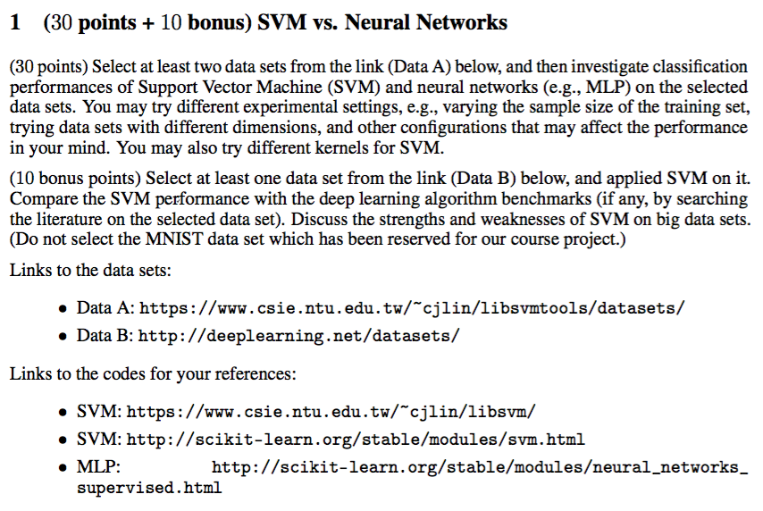
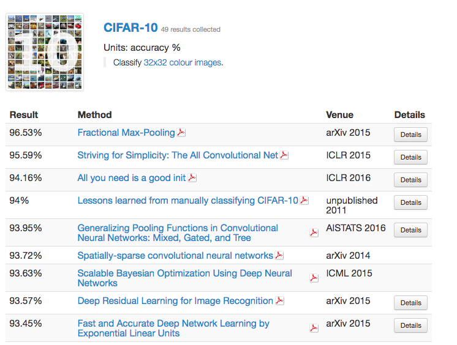

# <center> Homework 3 </center>

  
#### Solution 
To get the performances of SVM and neural network in different conditions, I select three data sets: adult, splice and dna. To get the influence of sample size, the adult dataset consists three "datasets": a3a, a5a and a9a, corresponding to three partition. The attributes of splices dataset are not bi-value, so we can preprocess the data before training to see the influence of data preprocessing. Besides, the dna dataset are 3-class classification, the SVM needs use one to one strategy to classify while the MLP can just classify directly, which is quite different from each other. In this way we can see the performances in multi-class condition.    
In each condition, both SVM and MLP are optimized by extracting features and adjusting configurations seperately. So after getting the best possible result, we can compare their performance.

##### Adult dataset (a2a.txt,a2a.t ; a5a.txt,a5a.t ; a9a.txt,a9a.t)  
The Adult data set is quite often used in classification, which has 14 features, among which six are continuous and eight are categorical. It includes comparatively enough number of data, which has up to 32561 records for training and 16281 for testing. In there continuous features are discretized into quantiles, and each quantile is represented by a binary feature. Also, a categorical feature with m categories is converted to m binary features. So finally we have 123 features.  
There we choose three data sample, 'a2a', 'a5a' and 'a9a' to investigate the influence of sample size, in which 'a2a' has 2,265 for training and 30,296 for testing, 'a5a' has 6,414 for training and 26,147 for testing, and 'a9a.t' has 32,561 for training and 16,281 for testing.    

- For SVM, first we trying to get the best performance on each dataset and the corresponding configuration. So we select 4 kinds of kernel: linear, polynomial, rbf and sigmoid, and adjust the parameters cost(-c), gamma(-g), coef0(-r) and degree in polynomial(-d) in a proper range. From the prediction accurancy of each trained model, we can compare the performance:

	```
	# a5a.t
	-t 0 -c 0.0001 -g 0.00102 -r 0 (76.01254446016752, 0.9594982215932994, nan)
	-t 0 -c 0.0004 -g 0.00102 -r 0 (76.01254446016752, 0.9594982215932994, nan)
	-t 0 -c 0.0016 -g 0.00102 -r 0 (80.14303744215398, 0.794278502313841, 0.1295187264078399)
	-t 0 -c 0.0064 -g 0.00102 -r 0 (83.89872643133056, 0.6440509427467779, 0.2691893737805844)
	-t 0 -c 0.0256 -g 0.00102 -r 0 (84.40356446246223, 0.6238574215015107, 0.29545320059046654)
	-t 0 -c 0.1024 -g 0.00102 -r 0 (84.49152866485639, 0.6203388534057445, 0.30431879621946656)
	-t 0 -c 0.4096 -g 0.00102 -r 0 (84.40356446246223, 0.6238574215015107, 0.3050749047338208)
	-t 0 -c 1.6384 -g 0.00102 -r 0 (84.41886258461774, 0.6232454966152905, 0.30651167623471887)
	-t 0 -c 6.5536 -g 0.00102 -r 0 (84.43416070677324, 0.6226335717290703, 0.3076099806968966)
	-t 0 -c 26.2144 -g 0.00102 -r 0 (84.45328335946762, 0.621868665621295, 0.3083758602491602)
	
	...
	
	
	-t 3 -c 0.0016 -g 0.06504 -r 2 (76.01254446016752, 0.9594982215932994, nan)
	-t 3 -c 0.0064 -g 0.06504 -r 2 (76.01254446016752, 0.9594982215932994, nan)
	-t 3 -c 0.0256 -g 0.06504 -r 2 (76.01254446016752, 0.9594982215932994, nan)
	-t 3 -c 0.1024 -g 0.06504 -r 2 (76.01254446016752, 0.9594982215932994, nan)
	-t 3 -c 0.4096 -g 0.06504 -r 2 (76.01254446016752, 0.9594982215932994, nan)
	-t 3 -c 1.6384 -g 0.06504 -r 2 (82.2733009523081, 0.7090679619076758, 0.20028078228443846)
	-t 3 -c 6.5536 -g 0.06504 -r 2 (81.99411022297014, 0.7202355910811948, 0.22807814034912893)
	-t 3 -c 26.2144 -g 0.06504 -r 2 (77.1637281523693, 0.9134508739052282, 0.14308147048391237)
	-t 3 -c 104.8576 -g 0.06504 -r 2 (77.27081500745784, 0.9091673997016866, 0.14132801410059206)
	-t 3 -c 419.4304 -g 0.06504 -r 2 (77.06046582781964, 0.9175813668872146, 0.13755300285871958)
	-t 3 -c 1677.7216 -g 0.06504 -r 2 (77.21727157991357, 0.9113091368034574, 0.1437720505670205)
	```
	In this way, according to the accrancies with different configurations, we can see that the cost funtion parameter has most remarkable influence:
	
	```
	-t 2 -c 0.0001 -g 0.03252 -r 0 (76.3773723972729, 0.9449051041090842, nan)
	-t 2 -c 0.0001 -g 0.06504 -r 2 (76.3773723972729, 0.9449051041090842, nan)
	-t 2 -c 1.6384 -g 0.03252 -r 0 (85.11147963884282, 0.595540814446287, 0.31449403186182173)
	-t 2 -c 1.6384 -g 0.06504 -r 2 (85.01934770591487, 0.5992260917634052, 0.3132902657971752)
	```
	 and for polynomial kernel the degree parameter also mainly make senses:
	 
	```
	-t 1 -c 26.2144 -g 0.00407 -r 0 -d 2 (84.42970333517597, 0.6228118665929612, 0.28394538620436494)
	-t 1 -c 26.2144 -g 0.00407 -r 0 -d 3 (81.73330876481789, 0.7306676494072846, 0.17321301955548177)
	-t 1 -c 26.2144 -g 0.00407 -r 0 -d 4 (76.3773723972729, 0.9449051041090842, nan)
	-t 1 -c 26.2144 -g 0.00407 -r 0 -d 5 (76.3773723972729, 0.9449051041090842, nan)
	-t 1 -c 26.2144 -g 0.00407 -r 0 -d 6 (76.3773723972729, 0.9449051041090842, nan)
	```
	  Unexpectedly, the best accurancies of all kinds of kernel are get close :
	  
	 ```
	 # a2a all close to 84.6% 
	 # linear kernel
	 -t 0 -c 0.1024 -g 0.00813 -r 2 (84.55901769210458, 0.6176392923158173, 0.30643940187407603)
	 # polynomial kernel
	 -t 1 -c 0.4096 -g 0.00203 -r 2 -d 6 (84.73725904409824, 0.6105096382360707, 0.31471009741469125)
	 # rbf kernel 
	 -t 2 -c 26.2144 -g 0.00407 -r 1 (84.67784526010034, 0.6128861895959863, 0.31291177542450116)
	 # sigmoid kernel 
	 -t 3 -c 419.4304 -g 0.00102 -r 1 (84.5821230525482, 0.6167150778980723, 0.3099597853136059)

	 # a5a all close to 84.5%
	 # linear kernel
	 -t 0 -c 0.1024 -g 0.00813 -r 0 (84.49152866485639, 0.6203388534057445, 0.30431879621946656)
	 # polynomial kernel
	 -t 1 -c 6.5536 -g 0.00102 -r 2 -d 4 (84.56037021455616, 0.6175851914177535, 0.30876260790287463)
	 # rbf kernel 
	 -t 2 -c 1.6384 -g 0.06504 -r 0 (84.56801927563392, 0.6172792289746434, 0.3056924676513213)
	 # sigmoid kernel 
	 -t 3 -c 104.8576 -g 0.00203 -r 0 (84.52977397024516, 0.6188090411901939, 0.3076464747222215)
 
	 # a9a all close to 85.1% 
	 # linear kernel
	 -t 0 -c 0.1024 -g 0.00813 -r 1 (85.01934770591487, 0.5992260917634052, 0.3144204965776658)
	 # polynomial kernel
     -t 1 -c 0.4096 -g 0.01626 -r 1 -d 6 (85.15447454087587, 0.5938210183649653, 0.3157506434758314)
     # rbf kernel 
     -t 2 -c 1.6384 -g 0.03252 -r 0 (85.11147963884282, 0.595540814446287, 0.31449403186182173)
     # sigmoid kernel 
	 -t 3 -c 104.8576 -g 0.00102 -r 1 (85.06234260794791, 0.5975062956820834, 0.3155179778381641)
	 ``` 
	
	Although with the increase of size of train data, the best accurancy just get a little increase. But we can see that the corresponding configurations when get best accurancies are quite different, it varies with the sample size and kernel type, for this dataset, it seems like the polynomial kernel has best performance.  
	 

- For MLP, we also need trying to get the best performance on each dataset and the corresponding configuration. Compared with SVM, the MLP needs design the network according to the demension of input and output. And it also need to solve the overfitting problem, the coefficient of regular	terms. To choose the best configuration, we adjust the parameters: network, activation, solver, learning rate, alpha(regular terms coefficient) and learning rate adjustment strategy in a proper range, then we get: 
	
	```
	# a5a
	0.001 constant (100, 20) logistic lbfgs
	             precision    recall  f1-score   support
	       -1.0       0.88      0.87      0.87     19875
	        1.0       0.60      0.62      0.61      6272
	avg / total       0.81      0.81      0.81     26147
	
	0.001 constant (200, 50) logistic lbfgs
	             precision    recall  f1-score   support
	       -1.0       0.87      0.90      0.89     19875
	        1.0       0.65      0.59      0.62      6272
	avg / total       0.82      0.83      0.82     26147
	
	0.001 constant (200, 300, 100) logistic lbfgs
	             precision    recall  f1-score   support
	       -1.0       0.88      0.92      0.90     19875
	        1.0       0.70      0.60      0.65      6272
	avg / total       0.84      0.84      0.84     26147

	...
	
	```
	From these result we can get the best accurancy:
	
	```
	# a2a 
	0.001 constant (100, 20) logistic adam
	             precision    recall  f1-score   support
	       -1.0       0.89      0.90      0.90     23027
	        1.0       0.67      0.66      0.67      7269
	avg / total       0.84      0.84      0.84     30296
	
	0.001 constant (200, 50) logistic adam
	             precision    recall  f1-score   support
	       -1.0       0.90      0.89      0.89     23027
	        1.0       0.66      0.68      0.67      7269
	avg / total       0.84      0.84      0.84     30296
	
	0.001 constant (200, 300, 100) logistic adam
	             precision    recall  f1-score   support
	       -1.0       0.91      0.87      0.89     23027
	        1.0       0.63      0.73      0.68      7269
	avg / total       0.84      0.83      0.84     30296
	
	# a5a 
	0.001 adaptive (200, 300, 100) logistic adam
	             precision    recall  f1-score   support
	       -1.0       0.90      0.89      0.90     19875
	        1.0       0.67      0.70      0.68      6272
	avg / total       0.85      0.84      0.84     26147
	
	0.001 adaptive (400, 200, 100) logistic adam
	             precision    recall  f1-score   support
	       -1.0       0.91      0.88      0.89     19875
	        1.0       0.65      0.72      0.68      6272
	avg / total       0.85      0.84      0.84     26147
	
	# a9a
	# For the limitation of time and memory (segmentation error), this 
	dataset didn't try all the configuration as former, but tried as 
	many as possible. 
	0.001 constant (400, 200, 100) logistic lbfgs
	             precision    recall  f1-score   support
	       -1.0       0.88      0.93      0.91     12435
	        1.0       0.72      0.60      0.66      3846
	avg / total       0.85      0.85      0.85     16281
	
	0.001 constant (400, 200, 100) tanh sgd
	             precision    recall  f1-score   support
	       -1.0       0.88      0.93      0.90     12435
	        1.0       0.72      0.61      0.66      3846
	avg / total       0.85      0.85      0.85     16281
	
	```
	
- 	Besides we can see that these three dataset are all imbanlanced: in a3a there are 1569 >50Ks, 4845 <= 50Ks; in a5a there are 572 >50Ks,  1694 <= 50Ks; in a9a there are 7841 >50Ks, 24720 <50Ks. From the recall value and f1-score:

	```
	# SVM a5a -t 2 -c 1.6384 -g 0.06504 -r 0
	             precision    recall  f1-score   support
	       -1.0       0.88      0.93      0.90     19875
	        1.0       0.72      0.59      0.65      6272
	avg / total       0.84      0.85      0.84     26147

	# MLP  a5a 0.001 adaptive (200, 300, 100) logistic adam
	             precision    recall  f1-score   support
	       -1.0       0.90      0.89      0.90     19875
	        1.0       0.67      0.70      0.68      6272
	avg / total       0.85      0.84      0.84     26147
	```
 we can see that the category with more data has higher accurancy. 
 
So with these comparation, we can see that:

- In this dataset with limited number of features, the best performance of 4 kinds of kernel is closed, but the configurations need to adjust according to the condition and quite different from each other a lot. 
- When the size of train data get to some degree, the increase of train data size will only make little difference. 
- For the imbalance of dataset, the relative size of category data is likely influence the accurancy, so the predict accurancy of dominant category will higher than the other categories. In this dataset, we can see that the SVM has better robustness than MLP.    

##### Splice dataset (splice.txt, splice.t ; splice\_scale.txt, splice\_scale.t)
The splice dataset is used to recognize two classes of splice junctions in a DNA sequence. It's relatively small, which has 1000 records for training and 2175 for testing. It has 60 feathers. All the feathers are from [1,4], so we can scale the data into [-1,1] to see the influence of scale.  
For the dataset is complete, we needn't solve the missing data, but in actual it's common to meet missing data. So we simulate it by replace some normal data by 0 to investigate the influence of missing data: 

- For SVM, we still need to get the best performance on each dataset and the corresponding configuration. And we do it in similar way as adult dataset, but the comparation is between original dataset and scaled dataset:

	```
	# splice 
	# linear kernel
	-t 0 -c 0.0064 -g 0.01667 -r 0 (84.8735632183908, 0.6050574712643678, 0.4870228672567262)
	# polynomial kernel 
	-t 1 -c 1.6384 -g 0.00208 -r 1 -d 5 (89.47126436781609, 0.4211494252873563, 0.6247913652523628)
	# rbf kernel 
	-t 2 -c 1.6384 -g 0.01667 -r 1 (90.52873563218391, 0.37885057471264366, 0.6573795757118182)
	# sigmoid kernel 
	-t 3 -c 0.4096 -g 0.00208 -r 0 (83.816091954023, 0.6473563218390804, 0.45807038714706555)
	

	# splice scale 
	# linear kernel 
	-t 0 -c 0.0064 -g 0.13333 -r 0 (85.42528735632185, 0.5829885057471265, 0.5034416659316027)
	# polynomial kernel 
	-t 1 -c 0.1024 -g 0.01667 -r 1 -d 6 (90.20689655172414, 0.3917241379310345, 0.6482865573893052)
	# rbf kernel 
	-t 2 -c 1.6384 -g 0.03333 -r 0 (90.39080459770115, 0.38436781609195403, 0.653249127866374)
	# sigmoid kernel 
	-t 3 -c 1.6384 -g 0.00417 -r 0 (85.33333333333333, 0.5866666666666667, 0.5007110407064829)	
	
	# splice scale with missing data
	# linear kernel 
	-t 0 -c 0.0256 -g 0.01667 -r 0 (83.64367816091954, 0.6142528735632183, 0.4804831650817191)
	# polynomial kernel 
	-t 1 -c 1.6384 -g 0.00417 -r 1 -d 5 (83.45977011494253, 0.46160919540229883, 0.5933280348015271)
	# rbf kernel
	-t 2 -c 0.4096 -g 0.01667 -r 1 (84.86206896551724, 0.48551724137931035, 0.5766632163255386)
	# sigmoid kernel 
	-t 3 -c 26.2144 -g 0.00417 -r 1 (81.88505747126437, 0.7245977011494252, 0.40659789879564057)
	```
	
	we can see that the scaled data takes a little bit benefit but still can decrease the accurancy. Also the configurations not that same in different condition. The mi
	  
- For MLP, we also do the similar things:
	
	```
	# splice	0.01 adaptive (200, 50) tanh sgd
	             precision    recall  f1-score   support
	       -1.0       0.89      0.90      0.89      1044
	        1.0       0.91      0.89      0.90      1131
	avg / total       0.90      0.90      0.90      2175
	
	# splice scale   0.01 constant (100, 20) relu adam
	             precision    recall  f1-score   support
	       -1.0       0.88      0.91      0.89      1044
	        1.0       0.91      0.89      0.90      1131
	avg / total       0.90      0.90      0.90      2175
	
	# splice scale with missing data
	0.01 constant (200, 50) relu sgd
	             precision    recall  f1-score   support
	       -1.0       0.86      0.87      0.86      1044
	        1.0       0.88      0.87      0.87      1131
	avg / total       0.87      0.87      0.87      2175
	```
	It seems that the scale of this dataset has little influence, but actually there are more configurations we can get this best performances. For the missing data condition we can see there is also a  drop of accurancy, but it is not that much as SVM.

- Compared with adult dataset, this dataset is relatively balanced, and we can see that both category have close accurancy in a natrual way.

So with these comparation, we can see that:

- The scale of data can take benefit, but limited.
- The balance of data usually makes sense.
- Miss data has considerable influence on accurancy, especially SVM.  

##### DNA dataset (dna.scale.txt, dna.scale.t)
Compared with other two datasets, this dataset is 3-class dataset, which means that SVM cannot classified directly. So the SVM need to use some strategies to transform the multi-class classification to bi-class classification. The common strategies are one to one and one to rest. For one to one, it needs select all the category pairs from the dataset and train a sub-SVM to classify this pair. Then with all these sub-SVMs, we can classify all class by summarize all the results. So in this way it's quite different from the direct classification of MLP. About the dataset itself, it has 2000 data records for training and 1186 records for testing. It has 180 features and all are scaled to [-1,1]. 
 
- For SVM, we also first optimize the configuration and find the best performance:

	```
	# linear kernel 
	-t 0 -c 0.1024 -g 0.04444 -r 1 
		             precision    recall  f1-score   support
	        1.0       0.93      0.96      0.95       303
	        2.0       0.94      0.93      0.93       280
	        3.0       0.97      0.96      0.97       603
	avg / total       0.95      0.95      0.95      1186

	# polynomial kernel 
	-t 1 -c 26.2144 -g 0.01111 -r 0 -d 2 
		             precision    recall  f1-score   support
	        1.0       0.93      0.96      0.95       303
	        2.0       0.95      0.93      0.94       280
	        3.0       0.97      0.96      0.97       603
	avg / total       0.96      0.96      0.96      1186
	
	# rbf kernel 
	-t 2 -c 6.5536 -g 0.00556 -r 0 
		             precision    recall  f1-score   support
	        1.0       0.93      0.97      0.95       303
	        2.0       0.95      0.94      0.94       280
	        3.0       0.98      0.96      0.97       603
	avg / total       0.96      0.96      0.96      1186
	# sigmoid kernel
	-t 3 -c 26.2144 -g 0.00278 -r 0 
		             precision    recall  f1-score   support
	        1.0       0.93      0.96      0.94       303
	        2.0       0.95      0.93      0.94       280
	        3.0       0.97      0.96      0.97       603
	avg / total       0.95      0.95      0.95      1186
	
	```
	The best accurancy is 96%. And we can see that this dataset is imbalanced, the third category has most data and highest accurancy. But we can see that the second category has least data and its accurancy still higher than the first category. Although it has nice performance, it takes quite a long time to train. 
- For MLP just operate like above and we get that: 
	
	```
		0.001 adaptive (100, 200, 30) logistic adam
	             precision    recall  f1-score   support
	        1.0       0.93      0.93      0.93       303
	        2.0       0.93      0.91      0.92       280
	        3.0       0.96      0.97      0.96       603
	avg / total       0.95      0.95      0.95      1186
	```
	
	The best accurancy is 95%, and we can see the influence from imbalance that the first and second cateory has same lover accurancy. Although the accurancy is slightly lower than SVM, it use relatively less time to train.
	
So we can see that, for this multi-class classification:

- The SVM can get slightly better performance than MLP, but it takes time.
- The SVM is more robust than MLP for data imbalance.

##### Conclusion
After all the analysis and comparation above, we can see that:

- In these datasets, the SVM can get nice performances that close to and maybe even slightly better than MLP. But when there are lager data size or multi-class, the SVM may take more time.
- For SVM, the configuration matters a lot. To get the best performance of SVM, the type of kernel and coeffient of cost function are mainly factors needed to consider. And all paramters needs adjusting according to the actual condition. Any little change may cause parameters change a lot.    
- For MLP, also the configuration matters a lot. The main factors are network, activations and solvers. Besides, compared with SVM , it need take avoiding overfitting into account, so it may consider network and regular term also other paramters togather.
- The missing data have a considerable influence on accurancy, especially for SVM. And scale the data to [-1,1] may take a little benefit. 
- The imbalance of data will influence the accurancy of correspponding category, especially for MLP. The category has more data will have higher accurancy.
- The sample size doesn't have a remarkable infulence, and for SVM, the accurancy may decrease with the data size increase. And when the data size is small, SVM can still get realtive nice result.

-- 
### Bonus part

There we choose the widely used image dataset cifar-10, which consists of 60000 32x32 colour images in 10 classes, with 6000 images per class. And there are 50000 training images and 10000 test images. The data we used data is a 10000x3072 numpy array of uint8s. Each row of the array stores a 32x32 colour image. The first 1024 entries contain the red channel values, the next 1024 the green, and the final 1024 the blue. The image is stored in row-major order, so that the first 32 entries of the array are the red channel values of the first row of the image.   
For the original deminsion of image is too big, we need to extranct some useful features from them. So we choose 'Histogram of oriented gradient' (HOG) method.  Briefly, HOG is computed on a dense grid of uniformly spaced cells and uses overlapping local contrast normalization. After we get the HOG features, we use these features as input to train SVM. 


##### Result 
For the training is unimageable time-consuming, so there we just try several parameter configuration, the results are closed and we choose the best one. 

```
# linear kernel
(33.4, 12.444000000000001, 0.061287058196058786)
# polynomial kernel
(15.55, 10.4359, 0.006892201589667751)
# rbf kernel
(41.45, 10.4193, 0.10719975607229136)
# sigmoid kernel
(36.75, 11.005, 0.06816703389797209)

```

We can see that the accurancies result are not that good. One important reason cames from feature extracting. It is quite different to get the features both general and 	small-quantity, the compuation complexity limits the processing capacity of SVM. 

Because Cifar-10 is a widely used image dataset, there are many  deep learning algorithms get excellent accurancies:
  

We can see that the gap is quite a lot.

##### Strengths
- High generalization	ability
- Avoid overfitting
- Avoid local optimum 


##### Weaknesses
- Large dataset will cause disastrous consume of memory space and the training time will be intolerable.
- Hard to find good kernel when the features are numerous.
- Difficult to understand and interpret the final model, variable weights and individual impact.
